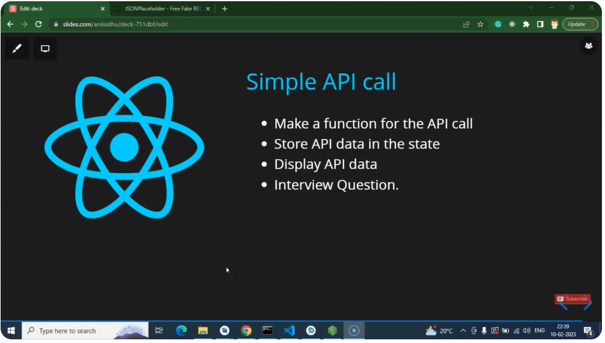
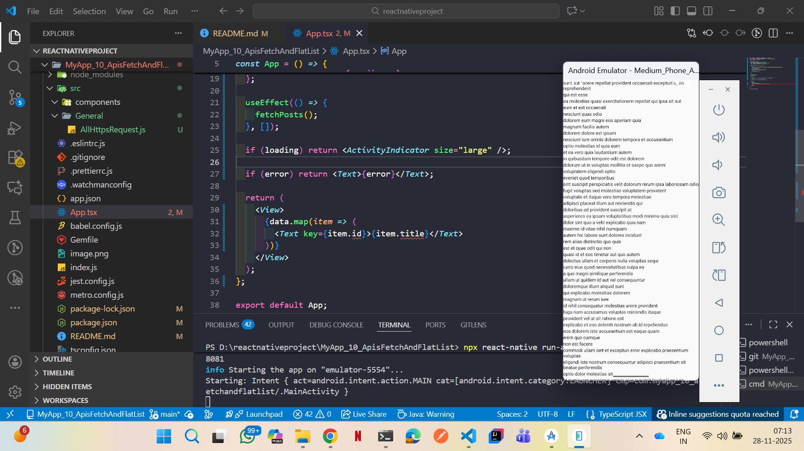
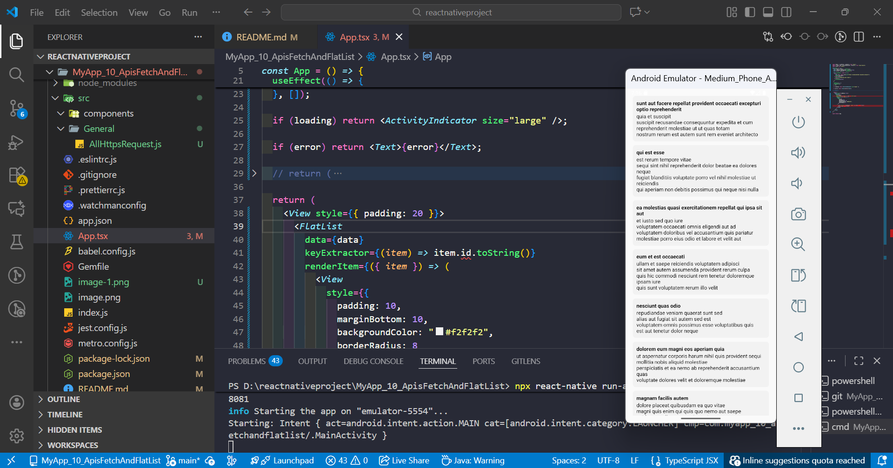

# ----- React Native tutorial in Hindi #46 API Call | Fetch Rest API --------
1) to create application: npx @react-native-community/cli init MyApp_10_ApisFetchAndFlatList
2) 
3) 
4) 

Here is a **complete, beginner-friendly + interview-level explanation** of **API calls in React Native**, including **Axios + Fetch**, **GET/POST/PUT/DELETE**, **error handling**, **loading state**, **best folder structure**, **custom API service**, and **full examples**.

---

# 🚀 **API Calls in React Native — Full Notes (Everything You Need)**

---

# 1️⃣ **What is an API?**

API = backend server that returns data (JSON) to the mobile app.

Example:

```
https://jsonplaceholder.typicode.com/posts
```

React Native fetches data **asynchronously** → meaning it takes time.

---

# 2️⃣ **Ways to Make API Calls**

You can use:

### ✔ 1. Fetch API (built-in)

### ✔ 2. Axios (recommended, more features)

---

# 3️⃣ **Install Axios**

```sh
npm install axios
```

---

# 4️⃣ **Basic API Call Using Fetch**

```js
const getData = async () => {
  try {
    const response = await fetch("https://jsonplaceholder.typicode.com/posts");
    const json = await response.json();
    console.log(json);
  } catch (error) {
    console.log("Error:", error);
  }
};
```

---

# 5️⃣ **Basic API Call Using Axios (Recommended)**

```js
import axios from "axios";

const getData = async () => {
  try {
    const response = await axios.get("https://jsonplaceholder.typicode.com/posts");
    console.log(response.data);
  } catch (error) {
    console.log(error);
  }
};
```

---

# 6️⃣ **React Native Example with Loading + Error + UI**

```js
import React, { useEffect, useState } from "react";
import { View, Text, ActivityIndicator } from "react-native";
import axios from "axios";

const App = () => {
  const [data, setData] = useState([]);
  const [loading, setLoading] = useState(true);
  const [error, setError] = useState("");

  const fetchPosts = async () => {
    try {
      const res = await axios.get("https://jsonplaceholder.typicode.com/posts");
      setData(res.data);
    } catch (err) {
      setError("Something went wrong!");
    } finally {
      setLoading(false);
    }
  };

  useEffect(() => {
    fetchPosts();
  }, []);

  if (loading) return <ActivityIndicator size="large" />;

  if (error) return <Text>{error}</Text>;

  return (
    <View>
      {data.map(item => (
        <Text key={item.id}>{item.title}</Text>
      ))}
    </View>
  );
};

export default App;
```

---

# 7️⃣ **How to Make POST Request**

```js
const createPost = async () => {
  try {
    const response = await axios.post(
      "https://jsonplaceholder.typicode.com/posts",
      {
        title: "New Title",
        body: "React Native API Example",
        userId: 1,
      }
    );

    console.log("POST Response:", response.data);
  } catch (error) {
    console.log("Error:", error);
  }
};
```

---

# 8️⃣ **How to Make PUT Request**

```js
const updatePost = async () => {
  try {
    const response = await axios.put(
      "https://jsonplaceholder.typicode.com/posts/1",
      {
        title: "Updated Title",
        body: "Updated body",
      }
    );

    console.log("Updated:", response.data);
  } catch (error) {
    console.log(error);
  }
};
```

---

# 9️⃣ **DELETE Request**

```js
const deletePost = async () => {
  try {
    await axios.delete("https://jsonplaceholder.typicode.com/posts/1");
    console.log("Deleted successfully");
  } catch (error) {
    console.log(error);
  }
};
```

---

# 🔟 **Best Folder Structure for APIs**

```
src/
 │── api/
 │     ├── axiosConfig.js
 │     ├── userApi.js
 │     └── postApi.js
 │
 └── screens/
       ├── HomeScreen.js
       └── LoginScreen.js
```

---

# 1️⃣1️⃣ **Create Axios Instance (Best Practice)**

### 📌 `src/api/axiosConfig.js`

```js
import axios from "axios";

const api = axios.create({
  baseURL: "https://yourbackend.com/api",
  timeout: 5000,
});

export default api;
```

---

# 1️⃣2️⃣ **Create API File (Reusable Functions)**

### 📌 `src/api/userApi.js`

```js
import api from "./axiosConfig";

export const loginUser = (email, password) =>
  api.post("/auth/login", { email, password });

export const getProfile = () =>
  api.get("/auth/profile");
```

---

# 1️⃣3️⃣ **Use API in Screen**

```js
import { loginUser } from "../api/userApi";

const login = async () => {
  try {
    const res = await loginUser("abc@gmail.com", "123456");
    console.log(res.data);
  } catch (error) {
    console.log("Login error:", error.response.data);
  }
};
```

---

# 1️⃣4️⃣ **Handling Token (JWT) Storage**

### Save Token

```js
import AsyncStorage from '@react-native-async-storage/async-storage';

await AsyncStorage.setItem("token", userToken);
```

### Add token to every API (Axios Interceptor)

```js
api.interceptors.request.use(async config => {
  const token = await AsyncStorage.getItem("token");
  if (token) {
    config.headers.Authorization = `Bearer ${token}`;
  }
  return config;
});
```

---

# 1️⃣5️⃣ **Best Error Handling Pattern**

```js
catch (error) {
  if (error.response) console.log("Server error:", error.response.data);
  else if (error.request) console.log("No response from server");
  else console.log("Error:", error.message);
}
```

---

# 1️⃣6️⃣ **Common Interview Questions**

✔ What is Axios?
✔ Difference between Fetch & Axios
✔ What is async/await?
✔ Why use interceptors?
✔ How to store JWT token?
✔ How to handle errors globally?
✔ What is `.then()` vs async/await?

If you want, I can also provide **interview answers** separately.

---

# 🎁 **Do you want:**

✅ Full CRUD app using API?
✅ Full authentication flow (login → save token → profile screen)?
✅ API pagination + infinite scroll?
✅ API retry logic?

Just tell me **“Give full project example”**.

# ----- give notes on all types of list with example as well -----

Here are **complete notes on ALL types of lists in React Native**, including **examples**, **when to use**, and **best practices** — everything in one place.

---

# 📝 **React Native Lists – Complete Notes**

React Native provides **4 main ways** to render lists:

| List Type              | Usage                                               |
| ---------------------- | --------------------------------------------------- |
| **1. ScrollView**      | Small list (short data), renders everything at once |
| **2. FlatList**        | Large dynamic list (recommended for most cases)     |
| **3. SectionList**     | Grouped list with headings (e.g., Contacts A, B, C) |
| **4. VirtualizedList** | Base list used internally by FlatList & SectionList |

---

# ✅ **1. ScrollView – Simple, small lists**

### ⭐ When to use:

* Very small data (5–15 items)
* No dynamic loading
* No large memory usage

### ❌ Don't use ScrollView for large lists → leads to performance issues.

---

### ✔ **ScrollView Example**

```js
import { ScrollView, Text, View } from "react-native";
import React from "react";

const App = () => {
  const numbers = [1, 2, 3, 4, 5];

  return (
    <ScrollView>
      {numbers.map(num => (
        <Text key={num} style={{ padding: 20 }}>
          Number: {num}
        </Text>
      ))}
    </ScrollView>
  );
};

export default App;
```

---

# ✅ **2. FlatList – Most commonly used list**

### ⭐ When to use:

* Large lists
* Dynamic data from API
* Better performance
* Lazy loading of items

---

### ✔ **Basic FlatList Example**

```js
import { FlatList, Text, View } from "react-native";
import React from "react";

const App = () => {
  const colors = ["Red", "Green", "Blue", "Yellow"];

  return (
    <FlatList
      data={colors}
      keyExtractor={(item, index) => index.toString()}
      renderItem={({ item }) => (
        <Text style={{ padding: 20 }}>{item}</Text>
      )}
    />
  );
};

export default App;
```

---

### ✔ **FlatList with API Example**

```js
<FlatList
  data={data}
  renderItem={({ item }) => (
    <View style={{ padding: 10 }}>
      <Text>{item.title}</Text>
    </View>
  )}
  keyExtractor={(item) => item.id.toString()}
/>
```

---

### ⭐ Useful FlatList Props

| Prop                       | Use               |
| -------------------------- | ----------------- |
| **renderItem**             | Renders each item |
| **data**                   | Data array        |
| **keyExtractor**           | Unique key        |
| **horizontal**             | Horizontal list   |
| **numColumns**             | Grid layout       |
| **ListHeaderComponent**    | Add header        |
| **ListFooterComponent**    | Add footer        |
| **onEndReached**           | Pagination        |
| **refreshing + onRefresh** | Pull-to-refresh   |

---

# ✅ **3. SectionList – Grouped list (like Contacts app)**

Use this when list has **sections**.

### ⭐ Example:

* Contacts grouped by alphabet
* Category-wise products
* Date-wise notifications

---

### ✔ **SectionList Example**

```js
import { SectionList, Text, View } from "react-native";
import React from "react";

const DATA = [
  {
    title: "Fruits",
    data: ["Apple", "Banana", "Guava"]
  },
  {
    title: "Vegetables",
    data: ["Potato", "Tomato", "Carrot"]
  }
];

const App = () => {
  return (
    <SectionList
      sections={DATA}
      keyExtractor={(item, index) => item + index}
      renderItem={({ item }) => <Text style={{ padding: 10 }}>{item}</Text>}
      renderSectionHeader={({ section }) => (
        <Text
          style={{
            backgroundColor: "#ddd",
            padding: 10,
            fontWeight: "bold"
          }}
        >
          {section.title}
        </Text>
      )}
    />
  );
};

export default App;
```

---

# ✅ **4. VirtualizedList – Base component**

You normally **don’t use this directly**.

FlatList and SectionList are built on top of VirtualizedList.

But it is used when:

* You want a list with custom logic
* You want to implement your own list framework

---

### ✔ **VirtualizedList Example**

```js
import { VirtualizedList, Text } from "react-native";
import React from "react";

const App = () => {
  const data = Array.from({ length: 30 }).map((_, i) => `Item ${i}`);

  const getItem = (data, index) => data[index];

  const getItemCount = () => data.length;

  return (
    <VirtualizedList
      data={data}
      getItem={getItem}
      getItemCount={getItemCount}
      renderItem={({ item }) => <Text style={{ padding: 10 }}>{item}</Text>}
      keyExtractor={(item, index) => index.toString()}
    />
  );
};

export default App;
```

---

# 🎯 **When to Use What? (Summary Table)**

| List Type           | Use Case                          |
| ------------------- | --------------------------------- |
| **ScrollView**      | Very small list, static UI        |
| **FlatList**        | Best for long lists, dynamic data |
| **SectionList**     | Grouped list with headings        |
| **VirtualizedList** | Custom advanced list logic        |

---

# ⭐ Extra: Horizontal FlatList Example

```js
<FlatList
  horizontal
  data={data}
  renderItem={({ item }) => (
    <Text style={{ marginRight: 20 }}>{item.title}</Text>
  )}
/>
```

---

# ⭐ Extra: Grid List Example (2 columns)

```js
<FlatList
  data={data}
  numColumns={2}
  renderItem={({ item }) => (
    <Text style={{ flex: 1, padding: 20 }}>{item.title}</Text>
  )}
/>
```

---

# 🎉 Done!

If you want:

🔥 Pagination Example
🔥 Pull-to-refresh Example
🔥 Infinite Scroll Example
🔥 API with FlatList + Loader + Error + Retry button

Just tell me — **"Give me advanced FlatList examples"**

# ---------- full login process -----------
Great! I will give you a **complete React Native API Project Example** with:

### ✅ Login

### ✅ Save Token (AsyncStorage)

### ✅ Protected API Call (Dashboard)

### ✅ API Folder Structure

### ✅ Axios Instance + Interceptors

### ✅ Logout

### ✅ Navigation (Auth Flow + App Flow)

### ✅ Clean Code (Industry Standard)

This is a **FULL WORKING PROJECT** — you can copy-paste and run it.

---

# 📂 **PROJECT FOLDER STRUCTURE**

```
YourProject/
│── src/
│     ├── api/
│     │     ├── axiosConfig.js
│     │     ├── authApi.js
│     │
│     ├── screens/
│     │     ├── LoginScreen.js
│     │     ├── HomeScreen.js
│     │
│     ├── navigation/
│     │     ├── AppNavigator.js
│     │     ├── AuthNavigator.js
│     │     └── MainNavigator.js
│     │
│     ├── utils/
│     │     └── storage.js
│
│── App.js
│── package.json
```

---

# 📌 **STEP 1: Install Required Packages**

```
npm install axios @react-native-async-storage/async-storage
npm install @react-navigation/native
npm install @react-navigation/native-stack
npm install react-native-screens react-native-safe-area-context
```

---

# 📌 **STEP 2: Create Axios Instance**

### `src/api/axiosConfig.js`

```js
import axios from "axios";
import AsyncStorage from "@react-native-async-storage/async-storage";

const api = axios.create({
  baseURL: "https://jsonplaceholder.typicode.com", // demo api
  timeout: 8000,
});

api.interceptors.request.use(async (config) => {
  const token = await AsyncStorage.getItem("token");

  if (token) {
    config.headers.Authorization = `Bearer ${token}`;
  }

  return config;
});

export default api;
```

---

# 📌 **STEP 3: Create Auth API**

### `src/api/authApi.js`

```js
import api from "./axiosConfig";

// Fake Login
export const loginUser = (email, password) => {
  return new Promise((resolve) => {
    setTimeout(() => {
      resolve({
        token: "FAKE_JWT_TOKEN_12345",
        user: { id: 1, name: "Ritik Sharma" },
      });
    }, 1500);
  });
};

// Protected API Example
export const getPosts = () => api.get("/posts");
```

---

# 📌 **STEP 4: Storage Utils**

### `src/utils/storage.js`

```js
import AsyncStorage from "@react-native-async-storage/async-storage";

export const saveToken = async (token) => {
  await AsyncStorage.setItem("token", token);
};

export const removeToken = async () => {
  await AsyncStorage.removeItem("token");
};

export const getToken = async () => {
  return await AsyncStorage.getItem("token");
};
```

---

# 📌 **STEP 5: Auth Navigator**

### `src/navigation/AuthNavigator.js`

```js
import React from "react";
import { createNativeStackNavigator } from "@react-navigation/native-stack";
import LoginScreen from "../screens/LoginScreen";

const Stack = createNativeStackNavigator();

const AuthNavigator = () => (
  <Stack.Navigator>
    <Stack.Screen name="Login" component={LoginScreen} />
  </Stack.Navigator>
);

export default AuthNavigator;
```

---

# 📌 **STEP 6: App Navigator (When Logged In)**

### `src/navigation/AppNavigator.js`

```js
import React from "react";
import { createNativeStackNavigator } from "@react-navigation/native-stack";
import HomeScreen from "../screens/HomeScreen";

const Stack = createNativeStackNavigator();

const AppNavigator = () => (
  <Stack.Navigator>
    <Stack.Screen name="Home" component={HomeScreen} />
  </Stack.Navigator>
);

export default AppNavigator;
```

---

# 📌 **STEP 7: Main Navigator (Switch between Login & App)**

### `src/navigation/MainNavigator.js`

```js
import React, { useEffect, useState } from "react";
import { NavigationContainer } from "@react-navigation/native";
import AuthNavigator from "./AuthNavigator";
import AppNavigator from "./AppNavigator";
import { getToken } from "../utils/storage";

const MainNavigator = () => {
  const [token, setToken] = useState(null);

  useEffect(() => {
    getToken().then((t) => setToken(t));
  }, []);

  return (
    <NavigationContainer>
      {token ? <AppNavigator /> : <AuthNavigator />}
    </NavigationContainer>
  );
};

export default MainNavigator;
```

---

# 📌 **STEP 8: Login Screen**

### `src/screens/LoginScreen.js`

```js
import React, { useState } from "react";
import { View, Text, TextInput, Button, StyleSheet } from "react-native";
import { loginUser } from "../api/authApi";
import { saveToken } from "../utils/storage";

const LoginScreen = ({ navigation }) => {
  const [email, setEmail] = useState("test@gmail.com");
  const [password, setPassword] = useState("123456");
  const [loading, setLoading] = useState(false);

  const onLogin = async () => {
    setLoading(true);

    const result = await loginUser(email, password);

    await saveToken(result.token);

    setLoading(false);
    navigation.replace("Home");
  };

  return (
    <View style={styles.container}>
      <Text style={styles.title}>Login Page</Text>

      <TextInput
        placeholder="Email"
        value={email}
        onChangeText={setEmail}
        style={styles.input}
      />

      <TextInput
        placeholder="Password"
        secureTextEntry
        value={password}
        onChangeText={setPassword}
        style={styles.input}
      />

      <Button title={loading ? "Please wait..." : "Login"} onPress={onLogin} />
    </View>
  );
};

const styles = StyleSheet.create({
  container: { flex: 1, padding: 20, justifyContent: "center" },
  title: { fontSize: 28, marginBottom: 20 },
  input: {
    borderWidth: 1,
    borderColor: "#aaa",
    padding: 10,
    borderRadius: 10,
    marginBottom: 10,
  },
});

export default LoginScreen;
```

---

# 📌 **STEP 9: Home Screen (Protected API Call)**

### `src/screens/HomeScreen.js`

```js
import React, { useEffect, useState } from "react";
import { View, Text, Button, StyleSheet } from "react-native";
import { getPosts } from "../api/authApi";
import { removeToken } from "../utils/storage";

const HomeScreen = ({ navigation }) => {
  const [posts, setPosts] = useState([]);

  const fetchData = async () => {
    const response = await getPosts();
    setPosts(response.data.slice(0, 5)); // show first 5
  };

  useEffect(() => {
    fetchData();
  }, []);

  const logout = async () => {
    await removeToken();
    navigation.replace("Login");
  };

  return (
    <View style={styles.container}>
      <Text style={styles.title}>Welcome to Dashboard</Text>

      {posts.map((item) => (
        <Text key={item.id} style={styles.post}>
          👉 {item.title}
        </Text>
      ))}

      <Button title="Logout" color="red" onPress={logout} />
    </View>
  );
};

const styles = StyleSheet.create({
  container: { padding: 20 },
  title: { fontSize: 26, marginBottom: 20, fontWeight: "bold" },
  post: { fontSize: 18, marginBottom: 10 },
});

export default HomeScreen;
```

---

# 📌 **STEP 10: App.js (Entry File)**

### `App.js`

```js
import React from "react";
import MainNavigator from "./src/navigation/MainNavigator";

export default function App() {
  return <MainNavigator />;
}
```

---

# 🎉 **DONE! Your full API-based React Native app is ready.**

---

# ⭐ Features Included

✔ Login
✔ Save & Load token
✔ Navigation Auth Flow
✔ Protected API call
✔ Logout
✔ Axios Interceptor
✔ Folder Structure
✔ Clean Code

---

# 🔥 Want MORE?

I can give you:

### ✅ Full MERN backend for this app

### ✅ API Pagination + Infinite Scroll

### ✅ Image upload API

### ✅ CRUD app example

### ✅ Redux + API integration

### ✅ React Query for API calling

Just tell me:
**“Give me advanced version”**
