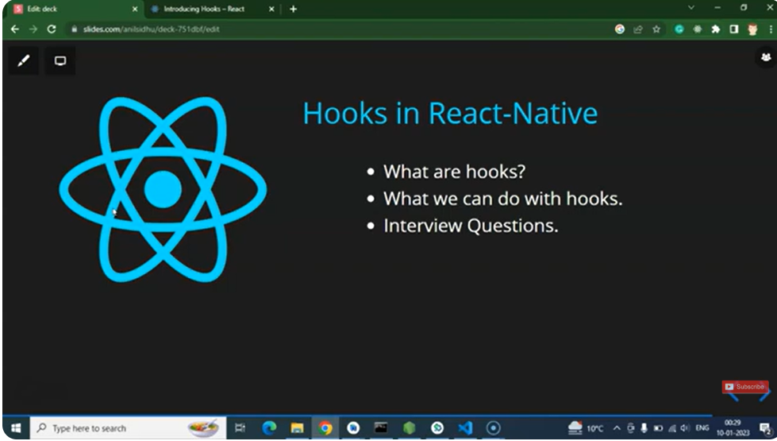
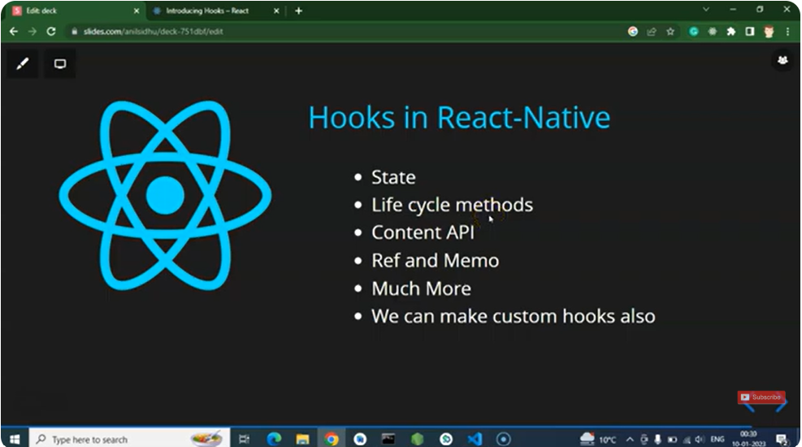
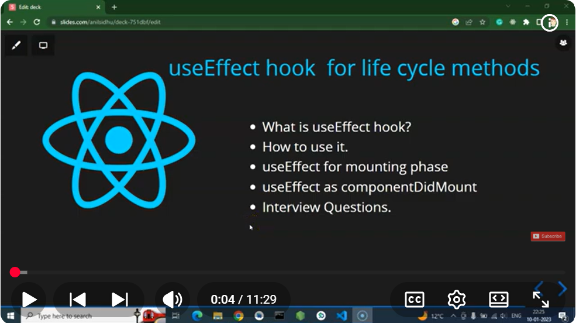

1) 
2) 
3) to create react native app: npx @react-native-community/cli init MyAppHooks
4) to run the application: npx react-native run-android

# --------- hooks in react native with full details notes --------
Below is a **full, complete, easy-to-understand notes sheet** on **React Native Hooks**, from **beginner → advanced**, including examples, best practices, pitfalls, and when to use them.

---

# 📘 **React Native Hooks – Full Notes (Beginner to Advanced)**

Hooks in React Native work the **same way** as in React (web), but here they also interact with **mobile-specific APIs** like AppState, Permissions, Dimensions, Device features, etc.

---

# 🔥 1. **What Are Hooks?**

Hooks let you use **state**, **lifecycle methods**, and **React features** inside **function components** (instead of class components).

There are 3 main types:

### ✔ Built-in Hooks

* `useState`
* `useEffect`
* `useContext`
* `useReducer`
* `useMemo`
* `useCallback`
* `useRef`
* `useLayoutEffect`
* `useImperativeHandle`

### ✔ React Native–specific Hooks

* `useWindowDimensions`
* `useColorScheme`
* `useAnimated…` (Reanimated library)
* `useNetInfo` (network status)
* `useAppState`
* `usePermissions` (custom)

---

# 📍 **2. useState()**

Used to store and update component state.

### Example:

```js
const [count, setCount] = useState(0);

<Button title="Increase" onPress={() => setCount(count + 1)} />
<Text>{count}</Text>
```

### 🔥 Used For:

✔ Form fields
✔ Toggle states
✔ Storing temporary UI data
✔ Count, modal visibility, flags

---

# 📍 **3. useEffect()**

Runs side effects (API calls, timers, event listeners).

### Example: Fetch API on component mount

```js
useEffect(() => {
  fetchData();
}, []);
```

### Example: Cleanup

```js
useEffect(() => {
  const subscription = AppState.addEventListener('change', handleChange);

  return () => subscription.remove();
}, []);
```

### ✔ When to use:

* API calls
* Add/remove listeners
* Timers
* Sync states

---

# 📍 **4. useRef()**

Used to store mutable values OR access components.

### Example 1: Hold previous value

```js
const counterRef = useRef(0);
```

### Example 2: Access TextInput element

```js
const inputRef = useRef();

<TextInput ref={inputRef} />;
<Button title="Focus" onPress={() => inputRef.current.focus()} />;
```

### ✔ Used For:

* Accessing components (TextInput, ScrollView, etc.)
* Storing values without re-render
* Imperative actions (focus, scroll)

---

# 📍 **5. useContext()**

Used for global state (authentication, theme, user data).

### Example:

```js
const AuthContext = createContext();

const { user, login } = useContext(AuthContext);
```

✔ Used For:

* Auth
* Theme
* Cart
* User settings

---

# 📍 **6. useReducer()**

Like Redux inside a component.

### Example:

```js
const reducer = (state, action) => {
  switch (action.type) {
    case "INC":
      return { count: state.count + 1 };
  }
};

const [state, dispatch] = useReducer(reducer, { count: 0 });

<Button title="Increase" onPress={() => dispatch({ type: "INC" })} />
<Text>{state.count}</Text>
```

✔ Used For:

* Complex state
* Multiple values depending on action
* Mini-state-machine

---

# 📍 **7. useCallback()**

Prevents function re-creation on every render (performance optimization).

### Example:

```js
const handlePress = useCallback(() => {
  console.log("Pressed");
}, []);
```

✔ Used For:

* Passing functions to child components
* Avoiding unnecessary re-renders

---

# 📍 **8. useMemo()**

Memoizes expensive calculations.

### Example:

```js
const total = useMemo(() => calculateTotal(price), [price]);
```

✔ Used For:

* Heavy calculations
* Derived data

---

# 📍 **9. useLayoutEffect()**

Runs *synchronously* before painting the screen.

### Example: custom header in React Navigation

```js
useLayoutEffect(() => {
  navigation.setOptions({ title: "Home" });
}, []);
```

✔ Used For:

* UI updates before render
* Measuring layout

---

# 📍 **10. useImperativeHandle()**

Expose a specific function from a child component.

Used with `forwardRef`.

---

# 🎯 React Native Specific Hooks

---

# 📱 **11. useWindowDimensions()**

Respond to screen orientation/size changes.

### Example:

```js
const { width, height } = useWindowDimensions();

<Text>{width}</Text>
```

✔ Used For responsive UI

---

# 🌙 **12. useColorScheme()**

Detect dark/light mode.

### Example:

```js
const theme = useColorScheme();
```

✔ Used For theming

---

# 🌐 **13. useNetInfo()** (from @react-native-community/netinfo)

Detect internet status.

```js
const netInfo = useNetInfo();

if (!netInfo.isConnected) {
  return <Text>No Internet</Text>;
}
```

✔ Used For offline UI

---

# 📴 **14. useAppState()**

Track whether the app is in background, foreground.

```js
const [appState, setAppState] = useState(AppState.currentState);

useEffect(() => {
  const subscription = AppState.addEventListener("change", nextState => {
    setAppState(nextState);
  });

  return () => subscription.remove();
}, []);
```

✔ Used For:

* Pause video/music
* Background sync
* Save screen data when app goes background

---

# 📍 Advanced Custom Hooks (React Native)

---

# 🗃 **15. useAsyncStorage()** (custom)

```js
const useAsyncStorage = (key) => {
  const [value, setValue] = useState(null);

  useEffect(() => {
    AsyncStorage.getItem(key).then(setValue);
  }, []);

  const save = async (val) => {
    setValue(val);
    await AsyncStorage.setItem(key, val);
  };

  return [value, save];
};
```

---

# ⚠ Important Rules of Hooks

1️⃣ Never use hooks inside loops
2️⃣ Never use hooks inside conditions
3️⃣ Use hooks only in top-level function component
4️⃣ Always start custom hook name with `useSomething`

---

# 📚 Summary Table

| Hook                | Usage                    |
| ------------------- | ------------------------ |
| useState            | Store UI state           |
| useEffect           | API calls, lifecycle     |
| useRef              | Access component methods |
| useContext          | Global state             |
| useReducer          | Complex state            |
| useMemo             | Memoize values           |
| useCallback         | Memoize functions        |
| useWindowDimensions | Responsive UI            |
| useColorScheme      | Theme detection          |
| useNetInfo          | Internet state           |
| useAppState         | Background/foreground    |

---

# ------- React Native tutorial in Hindi #23 useEffect hook as life cycle method in functional component --------

1) 
2) 


Below is a **complete, simple, clean example** showing **useEffect() behaving like all three lifecycle methods**:

* **componentDidMount** → Runs once when the component loads
* **componentDidUpdate** → Runs when state/props change
* **componentWillUnmount** → Runs when the component is removed

I will rewrite your `AppContent` with full useEffect lifecycle demonstration.

---

# ✅ **React Native Functional Component – useEffect Lifecycle Example**

```jsx
import React, { useEffect, useState } from 'react';
import { View, Text, Button, StyleSheet } from 'react-native';

function AppContent() {
  const [count, setCount] = useState(0);
  const [name, setName] = useState("Ritik");

  /* -----------------------------------------
     1️⃣ componentDidMount (runs only once)
  ------------------------------------------ */
  useEffect(() => {
    console.log("🔵 componentDidMount → Screen Loaded");

    // Example: API call
    // fetchUserData();

  }, []); // empty dependency → runs only once


  /* ---------------------------------------------------------
     2️⃣ componentDidUpdate (runs whenever 'count' changes)
  ------------------------------------------------------------ */
  useEffect(() => {
    console.log("🟡 componentDidUpdate → count changed:", count);
  }, [count]);


  /* -----------------------------------------------------------------------
     3️⃣ componentDidUpdate for specific state (runs when name changes)
  ------------------------------------------------------------------------- */
  useEffect(() => {
    console.log("🟢 Name updated:", name);
  }, [name]);


  /* ----------------------------------------------------
     4️⃣ componentWillUnmount (cleanup before unmount)
  ------------------------------------------------------ */
  useEffect(() => {
    console.log("🔴 componentWillUnmount setup");

    return () => {
      console.log("❌ componentWillUnmount → component removed");
    };
  }, []); 


  return (
    <View style={styles.container}>
      <Text style={styles.title}>useEffect Lifecycle Demo</Text>

      <Text style={styles.text}>Count: {count}</Text>
      <Button title="Increase Count" onPress={() => setCount(count + 1)} />

      <View style={{ marginTop: 20 }}>
        <Text style={styles.text}>Name: {name}</Text>
        <Button title="Change Name" onPress={() => setName("Sharma")} />
      </View>

    </View>
  );
}

export default AppContent;

const styles = StyleSheet.create({
  container: {
    flex: 1,
    justifyContent: 'center',
    alignItems: 'center',
    backgroundColor: 'white',
  },
  title: {
    fontSize: 22,
    fontWeight: 'bold',
    marginBottom: 30,
  },
  text: {
    fontSize: 18,
    marginVertical: 10,
  },
});
```

---

# 📘 **EXPLANATION — useEffect = 3 lifecycle methods**

## **1️⃣ componentDidMount → useEffect(() => {}, [])**

Runs only once when component loads.

Useful for:

* Fetch API
* Start timers
* Setup event listeners

---

## **2️⃣ componentDidUpdate → useEffect(() => {}, [state])**

Runs whenever the dependency changes.

Useful for:

* Run logic when state updates
* Validate after input change
* Track props change

---

## **3️⃣ componentWillUnmount → Cleanup return () => {}**

Runs when component is about to disappear.

Useful for:

* Remove event listeners
* Stop timers
* Cancel API calls

---

# 🎉 If you want, I can also give:

✅ useEffect interview questions
✅ useState + useEffect combined examples
✅ useEffect advanced (API, timers, navigation, async)
Just type **"next"**.
