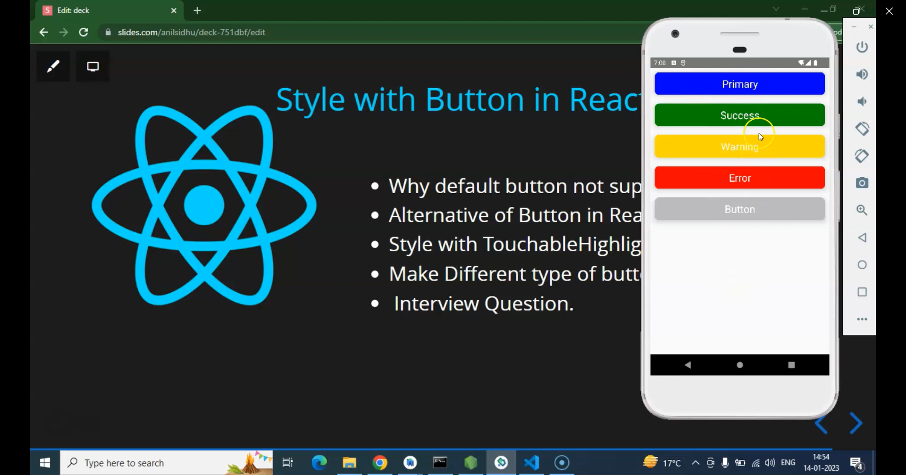
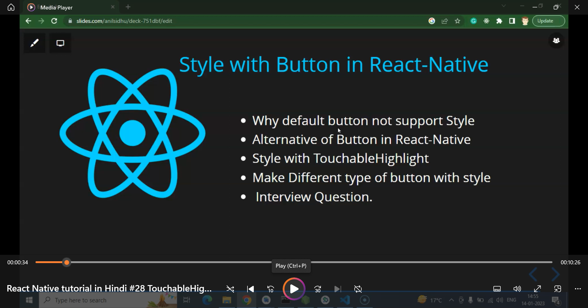
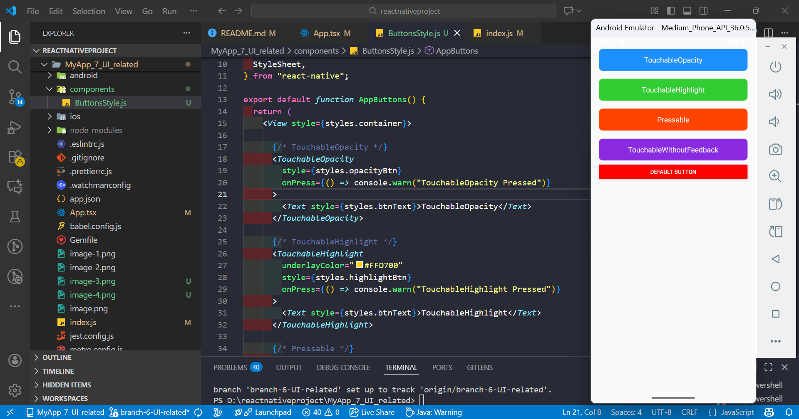

1) to create this application: npx @react-native-community/cli init MyApp_7_UI_related
2) to run the application: npx react-native run-android
3) 
4) 
5) 

## -------- React Native tutorial in Hindi #28 TouchableHighlight | Style with Button --
1) 
2) 

Here is **the complete and clear explanation** about:

✅ Does **React Native default Button** support style?
❌ Why not?
✅ What is the **alternative**?
✅ What is **TouchableHighlight**, **TouchableOpacity**, **Pressable**, and when to use which?
📘 Full notes in simple language.

---

# ✅ **1. Does React Native Default Button Support Styling?**

**NO**, the default React Native `<Button />` **does NOT support full styling.**

### ❌ You CANNOT style:

* width
* height
* padding
* font size
* border
* border-radius (corner round)
* background color (on Android)

### ✔ You CAN style only:

* color
* onPress
* title

### Example:

```js
<Button title="Click me" color="red" />
```

---

# ❓ **2. Why Button cannot be styled in React Native?**

Because React Native tries to use **native OS components**.

### iOS:

Uses `UIButton` (native Apple button)

### Android:

Uses `android.widget.Button` (native Android button)

➡ These two systems have **different design rules**, shapes, padding, behavior.

SO React Native uses simple, basic props to keep the button **consistent and same** on both platforms.

That’s why styling is limited.

---

# ✅ **3. What is the Alternative for Styling?**

Use:

### ✔ **TouchableOpacity**

### ✔ **TouchableHighlight**

### ✔ **Pressable**

### ✔ **TouchableWithoutFeedback**

### ✔ **Custom Button using View + Text**

---

# ⭐ Recommended Alternative:

## 👉 **TouchableOpacity** (Most used)

Allows **full styling** using normal `View` + `Text`.

Example:

```js
<TouchableOpacity style={{ 
  backgroundColor: "blue",
  padding: 15,
  borderRadius: 10,
  width: 200
}}>
  <Text style={{ color: "white", textAlign: "center" }}>Click Me</Text>
</TouchableOpacity>
```

---

# ⭐ What is TouchableOpacity?

### ➤ A pressable component that reduces **opacity** (becomes lighter) when clicked.

✔ Smooth animation
✔ Used for custom buttons
✔ Most popular choice

---

# ⭐ What is TouchableHighlight?

### ➤ Same as TouchableOpacity BUT:

When pressed → it shows a **background highlight color**.

Example:

```js
<TouchableHighlight
  underlayColor="yellow"
  style={{
    backgroundColor: "blue",
    padding: 15,
    borderRadius: 10,
    width: 200
  }}
>
  <Text style={{ color: "white", textAlign: "center" }}>Press Me</Text>
</TouchableHighlight>
```

### 🔍 Difference:

* **TouchableOpacity** → fades (opacity ↓)
* **TouchableHighlight** → shows highlight background color

---

# ⭐ **TouchableOpacity vs TouchableHighlight vs Pressable**

| Component                    | Feedback on Press      | Styling   | Use Cases                          |
| ---------------------------- | ---------------------- | --------- | ---------------------------------- |
| **Button**                   | Native system behavior | ❌ Limited | Simple buttons                     |
| **TouchableOpacity**         | Opacity fade           | ✔ Full    | Most custom buttons                |
| **TouchableHighlight**       | Highlight color        | ✔ Full    | When you want highlight effect     |
| **Pressable**                | Fully customizable     | ✔ Full    | Best for advanced interactions     |
| **TouchableWithoutFeedback** | No feedback            | ✔ Full    | When no visual press effect needed |

---

# ⭐ What is Pressable (Newer & Best)

React Native introduced `Pressable` as the **replacement for all touchables**.

Features:
✔ Detect press
✔ Detect long press
✔ Detect press in
✔ Detect press out
✔ Full styling
✔ Full animation support

Example:

```js
<Pressable 
  onPress={() => console.log("Pressed")}
  style={({ pressed }) => [
    {
      backgroundColor: pressed ? "#ddd" : "blue"
    },
    {
      padding: 15,
      borderRadius: 10
    }
  ]}
>
  <Text style={{ color: "white" }}>Pressable Button</Text>
</Pressable>
```

---

# 📘 FULL NOTES (READY TO SAVE)

Here is the full notes in a clean list:

---

# 📘 **React Native Button & Touchable Notes (Full Guide)**

### ✔ Default `<Button />`

* Limited styling
* Cannot change size, padding, borders
* Cross-platform native design
* Recommended only for very simple UI

---

# ✔ **Touchable Types**

### **1. TouchableOpacity**

* Most used for custom buttons
* Reduces opacity when pressed
* Smooth UI animation
* Supports full styling

---

### **2. TouchableHighlight**

* Shows highlight color on press
* Best for dark buttons
* Has `underlayColor` prop
* Full styling supported

---

### **3. Pressable (Best Modern Choice)**

* Highly customizable
* Detects: pressIn, pressOut, longPress
* Dynamic styling based on pressed state
* Recommended for production apps

---

### **4. TouchableWithoutFeedback**

* Invisible touch
* No animation
* Rarely used

---

# ⭐ Recommended Approach Today:

➡ **Use Pressable or TouchableOpacity**
➡ Build your button using **View + Text**

---

If you want, I can also provide:

📘 **Custom Button Component with reusability**
💡 **Animated button example**
✨ **Complete cheat sheet PDF**

Just tell me — **do you want custom reusable button code?**
1) 

