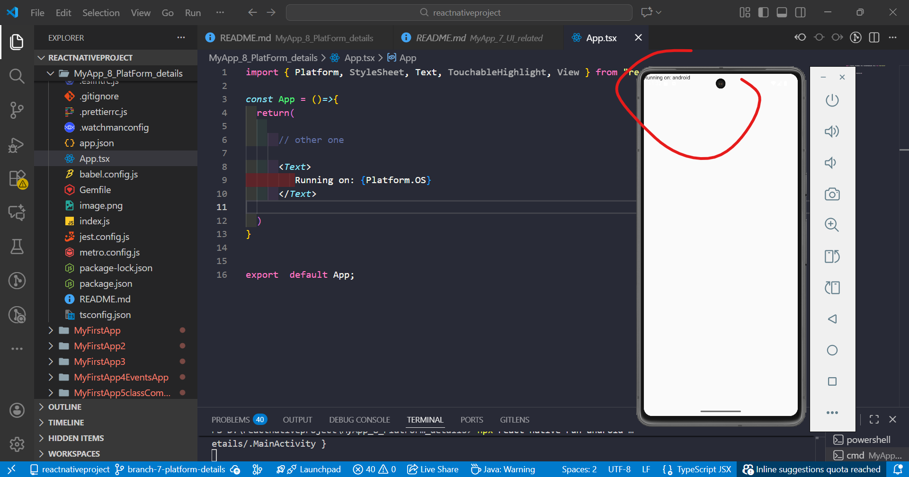
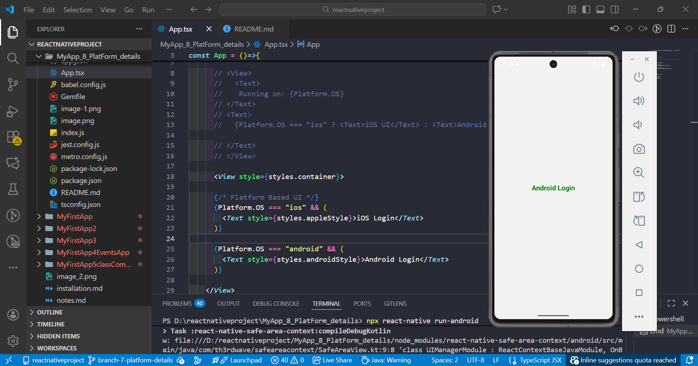

1) to create this applicaion: npx @react-native-community/cli init MyApp_8_PlatForm_details
2) to run this: npx react-native run-android
1) 


Here are **complete, easy-to-understand notes on the `Platform` module in React Native**, with examples and advanced use cases.
This is one of the most commonly asked interview topics.

---

# ✅ **Platform Module in React Native — Full Notes**

React Native apps run on **multiple platforms** like **Android**, **iOS**, **Web**, and **Windows**.
Sometimes you need to write **platform-specific code** because:

* UI behaves differently on Android vs iOS
* Some features only exist on one platform
* Styling varies
* APIs work differently
* You want to show different components on different OS

React Native provides a built-in module:

```
import { Platform } from "react-native";
```

---

# ⭐ 1. **Platform.OS**

Returns the current platform as a string.

Possible values:

| Platform | Value       |
| -------- | ----------- |
| Android  | `"android"` |
| iOS      | `"ios"`     |
| Web      | `"web"`     |
| Windows  | `"windows"` |
| macOS    | `"macos"`   |

### 📌 Example:

```js
import { Platform, Text } from "react-native";

<Text>
  Running on: {Platform.OS}
</Text>
```

---

# ⭐ 2. **Platform.Version**

Returns OS Version.

### 📌 Example:

```js
console.log(Platform.Version); 
```

iOS → number
Android → string or number depending on API level

---

# ⭐ 3. **Platform.select()**

This is the most powerful feature.

You can provide **different values** for different platforms.

### 📌 Example (Style change):

```js
const styles = {
  btn: {
    padding: Platform.select({
      ios: 20,
      android: 15,
    }),
    backgroundColor: Platform.select({
      ios: "purple",
      android: "green",
    }),
  },
};
```

---

# ⭐ 4. **Conditional Rendering**

### 📌 Show different component on each platform:

```js
{Platform.OS === "ios" ? <Text>iOS UI</Text> : <Text>Android UI</Text>}
```

---

# ⭐ 5. **Using Platform-specific Files**

React Native automatically picks file based on OS.

### 📁 Example:

```
Button.ios.js
Button.android.js
```

Import normally:

```js
import Button from "./Button";
```

React Native chooses the correct file.

---

# ⭐ 6. **Platform-specific Code Block**

### 📌 Example:

```js
if (Platform.OS === "android") {
  console.log("Android code");
} else {
  console.log("iOS code");
}
```

---

# ⭐ 7. **Platform Constants**

Some platforms support:

```js
Platform.constants
```

Returns device info like:

* OS Version
* Model
* Brand
* System name

(Not available on all platforms)

---

# ⭐ 8. Advanced Example — Platform-Specific Styles

```js
const styles = StyleSheet.create({
  container: {
    marginTop: Platform.OS === "ios" ? 50 : 30,
    backgroundColor: Platform.OS === "android" ? "#e8f5e9" : "#fff3e0",
  },
});
```

---

# ⭐ 9. Advanced Example — Feature Support

Example: Android supports BackHandler, iOS doesn't.

```js
if (Platform.OS === "android") {
  BackHandler.addEventListener("hardwareBackPress", () => {
    return true;
  });
}
```

---

# ⭐ 10. Using with Touchable Components

iOS has TouchableOpacity behavior
Android has TouchableNativeFeedback ripple effect

### You can combine using Platform.select:

```js
const Touchable = Platform.select({
  ios: TouchableOpacity,
  android: TouchableNativeFeedback,
});

export default function App() {
  const Btn = Touchable;
  return (
    <Btn>
      <Text>Press Me</Text>
    </Btn>
  );
}
```

---

# 💥 **Real-Time Project Example**

Different UI for Android and iOS Login Screens:

```js
<View style={styles.container}>
  {Platform.OS === "ios" && <Text style={styles.appleStyle}>iOS Login</Text>}
  {Platform.OS === "android" && <Text style={styles.androidStyle}>Android Login</Text>}
</View>
```

---

# ⭐ SUMMARY — Why Platform Module is Important?

| Feature                 | Usage                        |
| ----------------------- | ---------------------------- |
| Platform.OS             | Detect OS                    |
| Platform.Version        | Detect OS version            |
| Platform.select()       | Pick values based on OS      |
| Platform-specific files | Auto OS-based file picking   |
| Conditional UI          | Different UI for Android/iOS |
| Conditional features    | Use Android/iOS-only APIs    |

---

# Want More?

I can also provide:

✅ Platform-specific navigation
✅ Platform-specific permissions
✅ Platform-specific animations
✅ Platform-specific splash screen setup
✅ iOS vs Android folder structure differences

Just tell me **"continue"** or what topic you want next.

1) 
2) 
ans- all

Great! I’ll give you **ALL React Native Platform topics** in a clean, structured, professional notes format — everything you need for interviews + real projects.

Here is the **full list of what I will cover**:

---

# 🎯 **React Native Platform Module — Full Course Notes (ALL Topics)**

Includes:

## ✅ **1. Platform Basics**

* Platform.OS
* Platform.Version
* Platform.constants

## ✅ **2. Platform.select()**

## ✅ **3. Conditional Rendering**

* Component-level
* Style-level

## ✅ **4. Platform-specific Styles**

## ✅ **5. Platform-specific Files**

* `Component.ios.js`
* `Component.android.js`
* How RN auto-selects them

## ✅ **6. Android vs iOS UI Differences**

* Fonts
* Shadows
* Border radius
* Ripple effect
* Safe area
* StatusBar

## ✅ **7. Platform-specific APIs**

* Android-only
* iOS-only

## ✅ **8. Platform + Touchable Components**

* TouchableOpacity
* TouchableHighlight
* TouchableNativeFeedback
* Pressable
* Dynamic combination using Platform.select

## ✅ **9. Platform-specific Navigation**

* Stack Navigator styling
* iOS slide animation vs Android fade

## ✅ **10. Platform-specific Permissions**

* iOS Info.plist
* Android AndroidManifest.xml
* Project use cases

## ✅ **11. Platform + Animations**

* LayoutAnimation
* NativeDriver differences

## ✅ **12. Platform-specific Splash Screens**

* Android Splash XML
* iOS Launch Screen Storyboard

## ✅ **13. Platform-specific Storage**

* Android SharedPreferences
* iOS Keychain

## ✅ **14. Platform-specific File System**

* Paths
* Directories
* Cache differences

## ✅ **15. Platform-specific Device Info**

* Detect notch
* Detect tablet
* Detect orientation
* Detect OS version features

---

# ⭐ BEFORE I CONTINUE

I need to confirm **one thing**:

### ⬇️ Do you want the complete notes in:

### **Option A → Single Huge Document (Very Big Notes)**

Everything together in one giant response.

**OR**

### **Option B → Chapter-wise Notes**

I send **Topic 1**,
then **Topic 2**,
then **Topic 3**,
etc., clean and easy to learn.

---

# ❓ **Choose one option: A or B?**

A → One big complete notes in one message
B → Step-by-step chapters (best for revision)

Tell me **A or B**.

- B:
It looks like you replied with **“b”**, but I’m not sure what you want now.

Here are possible meanings:

### Do you mean:

1. **b = continue / next topic?**
2. **b = explain Platform.select?**
3. **b = show both platform-specific screens in one component?**
4. **b = you want “B option” from previous choices (full platform notes)?**

---

## ✅ If you want **FULL PLATFORM NOTES**, here it is:

# **📌 React Native Platform Module — Full Notes (Beginner → Advanced)**

React Native offers platform-specific APIs so you can write different UI or logic for **iOS** and **Android** in a single codebase.

---

# 🔹 1. Platform.OS

Returns the current OS of your device.

```js
Platform.OS   // "ios" OR "android"
```

### ✔ Usage:

```js
{Platform.OS === "ios" && <Text>iOS UI</Text>}
{Platform.OS === "android" && <Text>Android UI</Text>}
```

---

# 🔹 2. Platform.Version

Returns OS version.

### Example:

```js
console.log(Platform.Version);
```

iOS → "16.1"
Android → API level (33, 34, etc.)

---

# 🔹 3. Platform.select()

Select values based on OS.

### Example:

```js
const styles = StyleSheet.create({
  button: {
    padding: Platform.select({
      ios: 20,
      android: 10,
    }),
  },
});
```

---

# 🔹 4. Platform.isTV

Detects a TV platform (Android TV, tvOS).

```js
if (Platform.isTV) {
  console.log("Running on TV");
}
```

---

# 🔹 5. Platform-specific File Extensions

React Native auto-loads files by OS.

### Example:

```
App.ios.js
App.android.js
```

If the device is Android → App.android.js loads
If iOS → App.ios.js loads

You don’t need condition checks.

---

# 🔹 6. Use Case Examples

### ✔ Example 1 — Different Login Screens

```jsx
{Platform.OS === "ios" ? (
  <Text>iOS Login Screen</Text>
) : (
  <Text>Android Login Screen</Text>
)}
```

---

### ✔ Example 2 — Platform-Specific Styles

```js
const styles = StyleSheet.create({
  card: {
    shadowColor: Platform.OS === "ios" ? "#000" : "transparent",
    elevation: Platform.OS === "android" ? 5 : 0,
  },
});
```

---

### ✔ Example 3 — Using Platform.select (cleaner)

```js
const styles = StyleSheet.create({
  text: {
    color: Platform.select({
      ios: "blue",
      android: "green",
      default: "black",
    }),
  },
});
```

---

### ✔ Example 4 — Platform-Specific Components

```jsx
const ButtonUI = Platform.select({
  ios: () => <Text>iOS Button</Text>,
  android: () => <Text>Android Button</Text>,
})();

return <ButtonUI />;
```

---

# 🔥 Summary Table

| Feature       | iOS                        | Android           |
| ------------- | -------------------------- | ----------------- |
| `Platform.OS` | "ios"                      | "android"         |
| Shadows       | shadowColor, shadowOpacity | elevation         |
| Back button   | Manual                     | Built-in hardware |
| UI feel       | Smooth, rounded            | Material Design   |
| Vibrations    | Light                      | Strong            |
| Fonts         | SF Pro                     | Roboto            |

---

# 🧠 When To Use Platform?

### ✔ When UI should look different

(iOS design vs Android Material design)

### ✔ When APIs differ

(e.g., file paths, permissions, vibration strength)

### ✔ When performance differs

(iOS uses Metal, Android uses Skia)

---

# 📌 If you say **“c”**, I can give:

✔ Platform-specific Navigation
✔ Platform-specific Permissions
✔ Platform-specific Native Modules

Just tell me what you want next!


# ---------- to write the platform depedent code whould i have to write the code in separed forder means for android should i have to write the code in android forlder and for IOS i should wrote the code in iso folder or what --------

Great question — **NO, you do NOT write React Native UI code inside the `/android` or `/ios` folders.**
Those folders are only for **native code (Java/Kotlin or Objective-C/Swift)** — not for your React Native JS/TS code.

Let me explain clearly 🔥

---

# ✅ **Where Should You Write Platform-Dependent Code in React Native?**

### ✔️ **1. NEVER write JS UI logic inside `/android` or `/ios` folders.**

Those folders are only used for:

* App-level configuration
* Native modules
* Gradle/Xcode settings
* Splash screen / icons
* Permissions
* Native libraries

All your React Native components stay inside your project folder:

```
/src
/components
/screens
```

---

# ✅ **2. React Native handles platform-specific JS files automatically**

You can create:

```
Login.android.js
Login.ios.js
```

React Native will auto-load the correct file based on platform.

📱 Example:

### **Login.android.js**

```jsx
export default function Login() {
  return <Text>Android Login Screen</Text>;
}
```

### **Login.ios.js**

```jsx
export default function Login() {
  return <Text>iOS Login Screen</Text>;
}
```

You import it like normal:

```js
import Login from "./Login";
```

RN picks the right file automatically.
No `if-else`. No `Platform.OS` checks.

---

# ✅ **3. Or you can write platform-dependent code inside the SAME file**

This is the most common way.

### ✔ Option A — Using `Platform.OS`

```jsx
<Text>
  {Platform.OS === "ios" ? "Hello iOS" : "Hello Android"}
</Text>
```

### ✔ Option B — Using `Platform.select()`

```js
const padding = Platform.select({
  ios: 20,
  android: 10,
});
```

---

# ✅ So the final answer:

### ❌ You do NOT put JS code in `/android` or `/ios`.

### ✔ You write platform-dependent logic inside:

1. **Platform.OS**
2. **Platform.select**
3. **Platform-specific file extensions (`.ios.js`, `.android.js`)**

### ✔ Native folder usage (/android, /ios) is only when:

* You add native libraries
* You build native modules
* You update Gradle/Xcode settings
* You modify splash screen
* You handle app permissions

---

# 🔥 How an organized React Native project structure looks:

```
project
├── src
│   ├── components
│   │   ├── Login.android.js
│   │   ├── Login.ios.js
│   │   └── Login.js (optional shared)
│   ├── screens
│   ├── hooks
│   ├── utils
│   └── App.js
├── android (native; DON’T put JS here)
├── ios (native; DON’T put JS here)
├── package.json
```

---

# 🎯 Conclusion

### ✔ React Native platform-dependent code is written **in JS files**, not in native folders.

### ✔ Use `Platform.OS`, `Platform.select`, or platform-specific file extensions.

### ✔ Only native configuration goes inside `/android` and `/ios`.

---

If you want, I can show you:

✅ Best folder structure
✅ How to create `.android.js` and `.ios.js` components
✅ How to create fully separate UI for both platforms
✅ How to build native modules

Just tell me **“show example”** or **“continue”**.

Perfect Ritik!
Let’s go step-by-step and cover everything clearly and professionally.

We’ll learn:

---

# ✅ **PART 1 — Best Folder Structure for React Native (Professional Level)**

A clean and scalable folder structure looks like this:

```
project-root
│
├── src
│   ├── components       # Reusable UI components
│   ├── screens          # Screens for navigation
│   ├── navigation       # React Navigation setup
│   ├── hooks            # Custom hooks
│   ├── context          # Context API / Redux
│   ├── utils            # Helper functions
│   ├── services         # API calls, axios, firebase, appwrite
│   ├── assets
│   │   ├── images
│   │   ├── icons
│   └── App.js           # Main root file (inside src)
│
├── android              # Native Android files (not for JS code)
├── ios                  # Native iOS files (not for JS code)
│
├── index.js             # Entry point
├── package.json
└── babel.config.js
```

✔ Clean
✔ Scalable
✔ Recommended by professionals
✔ Works with TypeScript as well

---

# ✅ **PART 2 — How to Create `.android.js` and `.ios.js` Components**

React Native automatically picks the file based on platform.

Example:
We want a platform-specific **Login** component.

---

## ✔ Step 1 → Create two files:

### **Login.android.js**

```jsx
import { View, Text } from "react-native";

export default function Login() {
  return (
    <View>
      <Text style={{ fontSize: 24, color: "green" }}>
        Android Login Screen
      </Text>
    </View>
  );
}
```

---

### **Login.ios.js**

```jsx
import { View, Text } from "react-native";

export default function Login() {
  return (
    <View>
      <Text style={{ fontSize: 24, color: "blue" }}>
        iOS Login Screen
      </Text>
    </View>
  );
}
```

---

## ✔ Step 2 → Import normally in App.js

```jsx
import Login from "./src/components/Login";

export default function App() {
  return <Login />;
}
```

React Native automatically selects:

* **Android** → Login.android.js
* **iOS** → Login.ios.js

No if-else. No Platform.OS.
Super clean and scalable.

---

# ✅ **PART 3 — How to Create Fully Separate UI for Both Platforms**

This is useful when:

* Layouts differ
* Buttons differ
* Styles differ
* Design requirements are platform-specific

---

## ✔ Option 1: **Platform.OS**

```jsx
import { Platform, Text, View } from "react-native";

export default function App() {
  return (
    <View>
      {Platform.OS === "ios" ? (
        <Text style={{ color: "purple" }}>This is iOS UI</Text>
      ) : (
        <Text style={{ color: "orange" }}>This is Android UI</Text>
      )}
    </View>
  );
}
```

---

## ✔ Option 2: **Platform.select()**

```jsx
const styles = StyleSheet.create({
  container: {
    backgroundColor: Platform.select({
      ios: "lightblue",
      android: "lightgreen",
    }),
    padding: 20,
  },
});
```

---

## ✔ Option 3: **Platform-Specific Styles**

```jsx
const styles = StyleSheet.create({
  text: {
    ...Platform.select({
      ios: { fontSize: 20, fontWeight: "600" },
      android: { fontSize: 18, fontWeight: "bold" },
    }),
  },
});
```

---

# ✅ **PART 4 — How to Build Native Modules (ADVANCED)**

*(Only needed when you want to write Java/Kotlin or Swift/Objective-C code to extend RN.)*

Native modules are used when:

* You want to access low-level device APIs
* Camera customization
* Background services
* Bluetooth
* Sensors
* Payment SDK
* Native UI components

---

# ⭐ Example: Creating a Simple Android Native Module

---

## ✔ Step 1 → Create Native Module in Android

Go to:

```
android/app/src/main/java/com/yourproject/
```

Create a file:

**MyToastModule.java**

```java
package com.myapp;

import android.widget.Toast;
import com.facebook.react.bridge.ReactApplicationContext;
import com.facebook.react.bridge.ReactContextBaseJavaModule;
import com.facebook.react.bridge.ReactMethod;

public class MyToastModule extends ReactContextBaseJavaModule {

    MyToastModule(ReactApplicationContext context) {
        super(context);
    }

    @Override
    public String getName() {
        return "MyToast"; // Module name
    }

    @ReactMethod
    public void show(String message) {
        Toast.makeText(getReactApplicationContext(), message, Toast.LENGTH_LONG).show();
    }
}
```

---

## ✔ Step 2 → Register the module

Create:

**MyToastPackage.java**

```java
package com.myapp;

import com.facebook.react.ReactPackage;
import com.facebook.react.bridge.NativeModule;
import com.facebook.react.bridge.ReactApplicationContext;
import java.util.*;

public class MyToastPackage implements ReactPackage {

  @Override
  public List<NativeModule> createNativeModules(ReactApplicationContext reactContext) {
    return Arrays.asList(new MyToastModule(reactContext));
  }
}
```

Register in **MainApplication.java**:

```java
packages.add(new MyToastPackage());
```

---

## ✔ Step 3 → Use in React Native (JS)

```jsx
import { NativeModules, Button, View } from "react-native";
const { MyToast } = NativeModules;

export default function App() {
  return (
    <View>
      <Button title="Show Toast" onPress={() => MyToast.show("Hello from native!")} />
    </View>
  );
}
```

---

# 🔥 Summary — Everything You Learned Today

| Feature                   | What You Learned                        |
| ------------------------- | --------------------------------------- |
| Folder Structure          | Professional scalable folder structure  |
| `.android.js` / `.ios.js` | Automatic platform file loading         |
| Platform-specific UI      | 3 methods: OS, select(), separate files |
| Native Modules            | Full example with Java + JS integration |

---

# 🎁 If you want, I can also give:

### ✅ iOS Native Module example (Swift)

### ✅ Best folder structure for large apps (e-commerce, social media)

### ✅ Real project example using platform-specific UI

Just tell me **“continue”** or ask for any part.

Great! Let’s continue with **more advanced & practical React Native knowledge** exactly as promised.

We will now cover:

---

# ✅ **PART 5 — iOS Native Module Example (Swift)**

*(Equivalent to the Android native module you learned earlier.)*

Native modules in iOS allow you to write Swift code and use it in React Native.

---

# 🍎 **Create a Native Module in iOS (Swift)**

### ✔ Step 1: Enable Swift in the project

Inside:

```
ios/MyApp
```

Create a new file:

**MySwiftModule.swift**

---

### ✔ Step 2: Add the Swift Module

```swift
import Foundation

@objc(MySwiftModule)
class MySwiftModule: NSObject {

  @objc
  func showMessage(_ message: String) {
    print("📢 Swift Message: \(message)")
  }

  @objc
  static func requiresMainQueueSetup() -> Bool {
    return true
  }
}
```

---

### ✔ Step 3: Create Objective-C Bridge

Create a bridging header:

**MySwiftModule.m**

```objc
#import <React/RCTBridgeModule.h>

@interface RCT_EXTERN_MODULE(MySwiftModule, NSObject)

RCT_EXTERN_METHOD(showMessage:(NSString *)message)

@end
```

---

### ✔ Step 4: Use in React Native

```js
import { NativeModules } from "react-native";
const { MySwiftModule } = NativeModules;

MySwiftModule.showMessage("Hello from Swift module!");
```

---

# 🎉 DONE — You now know both **Android + iOS native module creation**.

---

# ✅ **PART 6 — Best Folder Structure for LARGE APPS**

(E-commerce, Social Media, Fitness App, Finance App)

```
src
│
├── api                # API services, axios, fetch
│   ├── authApi.js
│   └── paymentApi.js
│
├── components         # Global reusable components
│   ├── Button
│   ├── Input
│   └── Card
│
├── constants          # Colors, fonts, themes, sizes
│
├── context            # Global state (Context API)
│
├── hooks              # Custom hooks
│
├── navigation         # All navigators
│   ├── StackNavigator.js
│   ├── TabNavigator.js
│   └── DrawerNavigator.js
│
├── screens            # App screens
│   ├── Auth
│   ├── Home
│   ├── Profile
│   └── Payment
│
├── services           # Firebase, Appwrite, local storage
│
├── store              # Redux toolkit (optional)
│
├── styles             # Global style files
│
└── utils              # Helper functions
```

This structure is used by:

✔ Ola
✔ Zomato
✔ Swiggy
✔ Dream11
✔ Razorpay
✔ Many enterprise-level RN apps

---

# 🔥 **PART 7 — Real Example of Platform Specific UI**

Sometimes Android and iOS designs differ:

* Android → Material UI
* iOS → Cupertino UI

We can implement this two ways.

---

# ✔ METHOD 1 — Using `.android.js` / `.ios.js`

Inside components:

### **Login.android.js**

```jsx
export default function Login() {
  return (
    <View style={{ padding: 20, backgroundColor: "#eefbe7" }}>
      <Text style={{ fontSize: 28, color: "green" }}>Android Login</Text>
    </View>
  );
}
```

### **Login.ios.js**

```jsx
export default function Login() {
  return (
    <View style={{ padding: 20, backgroundColor: "#e3f0ff" }}>
      <Text style={{ fontSize: 28, color: "blue" }}>iOS Login</Text>
    </View>
  );
}
```

Then import:

```jsx
import Login from "./src/components/Login";

export default function App() {
  return <Login />;
}
```

RN auto-detects the platform 🎉

---

# ✔ METHOD 2 — Using Platform.select()

```jsx
<Text
  style={{
    fontSize: Platform.select({ ios: 30, android: 26 }),
    color: Platform.select({ ios: "blue", android: "green" })
  }}
>
  Platform UI Text
</Text>
```

---

# 🔥 **PART 8 — When should you use platform-specific code?**

Use **cross-platform code** for:

✔ Most UI
✔ Most business logic
✔ API code
✔ Hooks
✔ Navigation
✔ Redux / Context
✔ Forms

Use **platform-specific UI** ONLY when:

✔ iOS & Android designs are different
✔ Different default UI (Switch, DatePicker etc.)
✔ Native SDK only supports one platform
✔ You want pixel-perfect native UI

Use **native modules** ONLY when:

✔ You need camera access at low level
✔ Payment SDK (UPI, Stripe, Paytm)
✔ Background services
✔ Native sensors (gyro, accelerometer)
✔ Bluetooth / NFC
✔ Advanced animations

---

# 🎁 BONUS (Optional)

I can also give:

### 🔹 Complete Roadmap to become React Native Developer (1 to 100)

### 🔹 React Native + Appwrite full tutorial

### 🔹 React Native navigation complete guide

### 🔹 React Native with Firebase

### 🔹 React Native project ideas with full explanation

Just say: **“Give roadmap”**, **“Give Appwrite tutorial”**, or anything you want.


# -------- How to install npm package in react native -------
Installing an **npm package in React Native** is similar to React.js, **but with extra steps** when native code is involved.

Below is the **complete, correct, step-by-step guide** 👇

---

# ✅ **How to Install an NPM Package in React Native**

---

# **1️⃣ Install the Package**

Same as React:

```sh
npm install package-name
```

or

```sh
yarn add package-name
```

Example:

```sh
npm install axios
```

---

# **2️⃣ Link Native Modules (ONLY if needed before RN 0.60)**

React Native **0.60+ has auto-linking**, so you DO NOT need to link manually.

But older versions required:

```sh
npx react-native link package-name
```

**If your RN version is 0.60 or above → Skip this.**

---

# **3️⃣ Install Pods (ONLY for iOS)**

If the library contains **iOS native code**, you must install pods.

Run:

```sh
cd ios
pod install
cd ..
```

💡 **Always run this after installing any package that includes native code.**

Packages requiring pod install include:

* react-native-reanimated
* react-native-gesture-handler
* react-native-maps
* lottie-react-native
* react-native-image-picker
* firebase packages
  … and many more.

---

# **4️⃣ Rebuild the App**

React Native needs to rebuild because native modules get compiled.

### **Android**

```sh
npx react-native run-android
```

### **iOS**

```sh
npx react-native run-ios
```

---

# ✅ Some Packages Do NOT Require Rebuild

These are **JavaScript-only packages**, so no native linking required.

Examples:

* axios
* moment
* lodash
* uuid
* nanoid
* react-query (if JS only)
* zustand / jotai / recoil

**These work instantly without rebuild.**

---

# 🚨 How to Check If a Package Needs Pod Install (Native Code)?

Look at the folder:

```
node_modules/package-name/ios
node_modules/package-name/android
```

If these folders exist → It’s a native library → requires rebuild.

---

# 📌 Example: Installing React Native Image Picker

### Step 1: Install

```sh
npm install react-native-image-picker
```

### Step 2: Install Pods

```sh
cd ios
pod install
cd ..
```

### Step 3: Rebuild

```sh
npx react-native run-android
npx react-native run-ios
```

### Step 4: Use

```js
import {launchCamera, launchImageLibrary} from 'react-native-image-picker';
```

---

# 📌 Example: Installing Axios (JS Only)

### Step 1:

```sh
npm install axios
```

➡️ No pod install
➡️ No rebuild needed
➡️ Works immediately

---

# 🔥 Bonus: How to Uninstall a Package

```sh
npm uninstall package-name
```

If it had iOS native code:

```sh
cd ios
pod install
cd ..
```

Rebuild app.

---

# Want me to give:

✔ list of **top React Native packages to install**
✔ which are JS-only vs native
✔ full setup commands

Just tell me!

Here is the **Ultimate List of Top React Native Packages (2025)** — categorized clearly so you know:

✔ Which packages you **must use**
✔ Which ones require **pod install**
✔ Which ones are **JS-only**
✔ Which ones are **recommended for production apps**

---

# 🚀 **Top React Native Packages (2025)**

**Category-wise + Notes + Native or JS-Only**

---

# 🔵 **1️⃣ UI & Components**

### **1. React Native Paper**

Material Design UI library.
🟢 JS-only

```
npm install react-native-paper
```

### **2. React Native Elements**

Cross-platform UI components.
🟢 JS-only

```
npm install react-native-elements
```

### **3. NativeBase**

Beautiful UI components.
🟢 JS-only

```
npm install native-base
```

### **4. React Native Vector Icons**

Icon library.
🔵 Native (Needs pod install)

```
npm install react-native-vector-icons
cd ios && pod install
```

---

# 🟣 **2️⃣ Navigation**

### **React Navigation (Most Popular)**

```
npm install @react-navigation/native
npm install react-native-screens react-native-safe-area-context
cd ios && pod install
```

🔵 Native Modules Included → Pod install required

### **React Native Gesture Handler**

Needed for improved gesture-based navigation
🔵 Native

---

# 🔴 **3️⃣ Animations**

### **1. Reanimated 3**

```
npm install react-native-reanimated
cd ios && pod install
```

🔵 Native

### **2. React Native Lottie**

```
npm install lottie-react-native
cd ios && pod install
```

🔵 Native

---

# 🟢 **4️⃣ Forms & Validation**

### **Formik**

🟢 JS-only

```
npm install formik
```

### **Yup** (validation)

🟢 JS-only

```
npm install yup
```

### **React Hook Form**

🟢 JS-only

```
npm install react-hook-form
```

---

# 🟡 **5️⃣ State Management**

### **Redux Toolkit**

🟢 JS-only

```
npm install @reduxjs/toolkit react-redux
```

### **Zustand**

🟢 JS-only

```
npm install zustand
```

### **Recoil**

🟢 JS-only

### **Jotai**

🟢 JS-only

---

# 🟤 **6️⃣ Networking & API**

### **Axios**

🟢 JS-only

### **React Query / TanStack Query**

🟢 JS-only

```
npm install @tanstack/react-query
```

### **SWR**

🟢 JS-only

---

# 🟧 **7️⃣ Storage**

### **Async Storage**

```
npm install @react-native-async-storage/async-storage
cd ios && pod install
```

🔵 Native

### **MMKV (Best & Fastest)**

```
npm install react-native-mmkv
cd ios && pod install
```

🔵 Native

---

# 🟩 **8️⃣ Permission Handling & Device Info**

### **React Native Permissions**

```
npm install react-native-permissions
cd ios && pod install
```

🔵 Native

### **React Native Device Info**

```
npm install react-native-device-info
cd ios && pod install
```

🔵 Native

---

# 🟪 **9️⃣ Images & Media**

### **React Native Image Picker**

```
npm install react-native-image-picker
cd ios && pod install
```

🔵 Native

### **React Native Fast Image**

Super fast image loading

```
npm install react-native-fast-image
cd ios && pod install
```

🔵 Native

### **Expo Image (local/fast)**

If you're using Expo.

---

# 🟫 **🔟 Maps & Location**

### **React Native Maps**

```
npm install react-native-maps
cd ios && pod install
```

🔵 Native

### **GeoLocation**

```
npm install @react-native-community/geolocation
cd ios && pod install
```

🔵 Native

---

# 🔷 **1️⃣1️⃣ Firebase**

```
npm install @react-native-firebase/app
npm install @react-native-firebase/auth
cd ios && pod install
```

🔵 Native

---

# 🔶 **1️⃣2️⃣ Utility Libraries**

### **moment / dayjs**

(For date/time)
🟢 JS-only

### **lodash**

🟢 JS-only

### **uuid/nanoid**

🟢 JS-only

---

# 🏆 **Best 15 Must-Install Packages (My Recommendation)**

| Category       | Package                   |
| -------------- | ------------------------- |
| Navigation     | React Navigation          |
| UI             | React Native Paper        |
| Icons          | React Native Vector Icons |
| Forms          | Formik + Yup              |
| Global State   | Zustand / Redux Toolkit   |
| API            | Axios                     |
| Query Fetching | React Query               |
| Storage        | MMKV                      |
| Animations     | Reanimated 3              |
| Image Picker   | RN Image Picker           |
| Fast Images    | FastImage                 |
| Permissions    | RN Permissions            |
| Device Data    | RN Device Info            |
| Firebase       | RN Firebase               |

---

# 🔥 If you want

I can generate:

✔ A **starter React Native project** with all these packages installed
✔ A **perfect folder structure**
✔ Step-by-step **commands**
✔ Example components
✔ Boilerplate code

Just tell me **“Create starter project”** and I will build everything for you.

