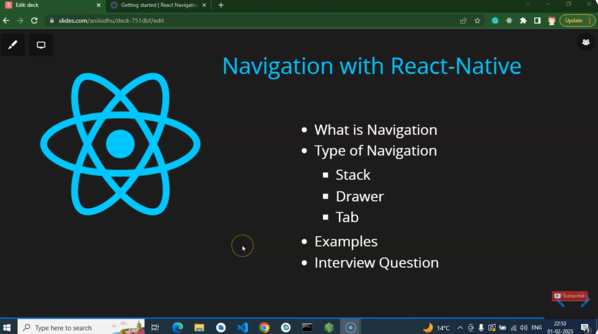
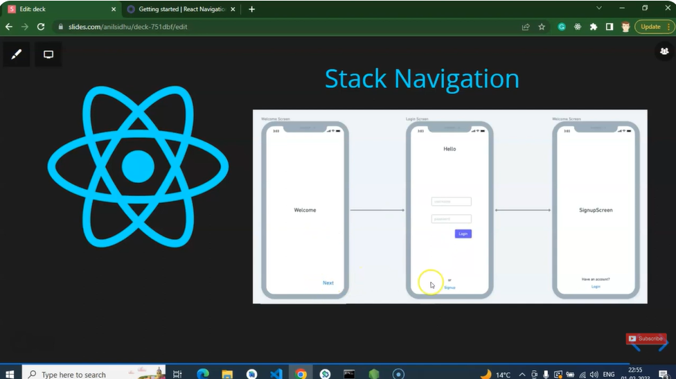
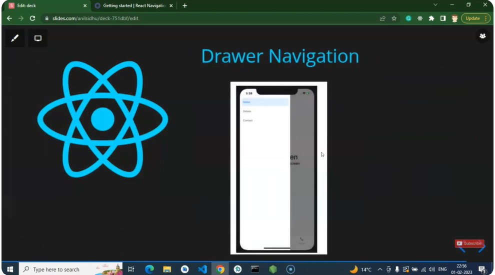
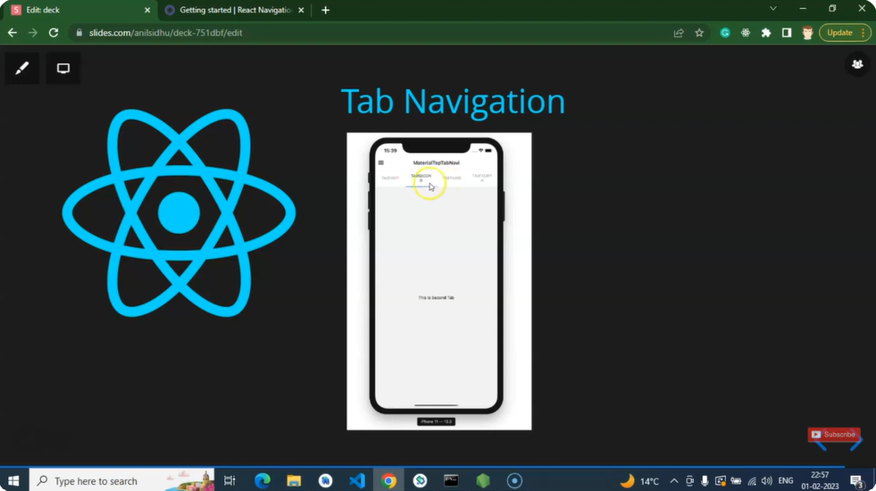
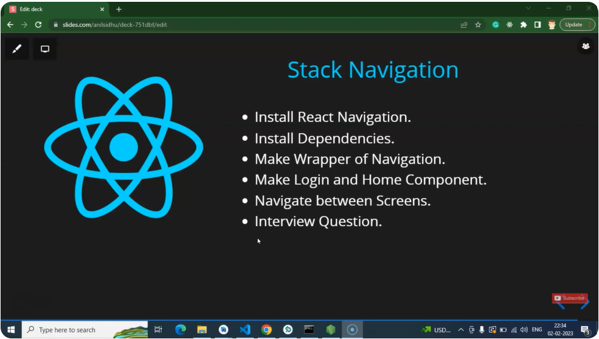
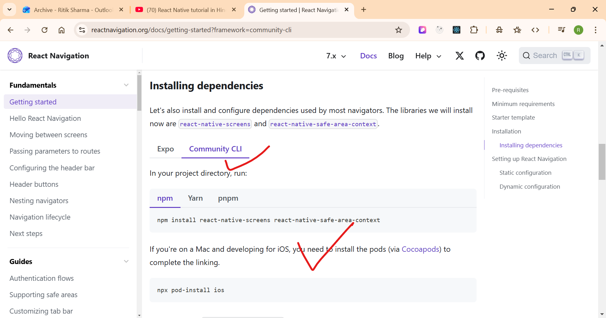
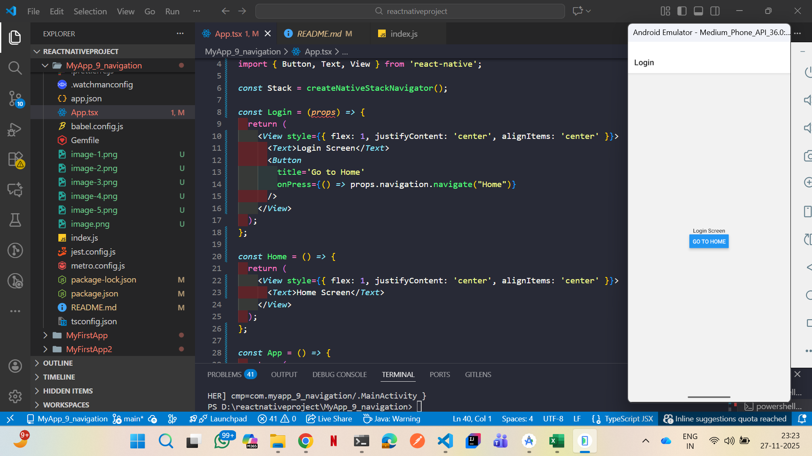
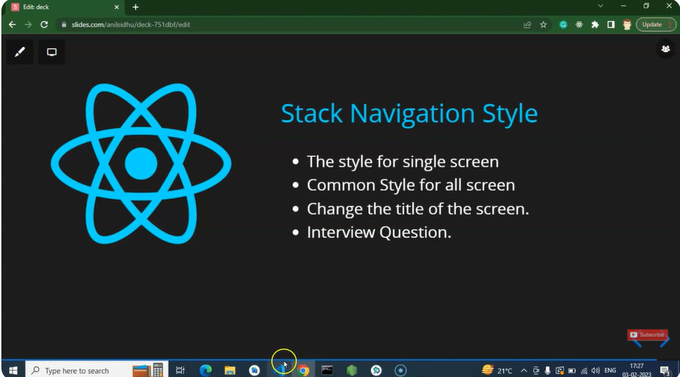
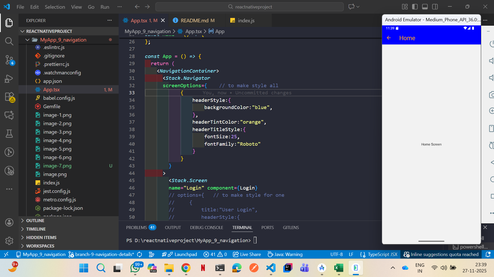

# ------ React Native tutorial in Hindi #38 React native navigation | v6 ---------
1) 
2) 
3) 
4) 

# ------ React Native tutorial in Hindi #39 Stack Navigation | React Navigation version 6 -----
1) 
2) go to : https://reactnavigation.org/
3) to install it: npm install @react-navigation/native
4) 
5) npm install react-native-screens react-native-safe-area-context
6) install hte stack navigation: npm install @react-navigation/native-stack
7) 


# ------------ React Native tutorial in Hindi #40 Style in Stack Navigation | React Navigation v6 ----
1) 
2) 

# --------- React Native tutorial in Hindi #41 Button and component in Stack Navigation | React Navigation v6 ----------


Below is the **Complete, Beginner-to-Advanced React Native Navigation Guide — Full Notes, Concepts, Examples, Best Practices (2025)**
This is everything you need to understand Navigation in React Native.

---

# 🚀 **React Native Navigation – Full Notes (2025)**

React Native does **not** include a navigation system by default.
So we use a third-party library called:

# ⭐ **React Navigation (Most Popular & Recommended)**

---

# 📌 **1. Why Navigation Is Needed?**

Navigation allows you to:

✔ Move from one screen to another
✔ Pass data between screens
✔ Create tab bars, bottom tabs, drawers
✔ Control navigation history
✔ Add animations, gestures, headers
✔ Build multi-page apps

---

# 📌 **2. Install React Navigation**

### Step 1: Base Package

```
npm install @react-navigation/native
```

### Step 2: Install Required Dependencies

```
npm install react-native-screens react-native-safe-area-context
```

### Step 3: If your app uses iOS:

```
cd ios && pod install
```

---

# 📌 **3. Types of Navigation in React Native**

React Navigation provides 5 main navigators:

1. **Stack Navigation**
2. **Tab Navigation**
3. **Drawer Navigation**
4. **Material Top Tabs**
5. **Switch Navigator / Auth Flow**

---

# ⭐ **4. Stack Navigation (Most Common)**

Used for:

✔ Login → Home
✔ Profile → Settings
✔ Product List → Product Details
✔ Back button support

---

## 🧩 **Install Stack Navigator**

```
npm install @react-navigation/stack
```

---

## 🧩 **Basic Stack Navigation Example**

### **App.js**

```js
import * as React from 'react';
import { NavigationContainer } from '@react-navigation/native';
import { createStackNavigator } from '@react-navigation/stack';
import Home from './screens/Home';
import Profile from './screens/Profile';

const Stack = createStackNavigator();

export default function App() {
  return (
    <NavigationContainer>
      <Stack.Navigator>
        <Stack.Screen name="Home" component={Home} />
        <Stack.Screen name="Profile" component={Profile} />
      </Stack.Navigator>
    </NavigationContainer>
  );
}
```

---

## 🧩 Navigate Between Screens

### **Go to another screen**

```js
navigation.navigate("Profile");
```

### **Go back**

```js
navigation.goBack();
```

---

# ⭐ Pass Data Between Screens

### **Send data**

```js
navigation.navigate("Profile", { name: "Ritik", age: 22 });
```

### **Receive data**

```js
const route = useRoute();
console.log(route.params.name);
```

---

# ⭐ Customize Header

```js
<Stack.Screen 
  name="Home"
  component={Home}
  options={{
    title: "Welcome",
    headerStyle: { backgroundColor: "blue" },
    headerTintColor: "white",
  }}
/>
```

---

# 📌 **5. Bottom Tab Navigation**

Used for:

✔ Instagram-style footer
✔ Home / Search / Profile
✔ Dashboard navigation

Install:

```
npm install @react-navigation/bottom-tabs
```

---

## 🧩 Bottom Tab Example

```js
import { createBottomTabNavigator } from '@react-navigation/bottom-tabs';

const Tab = createBottomTabNavigator();

function MyTabs() {
  return (
    <Tab.Navigator>
      <Tab.Screen name="Home" component={Home} />
      <Tab.Screen name="Settings" component={Settings} />
    </Tab.Navigator>
  );
}
```

---

# 📌 **6. Drawer Navigation (Side Menu)**

Used for:

✔ Gmail-style menu
✔ Admin panel
✔ Settings menu

Install:

```
npm install @react-navigation/drawer
```

Example:

```js
import { createDrawerNavigator } from '@react-navigation/drawer';

const Drawer = createDrawerNavigator();

function MyDrawer() {
  return (
    <Drawer.Navigator>
      <Drawer.Screen name="Home" component={Home} />
      <Drawer.Screen name="Profile" component={Profile} />
    </Drawer.Navigator>
  );
}
```

---

# 📌 **7. Combine Navigators (Professional Apps)**

Professional apps combine:

✔ Root Navigator
✔ Auth Stack
✔ Bottom Tabs
✔ Drawer inside Tabs

Example structure:

```
NavigationContainer
 └── RootStack
      ├── AuthStack (Login)
      └── MainTabs
           ├── HomeStack
           ├── SearchStack
           ├── Profile
```

---

# 📌 **8. Navigation Hooks**

React Navigation Hooks:

| Hook               | Purpose                        |
| ------------------ | ------------------------------ |
| `useNavigation()`  | Navigate programmatically      |
| `useRoute()`       | Get route params               |
| `useFocusEffect()` | Run code when screen is active |

Example:

```js
import { useNavigation } from '@react-navigation/native';

const navigation = useNavigation();
navigation.navigate("Home");
```

---

# 📌 **9. Reset Navigation (After Login)**

```js
navigation.reset({
  index: 0,
  routes: [{ name: "Home" }],
});
```

---

# 📌 **10. Remove Back Button**

```js
options={{ headerBackVisible: false }}
```

---

# 📌 **11. Deep Linking**

Used for:

✔ Open app from URL
✔ WhatsApp-style links
✔ Push notifications redirect

Example:

```
myapp://profile/123
```

---

# 📌 **12. Navigation Best Practices**

✔ Use a **separate folder** for navigation
✔ Keep screens inside `/screens` folder
✔ Use constants for routes
✔ Group stacks logically
✔ Pass less data through params
✔ Use global state for big data

---

# 📁 **Recommended Folder Structure**

```
src/
 ├── navigation/
 │     ├── StackNavigator.js
 │     ├── TabNavigator.js
 │     ├── DrawerNavigator.js
 ├── screens/
 ├── components/
 ├── assets/
 ├── hooks/
 └── App.js
```

---

# ⚡ Want Full Code Setup?

If you want, I can generate:

✔ A full project with
– Stack
– Tabs
– Drawer
– Auth Stack
– Nested navigation
– Screens + Icons + Styles

✔ Professional folder structure
✔ Pre-installed navigation dependencies
✔ Example Login → Dashboard navigation flow

Just say **“Create full navigation project”** and I will prepare everything.

Awesome — I’ll generate a complete **React Native (JavaScript)** starter project with **Stack + Tabs + Drawer + Auth flow**, ready-to-run code files, folder structure, commands, and setup notes. I’ll also point out the one uploaded asset you provided so you can drop it into the project.

Below you’ll find:

* Quick setup commands
* Project folder structure
* `package.json` (deps)
* `babel.config.js` additions (Reanimated)
* `index.js` and `App.js`
* `src/navigation/*` (Root, AuthStack, HomeStack, TabNavigator, Drawer)
* `src/screens/*` (Login, Signup, Home, Details, Search, Profile, Settings, Help)
* Small reusable components (HeaderButton)
* How to use the uploaded image asset (local path)
* Run & troubleshooting notes

---

# Quick commands (create & bootstrap)

1. Create project (RN CLI)

```
npx @react-native-community/cli init MyNavApp
cd MyNavApp
```

2. Install navigation & supporting libs

```
npm install @react-navigation/native
npm install @react-navigation/stack @react-navigation/bottom-tabs @react-navigation/drawer
npm install react-native-screens react-native-safe-area-context react-native-gesture-handler react-native-reanimated react-native-vector-icons
```

3. iOS pods (if on macOS / building iOS)

```
cd ios
pod install
cd ..
```

4. Add Reanimated babel plugin & rebuild
   (see `babel.config.js` below)

5. Start Metro and run:

```
npx react-native start
npx react-native run-android
# or
npx react-native run-ios
```

---

# Project folder structure (recommended)

```
MyNavApp/
├─ android/
├─ ios/
├─ src/
│  ├─ navigation/
│  │  ├─ RootNavigator.js
│  │  ├─ AuthStack.js
│  │  ├─ HomeStack.js
│  │  ├─ TabNavigator.js
│  │  └─ DrawerNavigator.js
│  ├─ screens/
│  │  ├─ Auth/
│  │  │  ├─ LoginScreen.js
│  │  │  └─ SignupScreen.js
│  │  ├─ Home/
│  │  │  ├─ HomeScreen.js
│  │  │  └─ DetailsScreen.js
│  │  ├─ SearchScreen.js
│  │  ├─ ProfileScreen.js
│  │  ├─ SettingsScreen.js
│  │  └─ HelpScreen.js
│  ├─ components/
│  │  └─ HeaderButton.js
│  ├─ assets/
│  │  └─ (place images here)
│  └─ AppNavigatorHelpers.js
├─ index.js
├─ App.js
├─ package.json
└─ babel.config.js
```

---

# `package.json` (important deps snippet)

Add these dependencies (the project `npm install` commands above will add them). Example `package.json` dependencies section:

```json
"dependencies": {
  "@react-navigation/bottom-tabs": "^6.7.0",
  "@react-navigation/drawer": "^6.5.0",
  "@react-navigation/native": "^6.1.6",
  "@react-navigation/stack": "^6.3.16",
  "react-native-gesture-handler": "^2.10.0",
  "react-native-reanimated": "^3.0.0",
  "react-native-safe-area-context": "^4.5.0",
  "react-native-screens": "^3.20.0",
  "react-native-vector-icons": "^9.2.0"
}
```

(versions will vary — use latest stable; `npm install` will populate your `package.json`.)

---

# `babel.config.js` (Reanimated requirement)

```js
module.exports = {
  presets: ['module:metro-react-native-babel-preset'],
  plugins: [
    'react-native-reanimated/plugin', // MUST be last in the plugins array
  ],
};
```

> **Important:** Put `'react-native-reanimated/plugin'` as the last plugin.

---

# `index.js`

```js
import 'react-native-gesture-handler'; // must be at top
import { AppRegistry } from 'react-native';
import App from './App';
import { name as appName } from './app.json';
import 'react-native-reanimated';

AppRegistry.registerComponent(appName, () => App);
```

---

# `App.js`

```js
import React from 'react';
import { StatusBar } from 'react-native';
import { NavigationContainer } from '@react-navigation/native';
import RootNavigator from './src/navigation/RootNavigator';
import { GestureHandlerRootView } from 'react-native-gesture-handler';

export default function App() {
  return (
    <GestureHandlerRootView style={{ flex: 1 }}>
      <StatusBar barStyle="dark-content" />
      <NavigationContainer>
        <RootNavigator />
      </NavigationContainer>
    </GestureHandlerRootView>
  );
}
```

---

# Navigation files

### `src/navigation/RootNavigator.js`

```js
import React, { useState, useEffect } from 'react';
import { createStackNavigator } from '@react-navigation/stack';
import AuthStack from './AuthStack';
import DrawerNavigator from './DrawerNavigator';
import { ActivityIndicator, View } from 'react-native';

const Stack = createStackNavigator();

export default function RootNavigator() {
  // Replace below with real auth state (context, redux, secure store)
  const [isLoading, setIsLoading] = useState(true);
  const [userToken, setUserToken] = useState(null);

  useEffect(() => {
    // simulate loading / check token
    setTimeout(() => {
      setIsLoading(false);
    }, 800);
  }, []);

  if (isLoading) {
    return (
      <View style={{flex:1,justifyContent:'center',alignItems:'center'}}>
        <ActivityIndicator size="large" />
      </View>
    );
  }

  return (
    <Stack.Navigator screenOptions={{ headerShown: false }}>
      {userToken == null ? (
        <Stack.Screen name="Auth" component={AuthStack} />
      ) : (
        <Stack.Screen name="Main" component={DrawerNavigator} />
      )}
    </Stack.Navigator>
  );
}
```

---

### `src/navigation/AuthStack.js`

```js
import React from 'react';
import { createStackNavigator } from '@react-navigation/stack';
import LoginScreen from '../screens/Auth/LoginScreen';
import SignupScreen from '../screens/Auth/SignupScreen';

const Stack = createStackNavigator();

export default function AuthStack() {
  return (
    <Stack.Navigator initialRouteName="Login">
      <Stack.Screen name="Login" component={LoginScreen} options={{ title: 'Login' }} />
      <Stack.Screen name="Signup" component={SignupScreen} options={{ title: 'Sign Up' }} />
    </Stack.Navigator>
  );
}
```

---

### `src/navigation/HomeStack.js`

```js
import React from 'react';
import { createStackNavigator } from '@react-navigation/stack';
import HomeScreen from '../screens/Home/HomeScreen';
import DetailsScreen from '../screens/Home/DetailsScreen';

const Stack = createStackNavigator();

export default function HomeStack() {
  return (
    <Stack.Navigator>
      <Stack.Screen name="HomeMain" component={HomeScreen} options={{ title: 'Home' }} />
      <Stack.Screen name="Details" component={DetailsScreen} options={{ title: 'Details' }} />
    </Stack.Navigator>
  );
}
```

---

### `src/navigation/TabNavigator.js`

```js
import React from 'react';
import { createBottomTabNavigator } from '@react-navigation/bottom-tabs';
import HomeStack from './HomeStack';
import SearchScreen from '../screens/SearchScreen';
import ProfileScreen from '../screens/ProfileScreen';
import Icon from 'react-native-vector-icons/Ionicons';

const Tab = createBottomTabNavigator();

export default function TabNavigator() {
  return (
    <Tab.Navigator
      screenOptions={({ route }) => ({
        headerShown: false,
        tabBarIcon: ({ color, size }) => {
          let name = 'home';
          if (route.name === 'Home') name = 'home';
          if (route.name === 'Search') name = 'search';
          if (route.name === 'Profile') name = 'person';
          return <Icon name={name} size={size} color={color} />;
        },
      })}
    >
      <Tab.Screen name="Home" component={HomeStack} />
      <Tab.Screen name="Search" component={SearchScreen} />
      <Tab.Screen name="Profile" component={ProfileScreen} />
    </Tab.Navigator>
  );
}
```

---

### `src/navigation/DrawerNavigator.js`

```js
import React from 'react';
import { createDrawerNavigator } from '@react-navigation/drawer';
import TabNavigator from './TabNavigator';
import SettingsScreen from '../screens/SettingsScreen';
import HelpScreen from '../screens/HelpScreen';

const Drawer = createDrawerNavigator();

export default function DrawerNavigator() {
  return (
    <Drawer.Navigator initialRouteName="HomeTabs">
      <Drawer.Screen name="HomeTabs" component={TabNavigator} options={{ title: 'Home' }} />
      <Drawer.Screen name="Settings" component={SettingsScreen} />
      <Drawer.Screen name="Help" component={HelpScreen} />
    </Drawer.Navigator>
  );
}
```

---

# Screens (simple versions you can extend)

### `src/screens/Auth/LoginScreen.js`

```js
import React from 'react';
import { View, Text, Button, StyleSheet } from 'react-native';

export default function LoginScreen({ navigation }) {
  return (
    <View style={styles.container}>
      <Text style={styles.title}>Login Screen</Text>

      {/* Replace below with form + API */}
      <Button title="Login (simulate)" onPress={() => {
        // in real app, after success set auth token (context/redux)
        navigation.replace('Main'); // note: depends on how RootNavigator configured
      }} />

      <Button title="Create account" onPress={() => navigation.navigate('Signup')} />
    </View>
  );
}

const styles = StyleSheet.create({
  container:{flex:1,justifyContent:'center',alignItems:'center',padding:20},
  title:{fontSize:24,marginBottom:20}
});
```

> Note: `navigation.replace('Main')` is illustrative; in the RootNavigator example, you'd update auth state instead. Adjust according to your auth flow.

---

### `src/screens/Auth/SignupScreen.js`

```js
import React from 'react';
import { View, Text, Button, StyleSheet } from 'react-native';

export default function SignupScreen({ navigation }) {
  return (
    <View style={styles.container}>
      <Text style={styles.title}>Signup Screen</Text>
      <Button title="Sign Up" onPress={() => navigation.goBack()} />
    </View>
  );
}

const styles = StyleSheet.create({
  container:{flex:1,justifyContent:'center',alignItems:'center',padding:20},
  title:{fontSize:24,marginBottom:20}
});
```

---

### `src/screens/Home/HomeScreen.js`

```js
import React from 'react';
import { View, Text, Button, StyleSheet } from 'react-native';

export default function HomeScreen({ navigation }) {
  return (
    <View style={styles.container}>
      <Text style={styles.title}>Home Screen</Text>
      <Button title="Go to details" onPress={() => navigation.navigate('Details')} />
    </View>
  );
}

const styles = StyleSheet.create({
  container:{flex:1,justifyContent:'center',alignItems:'center'},
  title:{fontSize:22}
});
```

---

### `src/screens/Home/DetailsScreen.js`

```js
import React from 'react';
import { View, Text, StyleSheet } from 'react-native';

export default function DetailsScreen({ route }) {
  return (
    <View style={styles.container}>
      <Text style={styles.title}>Details Screen</Text>
      <Text>Passed params: {JSON.stringify(route.params)}</Text>
    </View>
  );
}

const styles = StyleSheet.create({
  container:{flex:1,justifyContent:'center',alignItems:'center'},
  title:{fontSize:22}
});
```

---

### `src/screens/SearchScreen.js`

```js
import React from 'react';
import { View, Text, StyleSheet } from 'react-native';

export default function SearchScreen() {
  return (
    <View style={styles.container}><Text style={styles.title}>Search</Text></View>
  );
}

const styles = StyleSheet.create({
  container:{flex:1,justifyContent:'center',alignItems:'center'},
  title:{fontSize:22}
});
```

---

### `src/screens/ProfileScreen.js`

```js
import React from 'react';
import { View, Text, StyleSheet } from 'react-native';

export default function ProfileScreen() {
  return (
    <View style={styles.container}><Text style={styles.title}>Profile</Text></View>
  );
}

const styles = StyleSheet.create({
  container:{flex:1,justifyContent:'center',alignItems:'center'},
  title:{fontSize:22}
});
```

---

### `src/screens/SettingsScreen.js`

```js
import React from 'react';
import { View, Text, StyleSheet } from 'react-native';

export default function SettingsScreen() {
  return (
    <View style={styles.container}><Text style={styles.title}>Settings</Text></View>
  );
}

const styles = StyleSheet.create({
  container:{flex:1,justifyContent:'center',alignItems:'center'},
  title:{fontSize:22}
});
```

---

### `src/screens/HelpScreen.js`

```js
import React from 'react';
import { View, Text, StyleSheet } from 'react-native';

export default function HelpScreen() {
  return (
    <View style={styles.container}><Text style={styles.title}>Help & Support</Text></View>
  );
}

const styles = StyleSheet.create({
  container:{flex:1,justifyContent:'center',alignItems:'center'},
  title:{fontSize:22}
});
```

---

# Small reusable component

### `src/components/HeaderButton.js`

```js
import React from 'react';
import { TouchableOpacity, Text, StyleSheet } from 'react-native';

export default function HeaderButton({ title, onPress }) {
  return (
    <TouchableOpacity style={styles.btn} onPress={onPress}>
      <Text style={styles.text}>{title}</Text>
    </TouchableOpacity>
  );
}

const styles = StyleSheet.create({
  btn: { paddingHorizontal:12, paddingVertical:6, backgroundColor:'#007bff', borderRadius:6 },
  text: { color:'#fff' }
});
```

---

# Using your uploaded image asset

You uploaded an image earlier. Its path on the machine here is:

```
/mnt/data/An_infographic_in_a_vertical_layout_illustrates_th.png
```

(Keep this path to reference or move the file into your project `src/assets` folder.)

To use it in the app, copy it into `src/assets/images/` and reference like:

```js
import React from 'react';
import { Image } from 'react-native';
import infographic from '../assets/images/An_infographic_in_a_vertical_layout_illustrates_th.png';

export default function Example() {
  return <Image source={infographic} style={{ width: 300, height: 400 }} resizeMode="contain" />;
}
```

Or if for a quick test you want to require the absolute path directly (not recommended for production), you can try:

```js
<Image source={{ uri: 'file:///mnt/data/An_infographic_in_a_vertical_layout_illustrates_th.png' }} style={{ width: 300, height: 400 }} />
```

> Note: the recommended approach is copy the file into `src/assets/images/` and `import` it.

---

# Extra required Android/iOS native steps (common pitfalls)

1. **Gesture handler**: You already imported `'react-native-gesture-handler'` at the top of `index.js`.
2. **Reanimated**: After installing `react-native-reanimated`, add the babel plugin (shown earlier). Also rebuild the app after installing Reanimated:

   ```
   npx react-native run-android
   ```
3. **Vector icons**: If icons don’t show on Android, follow the vector icons install docs (sometimes additional gradle config required).
4. **Android 260 path limit**: On Windows keep project path short to avoid long filename issues.
5. **AndroidManifest & iOS Info.plist**: Add permissions (camera, location) if the packages require them.

---

# Run & build checklist

1. `npm install`
2. `npx pod-install ios` (or `cd ios && pod install`)
3. `npx react-native start --reset-cache` (only if caches are stale)
4. `npx react-native run-android` or `npx react-native run-ios`

---

# Want me to generate the files for you?

I can create the full project files as a downloadable zip and include them here.
If you want that, say **“generate files”** and I’ll produce the project files in the workspace and give you a download link.

---

If anything should be adjusted (TypeScript instead, different navigator behavior, auth flow using Context or Redux, or wiring to a backend like Appwrite/Firebase), tell me which and I’ll update the scaffold accordingly.
