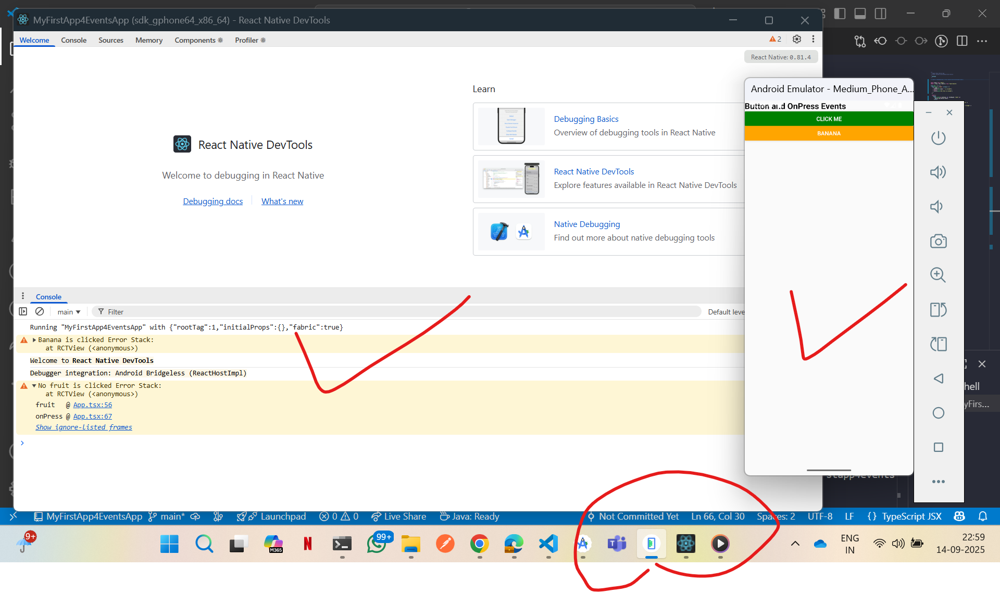

Got it 💡 You want **complete notes** on **events, event handlers, and event types** in **React Native (with TSX)**.
Here’s a structured guide for you 👇

---

# 📌 Events & Event Handling in React Native

In **React Native**, **events** are interactions between the **user** (or system) and the **UI** (like button presses, text input, scrolling, gestures, etc.).
To **handle** an event, you define a function (**event handler**) and pass it to a component’s event prop.

---

## ✅ 1. Event Handlers

An **event handler** is just a function (often arrow function) that gets called when an event happens.

Example:

```tsx
const handlePress = () => {
  console.log("Button was pressed!");
};
```

👉 You pass this function into a component like:

```tsx
<Button title="Click Me" onPress={handlePress} />
```

---

## ✅ 2. Common Types of Events in React Native

### 2.1 Touch Events

* **onPress** → when user taps a button or view.
* **onLongPress** → when user holds down on an element.
* **onPressIn** → triggered as soon as the press starts.
* **onPressOut** → triggered when user releases the press.

📌 Example:

```tsx
<TouchableOpacity
  onPress={() => console.log("Pressed")}
  onLongPress={() => console.log("Long Pressed")}
  onPressIn={() => console.log("Press Started")}
  onPressOut={() => console.log("Press Released")}
>
  <Text>Tap Me</Text>
</TouchableOpacity>
```

---

### 2.2 Text Input Events

* **onChangeText** → called every time the text changes.
* **onFocus** → when input gets focus.
* **onBlur** → when input loses focus.
* **onSubmitEditing** → when user submits (presses enter).

📌 Example:

```tsx
<TextInput
  placeholder="Enter your name"
  onChangeText={(text) => console.log("Text:", text)}
  onFocus={() => console.log("Focused")}
  onBlur={() => console.log("Blurred")}
  onSubmitEditing={() => console.log("Submitted")}
/>
```

---

### 2.3 Scroll & Gesture Events

* **onScroll** → triggered while scrolling.
* **onMomentumScrollBegin** → when momentum scroll starts.
* **onMomentumScrollEnd** → when momentum scroll ends.
* **onScrollEndDrag** → when user stops dragging.

📌 Example:

```tsx
<ScrollView
  onScroll={(e) => console.log("Scrolling Y:", e.nativeEvent.contentOffset.y)}
  scrollEventThrottle={16}
>
  <Text>Lots of content here...</Text>
</ScrollView>
```

---

### 2.4 Keyboard Events

* **onKeyPress** (for `TextInput`) → triggered when a key is pressed.

📌 Example:

```tsx
<TextInput
  onKeyPress={({ nativeEvent }) => console.log("Key pressed:", nativeEvent.key)}
/>
```

---

### 2.5 Other Useful Events

* **onLoad / onError** → for images.
* **onLayout** → when a component’s layout (size/position) is calculated.
* **onEndReached** → for FlatList when reaching the end.

---

## ✅ 3. Event Object (`nativeEvent`)

Many events provide a **nativeEvent** object with extra info.

📌 Example with `onScroll`:

```tsx
<ScrollView
  onScroll={(event) => {
    console.log("Scroll position:", event.nativeEvent.contentOffset.y);
  }}
/>
```

---

## ✅ 4. Writing Event Handlers in TypeScript

In TypeScript, you can type event handlers for clarity.

📌 Example for a button press:

```tsx
const handlePress = (): void => {
  console.log("Pressed!");
};
```

📌 Example for `TextInput` change:

```tsx
const handleChange = (text: string): void => {
  console.log("New text:", text);
};
```

📌 Example for scroll event:

```tsx
import { NativeSyntheticEvent, NativeScrollEvent } from "react-native";

const handleScroll = (event: NativeSyntheticEvent<NativeScrollEvent>) => {
  console.log(event.nativeEvent.contentOffset.y);
};
```

---

## ✅ 5. Best Practices

1. **Keep handlers short** → delegate heavy logic to helper functions.
2. **Use hooks** (`useState`, `useEffect`) with events to update UI.
3. **Avoid inline handlers** for performance in large lists.

   ```tsx
   // ❌ Bad (creates new fn each render)
   <Button title="Click" onPress={() => console.log("Hi")} />

   // ✅ Good
   <Button title="Click" onPress={handlePress} />
   ```
4. **Type your events** in TSX for better autocomplete and error checking.

---

## ✅ 6. Demo: Button Event Updating State

```tsx
import React, { useState } from "react";
import { SafeAreaView, Button, Text, StyleSheet } from "react-native";

export default function App() {
  const [count, setCount] = useState(0);

  const handlePress = () => {
    setCount(count + 1);
  };

  return (
    <SafeAreaView style={styles.container}>
      <Text style={styles.text}>You pressed {count} times</Text>
      <Button title="Press Me" onPress={handlePress} />
    </SafeAreaView>
  );
}

const styles = StyleSheet.create({
  container: { flex: 1, justifyContent: "center", alignItems: "center" },
  text: { fontSize: 20, marginBottom: 10 },
});
```

---

# 🎯 Summary

* **Events** = user/system actions (press, input, scroll, etc.).
* **Handlers** = functions that respond to events.
* **Types of events** → Touch, TextInput, Scroll, Keyboard, Layout, Image.
* Use **nativeEvent** for details.
* With TypeScript, type your handlers for safety.

---

👉 Do you want me to create a **cheat sheet table (all common events + props + handler types)** so you can keep it for quick reference while coding?

- yes:
Perfect idea ✅ — a **React Native Events + Props + Handler Types Cheat Sheet** will help you a lot when learning.
Here’s a **well-structured table** you can keep handy.

---

# 📘 React Native Events & Handlers Cheat Sheet

| **Component**              | **Common Props (Events/Handlers)**                                                                        | **Handler Type (TypeScript)**                                                           | **Example**                                                                                |
| -------------------------- | --------------------------------------------------------------------------------------------------------- | --------------------------------------------------------------------------------------- | ------------------------------------------------------------------------------------------ |
| **Button**                 | `onPress`                                                                                                 | `() => void`                                                                            | `<Button title="Click" onPress={() => console.log("Pressed")} />`                          |
| **TouchableOpacity**       | `onPress`, `onLongPress`, `onPressIn`, `onPressOut`                                                       | `(event: GestureResponderEvent) => void`                                                | `<TouchableOpacity onPress={() => console.log("Tap")}><Text>Tap</Text></TouchableOpacity>` |
| **Pressable**              | `onPress`, `onLongPress`, `onPressIn`, `onPressOut`, `onHoverIn`, `onHoverOut`, `onFocus`, `onBlur`       | `(event: GestureResponderEvent) => void`                                                | `<Pressable onPress={() => console.log("Pressed")}><Text>Press Me</Text></Pressable>`      |
| **TextInput**              | `onChangeText`, `onFocus`, `onBlur`, `onEndEditing`, `onSubmitEditing`                                    | `(text: string) => void` / `(e: NativeSyntheticEvent<TextInputFocusEventData>) => void` | `<TextInput onChangeText={(t) => setText(t)} />`                                           |
| **ScrollView**             | `onScroll`, `onContentSizeChange`, `onMomentumScrollBegin`, `onMomentumScrollEnd`                         | `(event: NativeSyntheticEvent<NativeScrollEvent>) => void`                              | `<ScrollView onScroll={(e) => console.log(e.nativeEvent.contentOffset.y)} />`              |
| **FlatList / SectionList** | `onEndReached`, `onRefresh`, `onScroll`, `onViewableItemsChanged`                                         | `() => void` / `(info: { viewableItems: ViewToken[]; changed: ViewToken[] }) => void`   | `<FlatList onEndReached={() => console.log("End")} />`                                     |
| **Image**                  | `onLoad`, `onError`, `onLoadStart`, `onLoadEnd`                                                           | `(event: NativeSyntheticEvent<ImageLoadEventData>) => void`                             | `<Image source={{uri: "img.png"}} onLoad={() => console.log("Loaded")} />`                 |
| **Switch**                 | `onValueChange`                                                                                           | `(value: boolean) => void`                                                              | `<Switch onValueChange={(val) => console.log(val)} />`                                     |
| **Picker / Dropdown**      | `onValueChange`                                                                                           | `(itemValue: string, itemIndex: number) => void`                                        | `<Picker onValueChange={(val) => setSelected(val)} />`                                     |
| **KeyboardAvoidingView**   | `onKeyboardWillShow`, `onKeyboardDidShow`, `onKeyboardWillHide`, `onKeyboardDidHide` (via `Keyboard` API) | `(event: KeyboardEvent) => void`                                                        | `Keyboard.addListener("keyboardDidShow", e => console.log(e))`                             |

---

## 🔑 Notes:

* `GestureResponderEvent` → generic type for touch/press events.
* `NativeSyntheticEvent<T>` → wrapper around native event objects.
* Always use **arrow functions** inside event props if you need to pass parameters.

---
1) 


