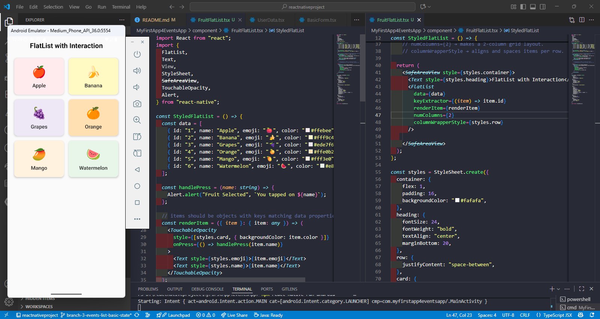
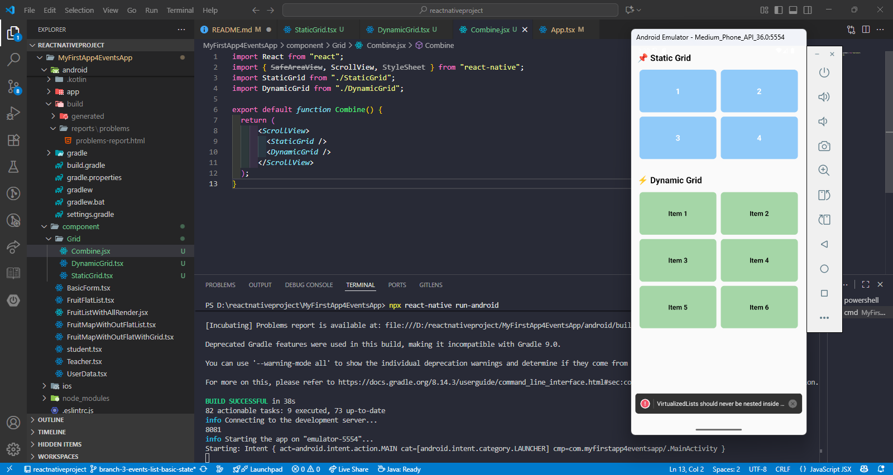

Got it 💡 You want **complete notes** on **events, event handlers, and event types** in **React Native (with TSX)**.
Here’s a structured guide for you 👇

---

# 📌 Events & Event Handling in React Native

In **React Native**, **events** are interactions between the **user** (or system) and the **UI** (like button presses, text input, scrolling, gestures, etc.).
To **handle** an event, you define a function (**event handler**) and pass it to a component’s event prop.

---

## ✅ 1. Event Handlers

An **event handler** is just a function (often arrow function) that gets called when an event happens.

Example:

```tsx
const handlePress = () => {
  console.log("Button was pressed!");
};
```

👉 You pass this function into a component like:

```tsx
<Button title="Click Me" onPress={handlePress} />
```

---

## ✅ 2. Common Types of Events in React Native

### 2.1 Touch Events

* **onPress** → when user taps a button or view.
* **onLongPress** → when user holds down on an element.
* **onPressIn** → triggered as soon as the press starts.
* **onPressOut** → triggered when user releases the press.

📌 Example:

```tsx
<TouchableOpacity
  onPress={() => console.log("Pressed")}
  onLongPress={() => console.log("Long Pressed")}
  onPressIn={() => console.log("Press Started")}
  onPressOut={() => console.log("Press Released")}
>
  <Text>Tap Me</Text>
</TouchableOpacity>
```

---

### 2.2 Text Input Events

* **onChangeText** → called every time the text changes.
* **onFocus** → when input gets focus.
* **onBlur** → when input loses focus.
* **onSubmitEditing** → when user submits (presses enter).

📌 Example:

```tsx
<TextInput
  placeholder="Enter your name"
  onChangeText={(text) => console.log("Text:", text)}
  onFocus={() => console.log("Focused")}
  onBlur={() => console.log("Blurred")}
  onSubmitEditing={() => console.log("Submitted")}
/>
```

---

### 2.3 Scroll & Gesture Events

* **onScroll** → triggered while scrolling.
* **onMomentumScrollBegin** → when momentum scroll starts.
* **onMomentumScrollEnd** → when momentum scroll ends.
* **onScrollEndDrag** → when user stops dragging.

📌 Example:

```tsx
<ScrollView
  onScroll={(e) => console.log("Scrolling Y:", e.nativeEvent.contentOffset.y)}
  scrollEventThrottle={16}
>
  <Text>Lots of content here...</Text>
</ScrollView>
```

---

### 2.4 Keyboard Events

* **onKeyPress** (for `TextInput`) → triggered when a key is pressed.

📌 Example:

```tsx
<TextInput
  onKeyPress={({ nativeEvent }) => console.log("Key pressed:", nativeEvent.key)}
/>
```

---

### 2.5 Other Useful Events

* **onLoad / onError** → for images.
* **onLayout** → when a component’s layout (size/position) is calculated.
* **onEndReached** → for FlatList when reaching the end.

---

## ✅ 3. Event Object (`nativeEvent`)

Many events provide a **nativeEvent** object with extra info.

📌 Example with `onScroll`:

```tsx
<ScrollView
  onScroll={(event) => {
    console.log("Scroll position:", event.nativeEvent.contentOffset.y);
  }}
/>
```

---

## ✅ 4. Writing Event Handlers in TypeScript

In TypeScript, you can type event handlers for clarity.

📌 Example for a button press:

```tsx
const handlePress = (): void => {
  console.log("Pressed!");
};
```

📌 Example for `TextInput` change:

```tsx
const handleChange = (text: string): void => {
  console.log("New text:", text);
};
```

📌 Example for scroll event:

```tsx
import { NativeSyntheticEvent, NativeScrollEvent } from "react-native";

const handleScroll = (event: NativeSyntheticEvent<NativeScrollEvent>) => {
  console.log(event.nativeEvent.contentOffset.y);
};
```

---

## ✅ 5. Best Practices

1. **Keep handlers short** → delegate heavy logic to helper functions.
2. **Use hooks** (`useState`, `useEffect`) with events to update UI.
3. **Avoid inline handlers** for performance in large lists.

   ```tsx
   // ⌠Bad (creates new fn each render)
   <Button title="Click" onPress={() => console.log("Hi")} />

   // ✅ Good
   <Button title="Click" onPress={handlePress} />
   ```
4. **Type your events** in TSX for better autocomplete and error checking.

---

## ✅ 6. Demo: Button Event Updating State

```tsx
import React, { useState } from "react";
import { SafeAreaView, Button, Text, StyleSheet } from "react-native";

export default function App() {
  const [count, setCount] = useState(0);

  const handlePress = () => {
    setCount(count + 1);
  };

  return (
    <SafeAreaView style={styles.container}>
      <Text style={styles.text}>You pressed {count} times</Text>
      <Button title="Press Me" onPress={handlePress} />
    </SafeAreaView>
  );
}

const styles = StyleSheet.create({
  container: { flex: 1, justifyContent: "center", alignItems: "center" },
  text: { fontSize: 20, marginBottom: 10 },
});
```

---

# 🯠Summary

* **Events** = user/system actions (press, input, scroll, etc.).
* **Handlers** = functions that respond to events.
* **Types of events** → Touch, TextInput, Scroll, Keyboard, Layout, Image.
* Use **nativeEvent** for details.
* With TypeScript, type your handlers for safety.

---

👉 Do you want me to create a **cheat sheet table (all common events + props + handler types)** so you can keep it for quick reference while coding?

- yes:
Perfect idea ✅ — a **React Native Events + Props + Handler Types Cheat Sheet** will help you a lot when learning.
Here’s a **well-structured table** you can keep handy.

---

# 📘 React Native Events & Handlers Cheat Sheet

| **Component**              | **Common Props (Events/Handlers)**                                                                        | **Handler Type (TypeScript)**                                                           | **Example**                                                                                |
| -------------------------- | --------------------------------------------------------------------------------------------------------- | --------------------------------------------------------------------------------------- | ------------------------------------------------------------------------------------------ |
| **Button**                 | `onPress`                                                                                                 | `() => void`                                                                            | `<Button title="Click" onPress={() => console.log("Pressed")} />`                          |
| **TouchableOpacity**       | `onPress`, `onLongPress`, `onPressIn`, `onPressOut`                                                       | `(event: GestureResponderEvent) => void`                                                | `<TouchableOpacity onPress={() => console.log("Tap")}><Text>Tap</Text></TouchableOpacity>` |
| **Pressable**              | `onPress`, `onLongPress`, `onPressIn`, `onPressOut`, `onHoverIn`, `onHoverOut`, `onFocus`, `onBlur`       | `(event: GestureResponderEvent) => void`                                                | `<Pressable onPress={() => console.log("Pressed")}><Text>Press Me</Text></Pressable>`      |
| **TextInput**              | `onChangeText`, `onFocus`, `onBlur`, `onEndEditing`, `onSubmitEditing`                                    | `(text: string) => void` / `(e: NativeSyntheticEvent<TextInputFocusEventData>) => void` | `<TextInput onChangeText={(t) => setText(t)} />`                                           |
| **ScrollView**             | `onScroll`, `onContentSizeChange`, `onMomentumScrollBegin`, `onMomentumScrollEnd`                         | `(event: NativeSyntheticEvent<NativeScrollEvent>) => void`                              | `<ScrollView onScroll={(e) => console.log(e.nativeEvent.contentOffset.y)} />`              |
| **FlatList / SectionList** | `onEndReached`, `onRefresh`, `onScroll`, `onViewableItemsChanged`                                         | `() => void` / `(info: { viewableItems: ViewToken[]; changed: ViewToken[] }) => void`   | `<FlatList onEndReached={() => console.log("End")} />`                                     |
| **Image**                  | `onLoad`, `onError`, `onLoadStart`, `onLoadEnd`                                                           | `(event: NativeSyntheticEvent<ImageLoadEventData>) => void`                             | `<Image source={{uri: "img.png"}} onLoad={() => console.log("Loaded")} />`                 |
| **Switch**                 | `onValueChange`                                                                                           | `(value: boolean) => void`                                                              | `<Switch onValueChange={(val) => console.log(val)} />`                                     |
| **Picker / Dropdown**      | `onValueChange`                                                                                           | `(itemValue: string, itemIndex: number) => void`                                        | `<Picker onValueChange={(val) => setSelected(val)} />`                                     |
| **KeyboardAvoidingView**   | `onKeyboardWillShow`, `onKeyboardDidShow`, `onKeyboardWillHide`, `onKeyboardDidHide` (via `Keyboard` API) | `(event: KeyboardEvent) => void`                                                        | `Keyboard.addListener("keyboardDidShow", e => console.log(e))`                             |

---

## 🔑 Notes:

* `GestureResponderEvent` → generic type for touch/press events.
* `NativeSyntheticEvent<T>` → wrapper around native event objects.
* Always use **arrow functions** inside event props if you need to pass parameters.

---
1) 

## -------- Basic state --------
1) 
# -- notes of state and props in react native -----
Got it 👠Let me give you **well-structured notes on `State` and `Props` in React Native** so you can keep them as reference while coding.

---

# 📒 Notes on **State & Props** in React Native

## 🔹 1. What are Props?

* **Definition**:
  `props` (short for **properties**) are read-only inputs passed **from parent component to child component**.
  They allow you to customize and reuse components.

* **Key points**:

  * Passed as attributes to components.
  * Immutable → cannot be modified by the child component.
  * Used for configuration and data flow **from parent → child**.
  * Similar to function parameters.

* **Example**:

  ```tsx
  import React from "react";
  import { Text } from "react-native";

  type GreetingProps = {
    name: string;
  };

  const Greeting = ({ name }: GreetingProps) => {
    return <Text>Hello, {name}! 👋</Text>;
  };

  export default Greeting;
  ```

  **Usage**:

  ```tsx
  <Greeting name="Ritik" />
  <Greeting name="Sharma" />
  ```

---

## 🔹 2. What is State?

* **Definition**:
  `state` is a built-in object that stores **mutable data** inside a component.
  When state changes → the component **re-renders** automatically.

* **Key points**:

  * Managed within the component itself.
  * Can be changed using `setState` (class components) or `useState` (functional components).
  * Local to the component (unless shared via context or props).
  * Ideal for user input, UI changes, toggles, counters, etc.

* **Example (using `useState`)**:

  ```tsx
  import React, { useState } from "react";
  import { View, Button, Text } from "react-native";

  const CounterApp = () => {
    const [count, setCount] = useState(0);

    return (
      <View>
        <Text>Count: {count}</Text>
        <Button title="Increase" onPress={() => setCount(count + 1)} />
        <Button title="Decrease" onPress={() => setCount(count - 1)} />
      </View>
    );
  };

  export default CounterApp;
  ```

---

## 🔹 3. Differences Between Props & State

| Feature          | Props                                | State                                   |
| ---------------- | ------------------------------------ | --------------------------------------- |
| Definition       | Data passed **to** a component       | Data managed **inside** a component     |
| Mutability       | **Immutable** (cannot change inside) | **Mutable** (can be updated)            |
| Who controls it? | Parent component                     | The component itself                    |
| Usage            | Configuring/reusing components       | Handling dynamic data/UI updates        |
| Example          | `<Greeting name="Ritik" />`          | `const [count, setCount] = useState(0)` |

---

## 🔹 4. Combining Props & State

Often you’ll use both together:

* **Props** → to get initial data from parent.
* **State** → to allow updates inside the component.

**Example**:

```tsx
import React, { useState } from "react";
import { View, Text, Button } from "react-native";

type CounterProps = {
  initialCount: number;
};

const Counter = ({ initialCount }: CounterProps) => {
  const [count, setCount] = useState(initialCount);

  return (
    <View>
      <Text>Count: {count}</Text>
      <Button title="Increase" onPress={() => setCount(count + 1)} />
    </View>
  );
};

export default Counter;
```

**Usage**:

```tsx
<Counter initialCount={5} />
```

---

## 🔹 5. Best Practices

✅ Use **props** for data/config that shouldn’t change in child.
✅ Use **state** for dynamic data that should update & trigger re-render.
✅ Keep state as **minimal** as possible (avoid duplication).
✅ If multiple components need the same state → lift it up to a parent or use **Context API**.

---

👉 Do you want me to also create a **cheat sheet table for React Native State Hooks (`useState`, `useEffect`, `useReducer`)** just like we did for events?

- yes:


## ------- difference between state and varaible --------

Perfect 🚀 Here’s a **React Native State Management Cheat Sheet (with Hooks)** — a quick reference for `useState`, `useEffect`, `useReducer` and how they’re used with props + events.

---

# 📒 **React Native State Management Cheat Sheet**

## 🔹 1. `useState` (Basic State Hook)

* **Purpose**: Manage local state in functional components.
* **Syntax**:

  ```tsx
  const [state, setState] = useState(initialValue);
  ```
* **Example**:

  ```tsx
  const [count, setCount] = useState(0);

  <Button title="+" onPress={() => setCount(count + 1)} />
  <Text>{count}</Text>
  ```

---

## 🔹 2. `useEffect` (Side Effects)

* **Purpose**: Run side effects (API calls, subscriptions, timers).
* **Syntax**:

  ```tsx
  useEffect(() => {
    // effect code here
    return () => {
      // cleanup (optional)
    };
  }, [dependencies]);
  ```
* **Example**:

  ```tsx
  const [time, setTime] = useState(new Date());

  useEffect(() => {
    const timer = setInterval(() => setTime(new Date()), 1000);
    return () => clearInterval(timer); // cleanup
  }, []);

  <Text>{time.toLocaleTimeString()}</Text>
  ```

---

## 🔹 3. `useReducer` (Complex State)

* **Purpose**: Manage more complex state logic with multiple transitions.
* **Syntax**:

  ```tsx
  const [state, dispatch] = useReducer(reducer, initialState);
  ```
* **Example**:

  ```tsx
  const reducer = (state: number, action: { type: string }) => {
    switch (action.type) {
      case "increment": return state + 1;
      case "decrement": return state - 1;
      default: return state;
    }
  };

  const [count, dispatch] = useReducer(reducer, 0);

  <Button title="+" onPress={() => dispatch({ type: "increment" })} />
  <Button title="-" onPress={() => dispatch({ type: "decrement" })} />
  <Text>{count}</Text>
  ```

---

## 🔹 4. Props + State Together

* **Props** = external data (read-only).
* **State** = internal data (can change).

**Example**:

```tsx
type CounterProps = { initial: number };

const Counter = ({ initial }: CounterProps) => {
  const [count, setCount] = useState(initial);
  return (
    <View>
      <Text>{count}</Text>
      <Button title="+" onPress={() => setCount(count + 1)} />
    </View>
  );
};

<Counter initial={5} />
```

---

## 🔹 5. Cheat Sheet Table (Quick Reference)

| Hook         | Purpose                        | Syntax Example                                   | Common Use Case                  |
| ------------ | ------------------------------ | ------------------------------------------------ | -------------------------------- |
| `useState`   | Store simple state             | `const [count, setCount] = useState(0)`          | Counters, toggles, forms         |
| `useEffect`  | Handle side effects            | `useEffect(()=>{}, [dep])`                       | API calls, timers, subscriptions |
| `useReducer` | Manage complex/multiple states | `const [state, dispatch] = useReducer(fn, init)` | Auth, forms, reducers            |
| Props        | Pass data parent → child       | `<Child name="Ritik" />`                         | Component config, UI text        |

---

✅ **Best Practices**

* Use `useState` for simple, local values.
* Use `useEffect` for async tasks (API, timers).
* Use `useReducer` when state grows complex (multiple conditions).
* Combine **props + state** for reusable + dynamic components.

---

👉 Do you want me to also create a **visual diagram (flowchart)** that shows how **props, state, and events** interact in a React Native component lifecycle?

- yes:
Great choice 🙌 A **visual diagram** makes props, state, and events much clearer.
Here’s a **flowchart-style explanation** (text + diagram idea) for **React Native data flow**:

---

# 🔄 **React Native: Props, State & Events Flow**

```
          ┌─────────────────────────â”
          │   Parent Component      │
          │   (holds state)         │
          └──────────┬──────────────┘
                     │  passes props
                     â–¼
          ┌─────────────────────────â”
          │   Child Component       │
          │   (receives props)      │
          └──────────┬──────────────┘
                     │ triggers event (onPress, onChange, etc.)
                     â–¼
          ┌─────────────────────────â”
          │   Event Handler         │
          │   (calls setState)      │
          └──────────┬──────────────┘
                     │ updates state
                     â–¼
          ┌─────────────────────────â”
          │   React Re-render       │
          │   (UI updates with new  │
          │    state & props)       │
          └─────────────────────────┘
```

---

## 🔹 Example Code for Diagram Above

```tsx
import React, { useState } from "react";
import { View, Text, Button } from "react-native";

const Child = ({ count, onIncrement }: { count: number; onIncrement: () => void }) => {
  return (
    <View>
      <Text style={{ fontSize: 20 }}>Count: {count}</Text>
      <Button title="Increment" onPress={onIncrement} />
    </View>
  );
};

const App = () => {
  const [count, setCount] = useState(0);

  // Event handler updates state
  const handleIncrement = () => setCount(count + 1);

  return (
    <View style={{ flex: 1, justifyContent: "center", alignItems: "center" }}>
      {/* Passing state (count) as props + event handler */}
      <Child count={count} onIncrement={handleIncrement} />
    </View>
  );
};

export default App;
```

---

## 🔹 Flow Explanation

1. **Parent holds state** → `count` is in `App`.
2. **Props flow down** → `Child` gets `count` + `onIncrement`.
3. **Event triggered** → User clicks button in `Child`.
4. **Handler updates state** → `setCount()` in parent.
5. **Re-render** → New `count` flows again as props to `Child`.

---

👉 This shows the **one-way data flow** in React Native:
**State lives at the top → passed as props → child triggers events → parent updates state → UI re-renders.**

---

## -------- difference between state and variable -------

That’s an excellent question 👠— many beginners confuse **state** and **variables** in React Native. Let’s break it down simply:

---

# âš¡ Difference Between **State** and **Variable** in React Native

| Feature               | **State (`useState`)**                                | **Variable (`let`, `const`)**                |
| --------------------- | ----------------------------------------------------- | -------------------------------------------- |
| **Purpose**           | Stores **data that affects UI rendering**             | Stores **temporary values** (not tied to UI) |
| **Re-render trigger** | ✅ **Changes re-render the component**                 | ⌠**Changes do NOT re-render UI**            |
| **Persistence**       | Persists across re-renders (until component unmount)  | Resets every time component re-renders       |
| **Usage**             | For dynamic UI (e.g., counters, form inputs, toggles) | For calculations, constants, helper values   |
| **Update method**     | Must use **`setState` function**                      | Direct assignment (`=`, `++`, etc.)          |
| **Example**           | `const [count, setCount] = useState(0)`               | `let temp = 5; temp += 1;`                   |

---

## 🔹 Example: State vs Variable

```tsx
import React, { useState } from "react";
import { View, Text, Button } from "react-native";

export default function App() {
  // State variable
  const [count, setCount] = useState(0);

  // Normal variable
  let temp = 0;

  return (
    <View style={{ flex: 1, justifyContent: "center", alignItems: "center" }}>
      <Text style={{ fontSize: 20 }}>State Count: {count}</Text>
      <Text style={{ fontSize: 20 }}>Temp Variable: {temp}</Text>

      <Button title="Increase State" onPress={() => setCount(count + 1)} />
      <Button title="Increase Variable" onPress={() => (temp += 1)} />
    </View>
  );
}
```

---

### 🟢 What happens when you click buttons:

* **Increase State** → UI updates because React re-renders when `setCount` is called.
* **Increase Variable** → UI does **not** update (temp resets to `0` on next render).

---

✅ Rule of Thumb:

* Use **state** when UI should **react to changes**.
* Use **variables** for temporary logic inside the function.

---

Do you want me to also make a **visual diagram (flow)** showing how **state re-renders but variables don’t**?

- yes:
Perfect 🚀 Let’s make it crystal clear with a **visual diagram** showing how **state** vs **variable** works in React Native.

---

# 🔹 State vs Variable Flow in React Native

## 🟢 State (`useState`)

```
Component Render → State Value Stored (by React)

   Button Click → setState(newValue)
                 ↓
         React Updates State
                 ↓
        🔄 Component Re-renders
                 ↓
       ✅ UI shows updated value
```

✅ State **persists across renders** and triggers **UI updates**.

---

## 🔵 Variable (`let`, `const`)

```
Component Render → Variable Value Created (temporary)

   Button Click → variable = variable + 1
                 ↓
         ⌠No re-render triggered
                 ↓
        UI still shows old value
```

⌠Variable **resets** when component re-renders, and **UI does not update**.

---

## 📊 Side-by-Side Example:

| Action                 | State (`count`) | Variable (`temp`) |
| ---------------------- | --------------- | ----------------- |
| Initial Render         | 0               | 0                 |
| Click "Increase State" | 1 (UI updates)  | 0                 |
| Click "Increase Var"   | 1 (internal)    | Still 0 on screen |
| Next Render Occurs     | Keeps 1         | Resets to 0       |

---

👉 That’s why we **must use state** whenever we want React Native to **re-render the UI**.
Variables are just like "scratchpads" for temporary logic, while **state is memory that React keeps between renders**.

---
# ------- output ------
1) 


## ---------- props ------------

## ---------- Style -----------------
1) 
2) ## ---------- react native style type of style in react-native and all notes related to styled in react native ---
Great question 🚀 Styling is one of the most important parts of **React Native**. Let’s go through everything step by step.

---

# 🨠React Native Styling — Complete Notes

## 1. Ways to Style in React Native

React Native supports several styling approaches:

| Style Method                  | Description                                                                                      | Example                                                                       |
| ----------------------------- | ------------------------------------------------------------------------------------------------ | ----------------------------------------------------------------------------- |
| **Inline Styles**             | Directly applied to components. Simple but less reusable.                                        | `<Text style={{color: 'blue', fontSize: 20}}>Hello</Text>`                    |
| **`StyleSheet.create`**       | Recommended way. Creates an object of styles that are optimized.                                 | `const styles = StyleSheet.create({ text: { color: 'blue', fontSize: 20 } })` |
| **External Style File**       | Store styles in a separate file (like CSS files) for cleaner code.                               | `import styles from './styles';`                                              |
| **Global Styles / Constants** | Define common style variables (colors, font sizes) in a separate file.                           | `export const Colors = { primary: '#007bff' }`                                |
| **Dynamic Styling**           | Conditional styling using state/props.                                                           | `<Text style={[styles.text, isActive && styles.activeText]}>`                 |
| **3rd-Party Libraries**       | Libraries like `styled-components`, `tailwind-rn`, or `react-native-paper` for advanced styling. | `const Box = styled.View\`background: red;\`\`                                |

---

## 2. Example of Each Style

### ✅ Inline Style

```tsx
<Text style={{ color: "blue", fontSize: 20 }}>Hello Inline</Text>
```

### ✅ StyleSheet.create

```tsx
const styles = StyleSheet.create({
  text: {
    color: "green",
    fontSize: 22,
    fontWeight: "bold",
  },
});

<Text style={styles.text}>Hello Styled</Text>
```

### ✅ Dynamic Style

```tsx
<Text style={[styles.text, isDarkMode ? styles.dark : styles.light]}>
  Dynamic Styling
</Text>
```

### ✅ External Style File (`styles.ts`)

```tsx
// styles.ts
import { StyleSheet } from "react-native";

export default StyleSheet.create({
  container: {
    flex: 1,
    backgroundColor: "#fff",
    justifyContent: "center",
    alignItems: "center",
  },
});
```

```tsx
// App.tsx
import styles from "./styles";
<View style={styles.container} />
```

### ✅ Styled-Components Example

```tsx
import styled from "styled-components/native";

const Box = styled.View`
  background: tomato;
  padding: 20px;
  border-radius: 10px;
`;

<Box><Text>Hello Styled Component</Text></Box>
```

---

## 3. Common Style Properties

### **Layout**

* `flex`, `flexDirection`, `justifyContent`, `alignItems`, `alignSelf`, `position`, `top`, `left`, `right`, `bottom`

### **Box Model**

* `margin`, `padding`, `borderWidth`, `borderColor`, `borderRadius`

### **Typography**

* `color`, `fontSize`, `fontWeight`, `fontStyle`, `textAlign`, `lineHeight`

### **Colors & Background**

* `backgroundColor`, `opacity`, `shadowColor`, `shadowOpacity`, `elevation` (Android)

### **Dimensions**

* `width`, `height`, `minWidth`, `maxWidth`, `minHeight`, `maxHeight`

---

## 4. Best Practices in Styling

✅ Use **`StyleSheet.create`** for performance (styles are precompiled).
✅ Use **array styles** (`[style1, style2]`) for combining styles dynamically.
✅ Keep **global constants** for colors, font sizes, spacing.
✅ Prefer **Flexbox layout** over absolute positioning.
✅ Use **3rd-party libraries** (`styled-components`, `tailwind-rn`) for large apps.
✅ Keep **consistency** (don’t mix inline and external styles randomly).

---

## 5. Example Putting It All Together

```tsx
import React, { useState } from "react";
import { View, Text, StyleSheet, Button } from "react-native";

export default function App() {
  const [isDark, setIsDark] = useState(false);

  return (
    <View style={[styles.container, isDark && styles.dark]}>
      <Text style={[styles.text, isDark ? styles.lightText : styles.darkText]}>
        React Native Styling 🚀
      </Text>
      <Button
        title={isDark ? "Switch to Light Mode" : "Switch to Dark Mode"}
        onPress={() => setIsDark(!isDark)}
      />
    </View>
  );
}

const styles = StyleSheet.create({
  container: {
    flex: 1,
    justifyContent: "center",
    alignItems: "center",
    backgroundColor: "#fff",
  },
  dark: {
    backgroundColor: "#222",
  },
  text: {
    fontSize: 22,
    fontWeight: "bold",
    marginBottom: 20,
  },
  darkText: {
    color: "#000",
  },
  lightText: {
    color: "#fff",
  },
});
```

---

🔥 This covers **all main styling methods in React Native** with examples and best practices.

Would you like me to also make a **comparison table (React Native styling vs Web CSS)** so you can quickly see what’s same and what’s different?
 -yes: 
Perfect 👠Let’s create a **comparison table between React Native Styling and Web CSS** so you can easily see the **similarities and differences** 🚀

---

# 🨠React Native Styling vs Web CSS

| Feature / Property                       | Web CSS                                                       | React Native                                                                                    |
| ---------------------------------------- | ------------------------------------------------------------- | ----------------------------------------------------------------------------------------------- |
| **Syntax**                               | CSS in `.css` files or inline `style="..."`                   | JavaScript objects (`{ key: "value" }`)                                                         |
| **Units**                                | Uses `px`, `%`, `em`, `rem`, `vh`, `vw`                       | No units → everything is assumed to be **density-independent pixels**                           |
| **Classes & IDs**                        | CSS Selectors (`.class`, `#id`)                               | Not supported → use `StyleSheet.create` or inline                                               |
| **Pseudo-classes** (`:hover`, `:active`) | ✅ Supported                                                   | ⌠Not supported (use state/props for conditional styling)                                       |
| **Inheritance**                          | Styles cascade & inherit                                      | ⌠No inheritance, each component styled individually                                            |
| **Flexbox**                              | CSS Flexbox                                                   | React Native uses **Flexbox by default** (all layouts are flex)                                 |
| **Positioning**                          | `static`, `relative`, `absolute`, `fixed`, `sticky`           | Only `relative` (default) & `absolute`                                                          |
| **Box Model**                            | `margin`, `padding`, `border`, `outline`                      | ✅ Same, except no `outline`                                                                     |
| **Backgrounds**                          | `background-color`, `background-image`, gradients             | Only `backgroundColor` (no gradients/images directly, need `ImageBackground`)                   |
| **Text Styling**                         | `font-size`, `font-weight`, `line-height`, `text-align`, etc. | ✅ Similar, but **fewer options** (e.g., no `text-decoration-thickness`)                         |
| **Media Queries**                        | ✅ Supported                                                   | ⌠Not directly supported (use **Dimensions API** or libraries)                                  |
| **Animations**                           | CSS animations (`@keyframes`, `transition`)                   | Use **`Animated API`**, `LayoutAnimation`, or libraries like `react-native-reanimated`          |
| **Shadows**                              | `box-shadow`                                                  | iOS → `shadowColor`, `shadowOffset`, `shadowOpacity`, `shadowRadius` <br> Android → `elevation` |
| **Grid Layout**                          | ✅ CSS Grid                                                    | ⌠Not supported (use Flexbox)                                                                   |
| **Z-index**                              | ✅ Supported                                                   | ✅ Supported, but only works with positioned elements                                            |
| **Units for Fonts**                      | `px`, `em`, `rem`                                             | Only numbers (`fontSize: 16`)                                                                   |
| **Colors**                               | Named (`red`), hex, rgb, hsl                                  | ✅ Same (`"red"`, `"#ff0000"`, `rgb(255,0,0)`)                                                   |

---

## 🔑 Key Takeaways

1. **React Native styles ≠ CSS** → They look similar but are **JavaScript objects**.
2. **No cascading/inheritance** → Must apply styles directly to each component.
3. **No units** → All values are **numbers** (React Native auto scales for devices).
4. **Flexbox is default** → Unlike web where block/inline exists, RN layouts = flexbox.
5. **Advanced features like media queries, pseudo-classes, grid** → Need **workarounds** or libraries.

---

✅ Example Comparison

### Web CSS

```css
.text {
  color: blue;
  font-size: 20px;
  margin: 10px;
}
```

### React Native

```tsx
const styles = StyleSheet.create({
  text: {
    color: "blue",
    fontSize: 20,
    margin: 10,
  },
});
```

---

Would you like me to also make a **React Native Styling Cheat Sheet PDF (all properties + examples)** so you can keep it as a quick reference while coding?
- yes: react_native_styling_cheatsheet.pdf

## ---------- React Native tutorial in Hindi #12 Get Text Input Value | Handling Text Input -----

1) 
2) 
3) 
4) 
5) 

## ---------React Native tutorial in Hindi #14 FlatList | Make list in React native ------

Good question 👠Let’s break it down clearly.

---

## 📌 1. **What is a List in React Native?**

* A **list** simply means **showing multiple items** (like an array of data) in the UI.
* In React Native, the most common way to render lists is using:

  * `ScrollView` → good for small lists (renders everything at once).
  * `FlatList` → best for large lists (renders items only when visible on screen).
  * `SectionList` → for grouped lists (like categories & sub-items).

---

## 📌 2. **FlatList in React Native**

* `FlatList` is a **performance-optimized component** for rendering large lists.
* It **renders only visible items** (lazy loading / virtualized list).
* It requires **data** (array) and a **renderItem** (function to display each item).

---

## ✅ Basic Example with `FlatList`

```tsx
import React from "react";
import { FlatList, Text, View, StyleSheet } from "react-native";

const MyFlatList = () => {
  const data = [
    { id: "1", name: "Ritik" },
    { id: "2", name: "Aman" },
    { id: "3", name: "Priya" },
    { id: "4", name: "Suresh" },
    { id: "5", name: "Neha" },
  ];

  return (
    <View style={styles.container}>
      <Text style={styles.heading}>FlatList Example</Text>

      <FlatList
        data={data} // array of items
        keyExtractor={(item) => item.id} // unique key
        renderItem={({ item }) => (
          <Text style={styles.item}>{item.name}</Text>
        )}
      />
    </View>
  );
};

const styles = StyleSheet.create({
  container: {
    flex: 1,
    padding: 20,
  },
  heading: {
    fontSize: 24,
    fontWeight: "bold",
    marginBottom: 10,
  },
  item: {
    padding: 15,
    marginVertical: 5,
    backgroundColor: "#f0f0f0",
    borderRadius: 5,
    fontSize: 18,
  },
});

export default MyFlatList;
```

---

## 📊 **FlatList Props You Should Know**

* `data` → Array of items.
* `renderItem` → Function that renders each item.
* `keyExtractor` → Function to set unique key for each item.
* `horizontal` → If `true`, list scrolls **horizontally**.
* `numColumns` → To create a **grid layout**.
* `ItemSeparatorComponent` → Adds a separator between items.
* `ListHeaderComponent` / `ListFooterComponent` → Add header/footer.

---

## 🔑 Difference between `ScrollView` and `FlatList`

| Feature     | ScrollView                     | FlatList                             |
| ----------- | ------------------------------ | ------------------------------------ |
| Rendering   | Renders **all items at once**  | Renders only **visible items**       |
| Performance | Good for **small lists**       | Best for **large lists**             |
| Props       | Children inside `<ScrollView>` | `data`, `renderItem`, `keyExtractor` |

---

👉 Do you want me to also show you an example of a **FlatList with multiple columns (grid view)**?
- yes:
Perfect 👠Let’s create a **FlatList Grid Example** with multiple columns using the `numColumns` prop.

---

## 📌 FlatList with Multiple Columns (Grid View)

```tsx
import React from "react";
import { FlatList, Text, View, StyleSheet } from "react-native";

const GridExample = () => {
  const data = [
    { id: "1", name: "ğŸ Apple" },
    { id: "2", name: "🌠Banana" },
    { id: "3", name: "🇠Grapes" },
    { id: "4", name: "🊠Orange" },
    { id: "5", name: "📠Strawberry" },
    { id: "6", name: "🥭 Mango" },
    { id: "7", name: "🉠Watermelon" },
    { id: "8", name: "ğŸ Pineapple" },
    { id: "9", name: "🥠Kiwi" },
  ];

  return (
    <View style={styles.container}>
      <Text style={styles.heading}>FlatList Grid Example</Text>

      <FlatList
        data={data}
        keyExtractor={(item) => item.id}
        numColumns={3} // 👉 3 columns (grid layout)
        renderItem={({ item }) => (
          <View style={styles.card}>
            <Text style={styles.item}>{item.name}</Text>
          </View>
        )}
      />
    </View>
  );
};

const styles = StyleSheet.create({
  container: {
    flex: 1,
    padding: 20,
  },
  heading: {
    fontSize: 24,
    fontWeight: "bold",
    marginBottom: 10,
    textAlign: "center",
  },
  card: {
    flex: 1,
    margin: 5,
    padding: 15,
    backgroundColor: "#f0f0f0",
    borderRadius: 10,
    alignItems: "center",
    justifyContent: "center",
  },
  item: {
    fontSize: 18,
    fontWeight: "600",
  },
});

export default GridExample;
```

---

### 🔑 Key Points in Grid Example:

* `numColumns={3}` → tells FlatList to show 3 items per row.
* Each item is wrapped in a `View` (`styles.card`) so that spacing and styling apply correctly.
* `flex: 1` inside card ensures equal space distribution for each column.

---

👉 Do you also want me to make another **FlatList with Header + Footer + Item Separator** example so you can cover all common use cases?

1) 
2) 
# --- explain this --
```
<FlatList data={data} keyExtractor={(item) => item.id} renderItem={renderItem} numColumns={2} columnWrapperStyle={styles.row} />
```
Great question 🙌 Let’s break down that **`<FlatList />`** snippet line by line so you clearly understand what’s happening in React Native.

---

### 🔠Explanation of Each Prop

```tsx
<FlatList
  data={data}
  keyExtractor={(item) => item.id}
  renderItem={renderItem}
  numColumns={2}
  columnWrapperStyle={styles.row}
/>
```

---

### 1. **`data={data}`**

* The **list of items** you want to display.
* Example:

```ts
const data = [
  { id: "1", name: "Apple" },
  { id: "2", name: "Banana" },
  { id: "3", name: "Mango" },
];
```

👉 `FlatList` will loop through this array and render each item.

---

### 2. **`keyExtractor={(item) => item.id}`**

* React needs a **unique key** for each list item for better performance.
* `keyExtractor` tells FlatList **which field should be used as the key**.
* Here: `item.id` (like `"1"`, `"2"`, `"3"`) becomes the unique key.

If you don’t provide this, React may throw a warning.

---

### 3. **`renderItem={renderItem}`**

* Defines **how each row/item should look**.
* `renderItem` is a function that receives an object with an `item` and returns JSX.

Example:

```tsx
const renderItem = ({ item }) => (
  <Text style={{ fontSize: 20 }}>{item.name}</Text>
);
```

So each fruit name (`Apple`, `Banana`, `Mango`) will be displayed.

---

### 4. **`numColumns={2}`**

* By default, FlatList renders items **vertically (1 column)**.
* `numColumns={2}` means → arrange items in **2 columns like a grid**.

👉 Without it → single column list.
👉 With it → looks like a 2-column layout.

---

### 5. **`columnWrapperStyle={styles.row}`**

* When `numColumns > 1`, you can style the **row wrapper** that contains items in a row.
* Example:

```ts
row: {
  justifyContent: "space-between",
}
```

This makes sure there’s space **between the two cards** in each row.

---

✅ So, putting it together:
This `FlatList` → takes your `data` array, extracts `id` for unique keys, renders each item using `renderItem`, arranges them in **2 columns**, and applies `styles.row` to the wrapper of each row.

---

âš¡ Would you like me to also draw a **visual diagram** of how FlatList items arrange in rows/columns when using `numColumns={2}`?

- yes: 
Perfect 👠Let’s visualize how `FlatList` behaves with `numColumns={2}`.

---

### Example Data:

```ts
const data = [
  { id: "1", name: "Apple" },
  { id: "2", name: "Banana" },
  { id: "3", name: "Mango" },
  { id: "4", name: "Orange" },
  { id: "5", name: "Pineapple" },
  { id: "6", name: "Grapes" },
];
```

---

### 🔹 With `numColumns={1}` (default)

```
Row 1 → Apple
Row 2 → Banana
Row 3 → Mango
Row 4 → Orange
Row 5 → Pineapple
Row 6 → Grapes
```

👉 **Single column list** (scroll vertically).

---

### 🔹 With `numColumns={2}`

```
Row 1 → Apple      Banana
Row 2 → Mango      Orange
Row 3 → Pineapple  Grapes
```

👉 **Two items per row**, arranged in **grid-like layout**.

---

### 🔹 Adding `columnWrapperStyle={styles.row}`

If `styles.row` =

```ts
row: {
  justifyContent: "space-between",
}
```

Then spacing looks like:

```
Row 1 → Apple            Banana
Row 2 → Mango            Orange
Row 3 → Pineapple        Grapes
```

👉 Items stretch apart evenly in the row.

---

📌 In short:

* `numColumns={2}` → makes a grid.
* `columnWrapperStyle` → styles the wrapper row that contains the two items.

---
# -------- output ----
1) 

## -------- React Native tutorial in Hindi #15 List with map function | without flatlist -----

Got it ğŸ‘
In React Native, you don’t **have to use `FlatList`** if your dataset is small.
You can simply use JavaScript’s `.map()` to render a list inside a `ScrollView` or `View`.

---

## ✅ Example: List using `map()` without `FlatList`

```tsx
import React from "react";
import { ScrollView, View, Text, StyleSheet } from "react-native";

const App = () => {
  const fruits = ["Apple", "Banana", "Mango", "Orange", "Pineapple", "Grapes"];

  return (
    <ScrollView contentContainerStyle={styles.container}>
      {fruits.map((fruit, index) => (
        <View key={index} style={styles.card}>
          <Text style={styles.text}>{fruit}</Text>
        </View>
      ))}
    </ScrollView>
  );
};

const styles = StyleSheet.create({
  container: {
    padding: 20,
  },
  card: {
    backgroundColor: "#f2f2f2",
    padding: 15,
    marginBottom: 10,
    borderRadius: 8,
  },
  text: {
    fontSize: 18,
    fontWeight: "500",
    color: "#333",
  },
});

export default App;
```

---

### 🔹 Explanation

* `ScrollView` → lets you scroll when list items exceed the screen height.
* `.map()` → loops over `fruits` array and returns a styled `<View>` with `<Text>`.
* `key={index}` → required to uniquely identify each item.

---

âš ï¸ **When to use `.map()` vs `FlatList`**:

* ✅ `.map()` → small lists (10–20 items, static or small data).
* ✅ `FlatList` → large/dynamic lists (better performance, lazy loading, recycling).

---

👉 Do you want me to also show you the **same list with `.map()` but in a grid layout (like `numColumns` in FlatList)**?
- yes: 

Perfect 👠let’s build a **Grid Layout with `.map()`** (without using `FlatList`).
We’ll use **`flexWrap`** and **`flexDirection: "row"`** in styling.

---

## ✅ Example: Grid List with `map()`

```tsx
import React from "react";
import { ScrollView, View, Text, StyleSheet } from "react-native";

const App = () => {
  const fruits = [
    "Apple",
    "Banana",
    "Mango",
    "Orange",
    "Pineapple",
    "Grapes",
    "Papaya",
    "Guava",
  ];

  return (
    <ScrollView contentContainerStyle={styles.container}>
      <View style={styles.grid}>
        {fruits.map((fruit, index) => (
          <View key={index} style={styles.card}>
            <Text style={styles.text}>{fruit}</Text>
          </View>
        ))}
      </View>
    </ScrollView>
  );
};

const styles = StyleSheet.create({
  container: {
    padding: 20,
  },
  grid: {
    flexDirection: "row",
    flexWrap: "wrap", // wraps to next line
    justifyContent: "space-between", // space between columns
  },
  card: {
    backgroundColor: "#e0f7fa",
    width: "47%", // two items per row
    padding: 20,
    marginBottom: 15,
    borderRadius: 10,
    alignItems: "center",
  },
  text: {
    fontSize: 18,
    fontWeight: "600",
    color: "#00796b",
  },
});

export default App;
```

---

### 🔹 How this works:

* `flexDirection: "row"` → items placed in row.
* `flexWrap: "wrap"` → automatically wraps items to the next line.
* `width: "47%"` → makes each card take \~half width (2 per row).
* `justifyContent: "space-between"` → adds spacing between items.

---

⚡ This mimics `FlatList`’s `numColumns={2}`, but using just `.map()`.

👉 Do you want me to extend this example to support **dynamic column count (2, 3, 4 depending on screen width)**?

## ----------- difference between List using map() without FlatList vs Grid List with map() ----------

Great question 👠Let’s break this down clearly.

---

# 📌 **Difference: List using `map()` vs Grid List with `map()`**

| Feature / Behavior   | **List with `map()`**                                                     | **Grid List with `map()`**                                                        |
| -------------------- | ------------------------------------------------------------------------- | --------------------------------------------------------------------------------- |
| **Layout direction** | Items are stacked **vertically** (like a column).                         | Items are placed in **rows & columns** (grid format).                             |
| **Flexbox usage**    | `flexDirection: "column"` (default). No wrapping.                         | `flexDirection: "row"` + `flexWrap: "wrap"` to auto-break into rows.              |
| **Width of items**   | Each item usually takes **full width** (100%).                            | Items are given a % width (e.g., `47%`) to fit multiple per row.                  |
| **UI Example**       | `Apple  <br> Banana <br> Mango`                                           | `Apple   Banana <br> Mango   Orange`                                              |
| **Use case**         | ✅ For simple vertical lists (menus, chat messages, tasks).                | ✅ For product grids, image galleries, cards in multiple columns.                  |
| **Performance**      | Both are not optimized for large data (since `.map()` renders all items). | Same limitation → `.map()` renders everything at once (not good for 1000+ items). |
| **Alternative**      | For better performance use `FlatList` (virtualized rendering).            | For grid version → use `FlatList` with `numColumns`.                              |

---

### 🔹 **Example — Vertical List with `map()`**

```tsx
<View>
  {fruits.map((item, index) => (
    <Text key={index}>{item}</Text>
  ))}
</View>
```

â¡ Items are just stacked vertically.

---

### 🔹 **Example — Grid List with `map()`**

```tsx
<View style={{flexDirection: "row", flexWrap: "wrap"}}>
  {fruits.map((item, index) => (
    <View key={index} style={{width: "45%", margin: 5, backgroundColor: "lightblue"}}>
      <Text>{item}</Text>
    </View>
  ))}
</View>
```

â¡ Items are arranged into rows & columns.

---

✅ **In short:**

* `List with map()` = simple vertical stack.
* `Grid with map()` = styled layout to create multi-column display.

---

Do you want me to also compare this with **FlatList vs map()** so you know when to use which one in real projects?

-yes: 
Got it 👠Let’s compare **all three approaches** for rendering lists in React Native:

1. **List using `map()` without FlatList**
2. **List/Grid using `map()` (manual grid layout)**
3. **Using `FlatList`**

---

## 🔹 1. List using `map()` without FlatList

* **How it works:**

  * Use JavaScript’s `map()` to loop through data and return `<Text>` or `<View>` elements directly inside a `ScrollView` or `View`.

✅ **Pros:**

* Simple and easy to implement.
* Good for **small lists** (e.g., static data with <20 items).
* Beginner-friendly.

⌠**Cons:**

* No virtualization → all items are rendered at once (bad for performance in large lists).
* No optimizations like lazy loading, recycling, etc.
* Manually handle scrolling with `ScrollView`.

👉 Example:

```jsx
<ScrollView>
  {data.map((item) => (
    <Text key={item.id}>{item.name}</Text>
  ))}
</ScrollView>
```

---

## 🔹 2. Grid/List using `map()` (manual grid layout)

* **How it works:**

  * Still using `map()`, but apply **`flexDirection: "row"` and `flexWrap: "wrap"`** to arrange items in a grid layout.

✅ **Pros:**

* Control over custom **grid designs**.
* Good for **small static grids** (images, icons, categories).
* Easy to style.

⌠**Cons:**

* Same problem: **no virtualization** → performance issues on large datasets.
* No built-in scroll performance optimization.
* Have to manually handle spacing/alignment.

👉 Example:

```jsx
<View style={{flexDirection:"row", flexWrap:"wrap"}}>
  {data.map((item) => (
    <View key={item.id} style={{width:"45%", margin:5, padding:10, backgroundColor:"#ddd"}}>
      <Text>{item.name}</Text>
    </View>
  ))}
</View>
```

---

## 🔹 3. FlatList

* **How it works:**

  * A **special React Native component** designed for rendering large lists with **virtualization** (only renders what’s visible on screen).

✅ **Pros:**

* Best **performance** for large lists (hundreds/thousands of items).
* Built-in scrolling.
* Optimized rendering (recycling rows).
* Supports `numColumns` for **grids**.
* Many props: `onEndReached`, `refreshing`, `ListHeaderComponent`, etc.

⌠**Cons:**

* Slightly more complex to set up compared to simple `map()`.
* Overhead for **very small static lists**.

👉 Example (grid with 2 columns):

```jsx
<FlatList
  data={data}
  keyExtractor={(item) => item.id.toString()}
  renderItem={({ item }) => (
    <View style={{flex:1, margin:5, padding:10, backgroundColor:"#eee"}}>
      <Text>{item.name}</Text>
    </View>
  )}
  numColumns={2}
/>
```

---

## âš–ï¸ Comparison Table

| Feature           | `map()` (List)            | `map()` (Grid)            | `FlatList`                   |
| ----------------- | ------------------------- | ------------------------- | ---------------------------- |
| **Performance**   | ⌠Poor (all items render) | ⌠Poor (all items render) | ✅ Excellent (virtualization) |
| **Scrolling**     | Manual (`ScrollView`)     | Manual (`ScrollView`)     | ✅ Built-in                   |
| **Grid Support**  | ⌠No                      | ✅ Yes (manual styling)    | ✅ Yes (`numColumns`)         |
| **Ease of Use**   | ✅ Very Easy               | ✅ Easy                    | âš–ï¸ Medium                    |
| **Best Use Case** | Small static lists        | Small static grids        | Large dynamic lists/grids    |

---

👉 **In short:**

* Use **`map()`** for **tiny lists/grids** (static, <20 items).
* Use **`FlatList`** for **anything dynamic, large, or scrollable**.

---

Would you like me to **make a single React Native example file** showing all three approaches (list with map, grid with map, and FlatList) side by side for better comparison?

## ----- static grid and dynaic grid in react native -----------
1) 
2) 


Great question 👠Let’s break it down clearly:

In **React Native**, a **grid** is just a way of laying out items in rows & columns. You can build it in two ways:

---

## 🔹 1. **Static Grid**

👉 A grid with **fixed items** — you manually write out each item instead of looping over an array.

* Good for small, fixed layouts (like a keypad, chessboard, or dashboard icons).
* No need for data-driven rendering.

**Example: Static 2x2 Grid**

```tsx
import React from "react";
import { View, Text, StyleSheet } from "react-native";

export default function StaticGrid() {
  return (
    <View style={styles.container}>
      <View style={styles.row}>
        <View style={styles.box}><Text style={styles.text}>1</Text></View>
        <View style={styles.box}><Text style={styles.text}>2</Text></View>
      </View>
      <View style={styles.row}>
        <View style={styles.box}><Text style={styles.text}>3</Text></View>
        <View style={styles.box}><Text style={styles.text}>4</Text></View>
      </View>
    </View>
  );
}

const styles = StyleSheet.create({
  container: { padding: 20 },
  row: { flexDirection: "row" },
  box: {
    flex: 1,
    height: 100,
    margin: 5,
    backgroundColor: "#90caf9",
    justifyContent: "center",
    alignItems: "center",
    borderRadius: 8,
  },
  text: { fontSize: 18, fontWeight: "bold", color: "#fff" },
});
```

✅ Use case → Calculator buttons, fixed layouts, dashboards.

---

## 🔹 2. **Dynamic Grid**

👉 A grid where items are created **dynamically from an array/list**.

* Uses `map()` or `FlatList` with `numColumns`.
* Flexible for displaying **dynamic data** (products, contacts, images, etc.).

**Example: Dynamic Grid with FlatList**

```tsx
import React from "react";
import { View, Text, FlatList, StyleSheet } from "react-native";

const data = [
  { id: "1", name: "Item 1" },
  { id: "2", name: "Item 2" },
  { id: "3", name: "Item 3" },
  { id: "4", name: "Item 4" },
  { id: "5", name: "Item 5" },
  { id: "6", name: "Item 6" },
];

export default function DynamicGrid() {
  return (
    <FlatList
      data={data}
      keyExtractor={(item) => item.id}
      numColumns={2} // 👈 makes it a grid
      columnWrapperStyle={styles.row}
      renderItem={({ item }) => (
        <View style={styles.box}>
          <Text style={styles.text}>{item.name}</Text>
        </View>
      )}
    />
  );
}

const styles = StyleSheet.create({
  row: { justifyContent: "space-between" },
  box: {
    flex: 1,
    height: 100,
    margin: 5,
    backgroundColor: "#a5d6a7",
    justifyContent: "center",
    alignItems: "center",
    borderRadius: 8,
  },
  text: { fontSize: 16, fontWeight: "bold", color: "#000" },
});
```

✅ Use case → E-commerce product lists, contact grid, photo gallery.

---

## âš¡ **Comparison: Static vs Dynamic Grid**

| Feature            | Static Grid 🟦                | Dynamic Grid 🟩                         |
| ------------------ | ----------------------------- | --------------------------------------- |
| **Data**           | Hardcoded (fixed items)       | From array / API                        |
| **Flexibility**    | Rigid, doesn’t scale          | Scales dynamically                      |
| **Use Case**       | Calculator, keypad, dashboard | Product list, images, feeds             |
| **Implementation** | `View` + `Text` manually      | `map()` or `FlatList` with `numColumns` |
| **Performance**    | Lightweight                   | Optimized for large lists (`FlatList`)  |

---

👉 So:

* Use **Static Grid** when items are **known & fixed**.
* Use **Dynamic Grid** when items are **data-driven or fetched from API**.

---

## ------------- sectionlist in react native with full notes  ----------
Got it 👠Let’s go step by step — I’ll give you **full notes on SectionList in React Native**, with explanation, key props, differences from FlatList, and an example.

---

# 📘 **SectionList in React Native**

## ✅ What is SectionList?

* `SectionList` is a **core React Native component** used for rendering lists with **grouped sections**.
* Example: A **contacts app** where names are grouped by their first letter (`A`, `B`, `C`, ...).

It’s like a `FlatList` but **with support for sections and headers**.

---

## ğŸ› ï¸ **Key Features**

* Renders **large lists efficiently** (only visible items are rendered, like FlatList).
* Allows **grouping data into sections**.
* Supports **section headers** and **footers**.
* Optimized for **performance** with large datasets.

---

## 📌 **Important Props**

1. **`sections` (required)**

   * An array of objects, each representing a section.
   * Example:

     ```js
     const sections = [
       { title: "A", data: ["Apple", "Apricot"] },
       { title: "B", data: ["Banana", "Blueberry"] },
     ];
     ```

2. **`renderItem` (required)**

   * Function to render each item inside a section.

3. **`renderSectionHeader`**

   * Function to render the header for each section.

4. **`keyExtractor`**

   * Function to give each item a unique key.

5. **`stickySectionHeadersEnabled` (default = true)**

   * Makes section headers "stick" at the top while scrolling.

6. **`ItemSeparatorComponent`**

   * Renders a separator between list items.

7. **`ListHeaderComponent` & `ListFooterComponent`**

   * Render components at the very top/bottom of the list.

8. **`onEndReached`**

   * Callback when scrolling reaches the end (used for pagination).

---

## 🔄 **Basic Example**

```jsx
import React from "react";
import { SectionList, Text, View, StyleSheet } from "react-native";

const DATA = [
  { title: "A", data: ["Apple", "Apricot", "Avocado"] },
  { title: "B", data: ["Banana", "Blueberry", "Blackberry"] },
  { title: "C", data: ["Cherry", "Coconut", "Cranberry"] },
];

export default function App() {
  return (
    <View style={styles.container}>
      <SectionList
        sections={DATA}
        keyExtractor={(item, index) => item + index}
        renderItem={({ item }) => <Text style={styles.item}>{item}</Text>}
        renderSectionHeader={({ section }) => (
          <Text style={styles.header}>{section.title}</Text>
        )}
        ItemSeparatorComponent={() => <View style={styles.separator} />}
      />
    </View>
  );
}

const styles = StyleSheet.create({
  container: { flex: 1, paddingTop: 50, backgroundColor: "#fff" },
  header: { fontSize: 20, fontWeight: "bold", backgroundColor: "#eee", padding: 10 },
  item: { fontSize: 16, padding: 10 },
  separator: { height: 1, backgroundColor: "#ddd", marginLeft: 10 },
});
```

---

## 📊 **SectionList vs FlatList vs map()**

| Feature                  | map() + ScrollView         | FlatList            | SectionList               |
| ------------------------ | -------------------------- | ------------------- | ------------------------- |
| Performance (large data) | ⌠Poor (renders all items) | ✅ Optimized         | ✅ Optimized               |
| Supports sections        | ⌠No                       | ⌠No                | ✅ Yes                     |
| Lazy loading             | ⌠No                       | ✅ Yes               | ✅ Yes                     |
| Sticky headers           | ⌠No                       | ⌠No                | ✅ Yes                     |
| Ideal use case           | Small static lists         | Large dynamic lists | Grouped/categorized lists |

---

## 🯠**When to use SectionList?**

* When you have **grouped data** (categories, alphabets, months, etc.).
* Example:

  * **Contacts app** → Names grouped by alphabet.
  * **Shopping app** → Items grouped by category.
  * **Events app** → Events grouped by date.

---

👉 Would you like me to also create an **advanced SectionList example** (with custom header, footer, and sticky headers), so you can reuse it in your projects?
