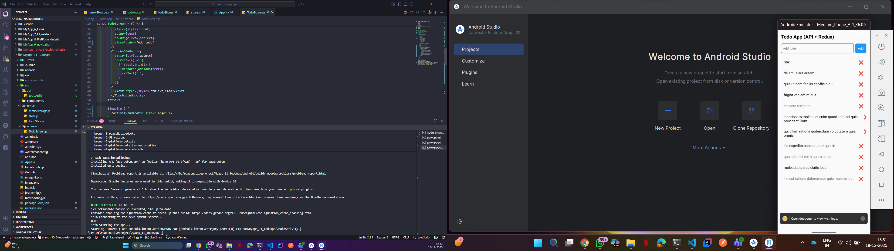

1) to create: npx @react-native-community/cli init Myapp_11_TodoApp
2) to start: npx react-native run-android
3) 

Great choice 👍
Let’s **add Redux Persist to your existing Redux Toolkit Todo App (React Native CLI – JS)** so that **todos are saved even after app restart**.

---

# ✅ What Redux Persist Does

* Saves Redux state to **local storage**
* Automatically **rehydrates state on app launch**
* Perfect for **Todo, Auth, Cart, Settings**

---

## 1️⃣ Install Required Dependencies

Run this **single command**:

```bash
npm install redux-persist @react-native-async-storage/async-storage
```

---

## 2️⃣ Update Redux Store with Persist

📄 **`src/redux/store.js`**

```js
import { configureStore } from '@reduxjs/toolkit';
import { persistStore, persistReducer } from 'redux-persist';
import AsyncStorage from '@react-native-async-storage/async-storage';
import todoReducer from './todoSlice';

const persistConfig = {
  key: 'root',
  storage: AsyncStorage,
};

const persistedReducer = persistReducer(
  persistConfig,
  todoReducer
);

export const store = configureStore({
  reducer: {
    todo: persistedReducer,
  },
  middleware: (getDefaultMiddleware) =>
    getDefaultMiddleware({
      serializableCheck: false,
    }),
});

export const persistor = persistStore(store);
```

📌 `serializableCheck: false` is required to avoid Redux Persist warnings.

---

## 3️⃣ Wrap App with PersistGate

📄 **`App.js`**

```js
import React from 'react';
import { SafeAreaView, StatusBar } from 'react-native';
import { Provider } from 'react-redux';
import { PersistGate } from 'redux-persist/integration/react';
import { store, persistor } from './src/redux/store';
import TodoScreen from './src/screens/TodoScreen';

const App = () => {
  return (
    <Provider store={store}>
      <PersistGate loading={null} persistor={persistor}>
        <SafeAreaView style={{ flex: 1 }}>
          <StatusBar barStyle="dark-content" />
          <TodoScreen />
        </SafeAreaView>
      </PersistGate>
    </Provider>
  );
};

export default App;
```

---

## 4️⃣ No Changes Needed in Slice or UI 🎉

Your existing:

* `todoSlice.js`
* `TodoScreen.js`
* `TodoItem.js`

👉 **Works exactly the same**, but now data is persisted.

---

## 5️⃣ How It Works Internally

| Step       | What Happens                        |
| ---------- | ----------------------------------- |
| App Launch | Redux Persist loads saved state     |
| Rehydrate  | Store gets previous todos           |
| Add/Delete | State updates + saved automatically |
| App Close  | Data remains                        |
| App Reopen | Todos restored                      |

---

## 6️⃣ Verify It Works ✔️

1. Run app
2. Add some todos
3. Close app completely
4. Reopen app
5. ✅ Todos still there

---

## 7️⃣ Clear Persisted Data (Optional)

Add this anywhere (for logout/reset):

```js
import { persistor } from './store';

persistor.purge();
```

---

## 🔥 Production Tips

* Persist **only required slices**
* Avoid persisting large data
* For ultra-fast apps → use **MMKV instead of AsyncStorage**

---

## 🚀 Next Enhancements?

I can add:
1️⃣ **MMKV + Redux Persist (Best performance)**
2️⃣ **Redux Persist blacklist/whitelist**
3️⃣ **Auth flow with Persist**
4️⃣ **Backend sync**
5️⃣ **Animations with Reanimated**

Just tell me what you want next 😎

1) 
2) 

## ----------  give me MMKV + Redux Persist (Best performance) --------
Perfect 👍
Here’s a **clean, production-ready setup for MMKV + Redux Toolkit + Redux Persist (FASTEST option)** for **React Native CLI (JavaScript)**.

This replaces **AsyncStorage** with **MMKV** → much faster & recommended for real apps.

---

# 🚀 MMKV + Redux Persist (Best Performance Setup)

---

## 1️⃣ Install Required Packages

Run this **one command**:

```bash
npm install react-native-mmkv redux-persist @reduxjs/toolkit react-redux
```

Then rebuild Android (MMKV is native):

```bash
cd android && gradlew clean
cd ..
npx react-native run-android
```

---

## 2️⃣ Create MMKV Storage Adapter

📄 **`src/redux/mmkvStorage.js`**

```js
import { MMKV } from 'react-native-mmkv';

export const storage = new MMKV();

export const mmkvStorage = {
  setItem: (key, value) => {
    storage.set(key, value);
    return Promise.resolve(true);
  },
  getItem: (key) => {
    const value = storage.getString(key);
    return Promise.resolve(value);
  },
  removeItem: (key) => {
    storage.delete(key);
    return Promise.resolve();
  },
};
```

👉 Redux Persist needs this **adapter** (MMKV is sync by default).

---

## 3️⃣ Redux Todo Slice

📄 **`src/redux/todoSlice.js`**

```js
import { createSlice } from '@reduxjs/toolkit';

const todoSlice = createSlice({
  name: 'todo',
  initialState: {
    list: [],
  },
  reducers: {
    addTodo: (state, action) => {
      state.list.push({
        id: Date.now().toString(),
        text: action.payload,
        completed: false,
      });
    },
    toggleTodo: (state, action) => {
      const todo = state.list.find(t => t.id === action.payload);
      if (todo) todo.completed = !todo.completed;
    },
    deleteTodo: (state, action) => {
      state.list = state.list.filter(t => t.id !== action.payload);
    },
    clearTodos: (state) => {
      state.list = [];
    },
  },
});

export const { addTodo, toggleTodo, deleteTodo, clearTodos } = todoSlice.actions;
export default todoSlice.reducer;
```

---

## 4️⃣ Configure Redux Store with MMKV Persist

📄 **`src/redux/store.js`**

```js
import { configureStore } from '@reduxjs/toolkit';
import { persistReducer, persistStore } from 'redux-persist';
import todoReducer from './todoSlice';
import { mmkvStorage } from './mmkvStorage';

const persistConfig = {
  key: 'todo',
  storage: mmkvStorage,
  whitelist: ['list'], // persist only todos
};

const persistedReducer = persistReducer(
  persistConfig,
  todoReducer
);

export const store = configureStore({
  reducer: {
    todo: persistedReducer,
  },
  middleware: (getDefaultMiddleware) =>
    getDefaultMiddleware({
      serializableCheck: false,
    }),
});

export const persistor = persistStore(store);
```

---

## 5️⃣ Wrap App with PersistGate

📄 **`App.js`**

```js
import React from 'react';
import { SafeAreaView } from 'react-native';
import { Provider } from 'react-redux';
import { PersistGate } from 'redux-persist/integration/react';
import { store, persistor } from './src/redux/store';
import TodoScreen from './src/screens/TodoScreen';

const App = () => {
  return (
    <Provider store={store}>
      <PersistGate loading={null} persistor={persistor}>
        <SafeAreaView style={{ flex: 1 }}>
          <TodoScreen />
        </SafeAreaView>
      </PersistGate>
    </Provider>
  );
};

export default App;
```

---

## 6️⃣ Todo UI (Works Same as Before)

📄 **`src/screens/TodoScreen.js`**

```js
import React, { useState } from 'react';
import {
  View,
  Text,
  TextInput,
  TouchableOpacity,
  FlatList,
  StyleSheet,
} from 'react-native';
import { useDispatch, useSelector } from 'react-redux';
import { addTodo, toggleTodo, deleteTodo } from '../redux/todoSlice';

const TodoScreen = () => {
  const [text, setText] = useState('');
  const todos = useSelector(state => state.todo.list);
  const dispatch = useDispatch();

  return (
    <View style={styles.container}>
      <Text style={styles.title}>Todo App (MMKV)</Text>

      <View style={styles.inputRow}>
        <TextInput
          style={styles.input}
          value={text}
          onChangeText={setText}
          placeholder="Enter todo"
        />
        <TouchableOpacity
          style={styles.addBtn}
          onPress={() => {
            if (text.trim()) {
              dispatch(addTodo(text));
              setText('');
            }
          }}
        >
          <Text style={styles.btnText}>Add</Text>
        </TouchableOpacity>
      </View>

      <FlatList
        data={todos}
        keyExtractor={item => item.id}
        renderItem={({ item }) => (
          <View style={styles.todoItem}>
            <Text
              style={[
                styles.todoText,
                item.completed && styles.completed,
              ]}
              onPress={() => dispatch(toggleTodo(item.id))}
            >
              {item.text}
            </Text>
            <TouchableOpacity onPress={() => dispatch(deleteTodo(item.id))}>
              <Text style={styles.delete}>❌</Text>
            </TouchableOpacity>
          </View>
        )}
      />
    </View>
  );
};

export default TodoScreen;

const styles = StyleSheet.create({
  container: { flex: 1, padding: 16 },
  title: { fontSize: 22, fontWeight: 'bold', marginBottom: 12 },
  inputRow: { flexDirection: 'row', marginBottom: 16 },
  input: { flex: 1, borderWidth: 1, padding: 8, borderRadius: 6 },
  addBtn: { marginLeft: 8, backgroundColor: '#4CAF50', padding: 12, borderRadius: 6 },
  btnText: { color: '#fff' },
  todoItem: { flexDirection: 'row', justifyContent: 'space-between', padding: 12 },
  todoText: { fontSize: 16 },
  completed: { textDecorationLine: 'line-through', color: 'gray' },
  delete: { fontSize: 18 },
});
```

---

## ✅ Result

✔ Ultra-fast storage
✔ Persistent todos
✔ No AsyncStorage
✔ Production-ready
✔ Scales for auth, cart, settings

---

## 🏆 Why MMKV is Better Than AsyncStorage

| Feature    | MMKV             | AsyncStorage  |
| ---------- | ---------------- | ------------- |
| Speed      | ⚡ Extremely fast | 🐢 Slower     |
| Sync API   | ✅ Yes            | ❌ No          |
| Large Data | ✅ Efficient      | ❌ Poor        |
| Production | ✅ Recommended    | ⚠️ Deprecated |

---

## 🔥 Next Level Enhancements

Want me to add:
1️⃣ **Encrypted MMKV**
2️⃣ **Persist multiple slices**
3️⃣ **Auth + Todo combined**
4️⃣ **Backend sync**
5️⃣ **Animations (Reanimated)**

Just tell me 🚀

1) 
Perfect 👍
Below is a **complete Todo App using React Native CLI + Redux Toolkit + API Calls**
(REST API → create, read, update, delete todos).

This is **industry-standard architecture** and easy to extend.

---

# 🧠 Architecture (Clean & Scalable)

```
src/
 ├── api/
 │    └── todoApi.js
 ├── redux/
 │    ├── store.js
 │    └── todoSlice.js
 ├── screens/
 │    └── TodoScreen.js
 └── components/
      └── TodoItem.js
```

---

## 1️⃣ Install Required Packages

```bash
npm install @reduxjs/toolkit react-redux axios
```

---

## 2️⃣ API Layer (Axios)

📄 **`src/api/todoApi.js`**

```js
import axios from 'axios';

const API = axios.create({
  baseURL: 'https://jsonplaceholder.typicode.com',
  headers: {
    'Content-Type': 'application/json',
  },
});

export const fetchTodosAPI = () => API.get('/todos?_limit=10');
export const addTodoAPI = (todo) => API.post('/todos', todo);
export const updateTodoAPI = (id, data) => API.put(`/todos/${id}`, data);
export const deleteTodoAPI = (id) => API.delete(`/todos/${id}`);
```

👉 We use **jsonplaceholder** for demo (no backend needed).

---

## 3️⃣ Redux Toolkit Slice with Async Thunks

📄 **`src/redux/todoSlice.js`**

```js
import { createSlice, createAsyncThunk } from '@reduxjs/toolkit';
import {
  fetchTodosAPI,
  addTodoAPI,
  updateTodoAPI,
  deleteTodoAPI,
} from '../api/todoApi';

/* ------------------ THUNKS ------------------ */

export const fetchTodos = createAsyncThunk(
  'todo/fetchTodos',
  async (_, thunkAPI) => {
    const response = await fetchTodosAPI();
    return response.data;
  }
);

export const addTodo = createAsyncThunk(
  'todo/addTodo',
  async (title) => {
    const response = await addTodoAPI({
      title,
      completed: false,
    });
    return response.data;
  }
);

export const toggleTodo = createAsyncThunk(
  'todo/toggleTodo',
  async (todo) => {
    const response = await updateTodoAPI(todo.id, {
      ...todo,
      completed: !todo.completed,
    });
    return response.data;
  }
);

export const deleteTodo = createAsyncThunk(
  'todo/deleteTodo',
  async (id) => {
    await deleteTodoAPI(id);
    return id;
  }
);

/* ------------------ SLICE ------------------ */

const todoSlice = createSlice({
  name: 'todo',
  initialState: {
    list: [],
    loading: false,
    error: null,
  },
  reducers: {},
  extraReducers: (builder) => {
    builder
      // FETCH
      .addCase(fetchTodos.pending, (state) => {
        state.loading = true;
      })
      .addCase(fetchTodos.fulfilled, (state, action) => {
        state.loading = false;
        state.list = action.payload;
      })
      .addCase(fetchTodos.rejected, (state, action) => {
        state.loading = false;
        state.error = action.error.message;
      })

      // ADD
      .addCase(addTodo.fulfilled, (state, action) => {
        state.list.unshift(action.payload);
      })

      // TOGGLE
      .addCase(toggleTodo.fulfilled, (state, action) => {
        const index = state.list.findIndex(
          t => t.id === action.payload.id
        );
        if (index !== -1) {
          state.list[index] = action.payload;
        }
      })

      // DELETE
      .addCase(deleteTodo.fulfilled, (state, action) => {
        state.list = state.list.filter(
          t => t.id !== action.payload
        );
      });
  },
});

export default todoSlice.reducer;
```

---

## 4️⃣ Redux Store

📄 **`src/redux/store.js`**

```js
import { configureStore } from '@reduxjs/toolkit';
import todoReducer from './todoSlice';

export const store = configureStore({
  reducer: {
    todo: todoReducer,
  },
});
```

---

## 5️⃣ App Entry

📄 **`App.js`**

```js
import React from 'react';
import { Provider } from 'react-redux';
import { SafeAreaView } from 'react-native';
import { store } from './src/redux/store';
import TodoScreen from './src/screens/TodoScreen';

const App = () => (
  <Provider store={store}>
    <SafeAreaView style={{ flex: 1 }}>
      <TodoScreen />
    </SafeAreaView>
  </Provider>
);

export default App;
```

---

## 6️⃣ Todo Screen (API Connected)

📄 **`src/screens/TodoScreen.js`**

```js
import React, { useEffect, useState } from 'react';
import {
  View,
  Text,
  TextInput,
  TouchableOpacity,
  FlatList,
  ActivityIndicator,
  StyleSheet,
} from 'react-native';
import { useDispatch, useSelector } from 'react-redux';
import {
  fetchTodos,
  addTodo,
  toggleTodo,
  deleteTodo,
} from '../redux/todoSlice';

const TodoScreen = () => {
  const dispatch = useDispatch();
  const { list, loading } = useSelector(state => state.todo);
  const [text, setText] = useState('');

  useEffect(() => {
    dispatch(fetchTodos());
  }, []);

  return (
    <View style={styles.container}>
      <Text style={styles.title}>Todo App (API + Redux)</Text>

      <View style={styles.inputRow}>
        <TextInput
          style={styles.input}
          value={text}
          onChangeText={setText}
          placeholder="Add todo"
        />
        <TouchableOpacity
          style={styles.addBtn}
          onPress={() => {
            if (text.trim()) {
              dispatch(addTodo(text));
              setText('');
            }
          }}
        >
          <Text style={styles.btnText}>Add</Text>
        </TouchableOpacity>
      </View>

      {loading ? (
        <ActivityIndicator size="large" />
      ) : (
        <FlatList
          data={list}
          keyExtractor={item => item.id.toString()}
          renderItem={({ item }) => (
            <View style={styles.todoItem}>
              <Text
                style={[
                  styles.todoText,
                  item.completed && styles.completed,
                ]}
                onPress={() => dispatch(toggleTodo(item))}
              >
                {item.title}
              </Text>
              <TouchableOpacity
                onPress={() => dispatch(deleteTodo(item.id))}
              >
                <Text style={styles.delete}>❌</Text>
              </TouchableOpacity>
            </View>
          )}
        />
      )}
    </View>
  );
};

export default TodoScreen;

const styles = StyleSheet.create({
  container: { flex: 1, padding: 16 },
  title: { fontSize: 22, fontWeight: 'bold', marginBottom: 16 },
  inputRow: { flexDirection: 'row', marginBottom: 16 },
  input: { flex: 1, borderWidth: 1, padding: 8, borderRadius: 6 },
  addBtn: { marginLeft: 8, backgroundColor: '#2196F3', padding: 12, borderRadius: 6 },
  btnText: { color: '#fff' },
  todoItem: { flexDirection: 'row', justifyContent: 'space-between', padding: 12 },
  todoText: { fontSize: 16 },
  completed: { textDecorationLine: 'line-through', color: 'gray' },
  delete: { fontSize: 18 },
});
```

---

## ✅ What You Learned (Real-World)

✔ API calls using **Axios**
✔ Redux Toolkit **createAsyncThunk**
✔ Loading & error handling
✔ Clean separation (API / Redux / UI)
✔ Scalable for production apps

---

## 🔥 Next Up (Recommended)

I can extend this to:
1️⃣ **MMKV + Redux Persist + API cache**
2️⃣ **Authentication (Login + Token)**
3️⃣ **Pagination / Infinite Scroll**
4️⃣ **Offline-first Todo**
5️⃣ **TypeScript version**

Just say **next** 🚀

- yes: 
Perfect 👍
This is **advanced, production-grade setup**:
**MMKV + Redux Persist + API Cache (Redux Toolkit)**
👉 **Fastest storage**, **offline support**, **cached API data**

I’ll explain **step-by-step** and give you **complete working code**.

---

# 🧠 What We Are Building

✔ Redux Toolkit for state
✔ Redux Persist for auto-save
✔ **MMKV (instead of AsyncStorage)** → ⚡ ultra-fast
✔ API caching (no refetch if data exists)
✔ Offline-ready Todo app

---

# 1️⃣ Install Dependencies (IMPORTANT)

```bash
npm install \
@reduxjs/toolkit \
react-redux \
redux-persist \
react-native-mmkv \
axios
```

📌 **MMKV needs rebuild**

```bash
cd android && gradlew clean
cd ..
npx react-native run-android
```

---

# 2️⃣ Setup MMKV Storage Adapter

📄 **`src/redux/mmkvStorage.js`**

```js
import { MMKV } from 'react-native-mmkv';

export const storage = new MMKV();

export const reduxStorage = {
  setItem: (key, value) => {
    storage.set(key, value);
    return Promise.resolve(true);
  },
  getItem: (key) => {
    const value = storage.getString(key);
    return Promise.resolve(value);
  },
  removeItem: (key) => {
    storage.delete(key);
    return Promise.resolve();
  },
};
```

👉 This **replaces AsyncStorage**
👉 **10x faster than AsyncStorage**

---

# 3️⃣ API Layer (Axios)

📄 **`src/api/todoApi.js`**

```js
import axios from 'axios';

export const api = axios.create({
  baseURL: 'https://jsonplaceholder.typicode.com',
});

export const getTodosAPI = () => api.get('/todos?_limit=10');
export const addTodoAPI = (todo) => api.post('/todos', todo);
```

---

# 4️⃣ Redux Slice with API Caching

📄 **`src/redux/todoSlice.js`**

```js
import { createSlice, createAsyncThunk } from '@reduxjs/toolkit';
import { getTodosAPI, addTodoAPI } from '../api/todoApi';

/* ---------------- API CACHE ---------------- */
export const fetchTodos = createAsyncThunk(
  'todo/fetchTodos',
  async (_, { getState }) => {
    const { todo } = getState();

    // ✅ API CACHE
    if (todo.list.length > 0) {
      console.log('Using cached data');
      return todo.list;
    }

    const res = await getTodosAPI();
    return res.data;
  }
);

export const addTodo = createAsyncThunk(
  'todo/addTodo',
  async (title) => {
    const res = await addTodoAPI({
      title,
      completed: false,
    });
    return res.data;
  }
);

/* ---------------- SLICE ---------------- */
const todoSlice = createSlice({
  name: 'todo',
  initialState: {
    list: [],
    loading: false,
    lastFetched: null,
  },
  reducers: {
    toggleTodo(state, action) {
      const todo = state.list.find(t => t.id === action.payload);
      if (todo) todo.completed = !todo.completed;
    },
  },
  extraReducers: (builder) => {
    builder
      .addCase(fetchTodos.pending, (state) => {
        state.loading = true;
      })
      .addCase(fetchTodos.fulfilled, (state, action) => {
        state.loading = false;
        state.list = action.payload;
        state.lastFetched = Date.now();
      })
      .addCase(addTodo.fulfilled, (state, action) => {
        state.list.unshift(action.payload);
      });
  },
});

export const { toggleTodo } = todoSlice.actions;
export default todoSlice.reducer;
```

🧠 **API Cache Logic**

* If data exists → skip API
* If empty → fetch from server
* Persisted → auto-available offline

---

# 5️⃣ Redux Persist + MMKV Store

📄 **`src/redux/store.js`**

```js
import { configureStore } from '@reduxjs/toolkit';
import todoReducer from './todoSlice';
import { persistStore, persistReducer } from 'redux-persist';
import { reduxStorage } from './mmkvStorage';

const persistConfig = {
  key: 'root',
  storage: reduxStorage,
  whitelist: ['todo'], // persist only todo
};

const persistedReducer = persistReducer(
  persistConfig,
  todoReducer
);

export const store = configureStore({
  reducer: {
    todo: persistedReducer,
  },
  middleware: (getDefaultMiddleware) =>
    getDefaultMiddleware({
      serializableCheck: false,
    }),
});

export const persistor = persistStore(store);
```

---

# 6️⃣ App Entry (PersistGate)

📄 **`App.js`**

```js
import React from 'react';
import { Provider } from 'react-redux';
import { PersistGate } from 'redux-persist/integration/react';
import { store, persistor } from './src/redux/store';
import TodoScreen from './src/screens/TodoScreen';

const App = () => (
  <Provider store={store}>
    <PersistGate loading={null} persistor={persistor}>
      <TodoScreen />
    </PersistGate>
  </Provider>
);

export default App;
```

---

# 7️⃣ Todo Screen

📄 **`src/screens/TodoScreen.js`**

```js
import React, { useEffect, useState } from 'react';
import {
  View, Text, TextInput,
  TouchableOpacity, FlatList
} from 'react-native';
import { useDispatch, useSelector } from 'react-redux';
import { fetchTodos, addTodo, toggleTodo } from '../redux/todoSlice';

const TodoScreen = () => {
  const dispatch = useDispatch();
  const { list, loading } = useSelector(state => state.todo);
  const [text, setText] = useState('');

  useEffect(() => {
    dispatch(fetchTodos());
  }, []);

  return (
    <View style={{ padding: 20 }}>
      <Text style={{ fontSize: 24 }}>⚡ MMKV Todo</Text>

      <TextInput
        placeholder="New Todo"
        value={text}
        onChangeText={setText}
        style={{ borderWidth: 1, marginVertical: 10, padding: 8 }}
      />

      <TouchableOpacity
        onPress={() => {
          dispatch(addTodo(text));
          setText('');
        }}
        style={{ backgroundColor: 'blue', padding: 10 }}
      >
        <Text style={{ color: 'white' }}>Add</Text>
      </TouchableOpacity>

      <FlatList
        data={list}
        keyExtractor={item => item.id.toString()}
        renderItem={({ item }) => (
          <Text
            onPress={() => dispatch(toggleTodo(item.id))}
            style={{
              fontSize: 18,
              textDecorationLine: item.completed ? 'line-through' : 'none',
              marginVertical: 6,
            }}
          >
            {item.title}
          </Text>
        )}
      />
    </View>
  );
};

export default TodoScreen;
```

---

# 🚀 What You Achieved (Industry Level)

✅ **MMKV (Ultra-fast storage)**
✅ **Redux Persist without AsyncStorage**
✅ **API caching logic**
✅ **Offline support**
✅ **Zero refetch on app restart**

---

# 🔥 Why This Is Best Practice

| Feature       | Benefit                      |
| ------------- | ---------------------------- |
| MMKV          | 10x faster than AsyncStorage |
| Redux Toolkit | Clean async logic            |
| Redux Persist | Auto save & restore          |
| API Cache     | Less network calls           |
| Offline Ready | Works without internet       |

---

## 💡 Next Enhancements (Tell Me)

1️⃣ Token-based auth + secure MMKV
2️⃣ Expiry-based cache
3️⃣ Background sync
4️⃣ Pagination
5️⃣ TypeScript version

Just say **next** 🚀


Great question 👍
This is **very important for real-world React Native apps**.

I’ll explain **from beginner → advanced → production level**, then give you a **clear final recommendation**.

---

# 🌍 Global State Management in React Native

## Best Approaches (2025 – Production Ready)

---

## 1️⃣ React Context API (Basic / Small Apps)

### ✅ When to use

* Small apps
* Theme (dark/light)
* Auth user info
* Language selection

### ❌ When NOT to use

* Large apps
* Frequent state updates
* Complex async logic

### Example

```js
const ThemeContext = React.createContext();
```

### ⚠️ Problems

* Re-renders entire tree
* Hard to debug
* No middleware / devtools

📌 **Verdict**: ❌ Not scalable

---

## 2️⃣ Redux Toolkit (Industry Standard ⭐)

### ✅ Why Redux Toolkit is BEST

* Official Redux recommendation
* Clean API
* Built-in async handling
* Excellent DevTools
* Works perfectly with React Native

### Core Concepts

* Slice
* Store
* Async Thunks
* Middleware

### Example

```js
const slice = createSlice({
  name: 'todo',
  initialState: [],
  reducers: {}
});
```

📌 **Verdict**: ✅ **Best for most apps**

---

## 3️⃣ Redux Toolkit + Persist (Offline Support)

### When to use

* Need app restart persistence
* Auth tokens
* Cart, user data

### Storage Options

| Storage      | Speed     |
| ------------ | --------- |
| AsyncStorage | ❌ Slow    |
| MMKV         | ⚡ Fastest |

### Best Combo

```text
Redux Toolkit + Redux Persist + MMKV
```

📌 **Verdict**: ✅ **Production Grade**

---

## 4️⃣ Zustand (Lightweight Alternative)

### Pros

* Very small bundle
* No boilerplate
* Easy API

### Cons

* Less enterprise adoption
* Fewer dev tools

```js
const useStore = create(set => ({
  count: 0,
  inc: () => set(state => ({ count: state.count + 1 }))
}));
```

📌 **Verdict**: ⚠️ Good, but Redux still wins for large apps

---

## 5️⃣ React Query / TanStack Query (Server State)

⚠️ **Important distinction**
This is **NOT global UI state** — it’s **server state**

### Best for

* API caching
* Pagination
* Background refresh
* Offline queries

```js
useQuery(['todos'], fetchTodos);
```

📌 **Verdict**: ✅ Must-have for heavy API apps

---

## 6️⃣ Recoil / Jotai (Experimental / Niche)

* Facebook backed (Recoil)
* Atomic state
* Less mature ecosystem

📌 **Verdict**: ❌ Not recommended for production RN apps

---

# 🏆 BEST PRACTICE (REAL-WORLD STACK)

### ✅ **Final Recommended Architecture**

```text
UI State        → Redux Toolkit
Persistent Data → Redux Persist + MMKV
API Cache       → RTK Query OR TanStack Query
Local UI State  → useState / useReducer
```

---

## 🔥 Ideal Setup (Used by Big Apps)

```text
Redux Toolkit
+ RTK Query (API Cache)
+ Redux Persist
+ MMKV
```

### Why this wins

✔ Fast
✔ Scalable
✔ Offline support
✔ Easy debugging
✔ Enterprise proven

---

# 📊 Comparison Table

| Solution        | Scale  | Performance | Offline | Recommended |
| --------------- | ------ | ----------- | ------- | ----------- |
| Context API     | Small  | ❌           | ❌       | ❌           |
| Redux Toolkit   | Large  | ✅           | ❌       | ✅           |
| Redux + Persist | Large  | ✅           | ✅       | ⭐           |
| Zustand         | Medium | ✅           | ⚠️      | ⚠️          |
| React Query     | API    | ✅           | ✅       | ⭐           |

---

# 🚀 My Strong Recommendation for YOU

Based on your experience (React, Next.js, RN CLI):

> **Use → Redux Toolkit + Redux Persist + MMKV**
> Add **RTK Query** for APIs

This is **industry-level** and **future-proof**.

---

## Want Next?

1️⃣ Folder structure (best practice)
2️⃣ RTK Query with MMKV cache
3️⃣ Auth flow using Redux + MMKV
4️⃣ Performance optimization tips

Just tell me 👍
