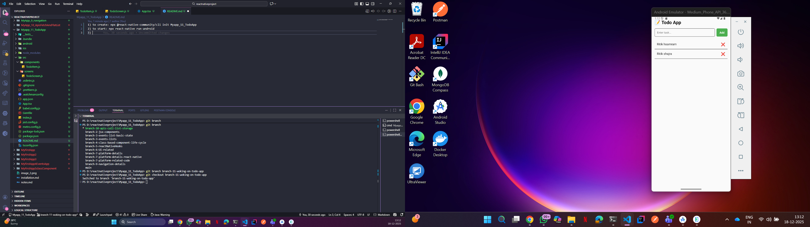
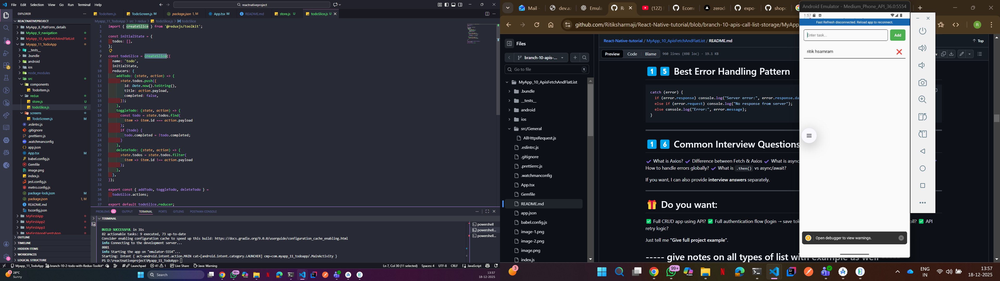

1) to create: npx @react-native-community/cli init Myapp_11_TodoApp
2) to start: npx react-native run-android
3) 

Great choice 👍
Let’s **add Redux Persist to your existing Redux Toolkit Todo App (React Native CLI – JS)** so that **todos are saved even after app restart**.

---

# ✅ What Redux Persist Does

* Saves Redux state to **local storage**
* Automatically **rehydrates state on app launch**
* Perfect for **Todo, Auth, Cart, Settings**

---

## 1️⃣ Install Required Dependencies

Run this **single command**:

```bash
npm install redux-persist @react-native-async-storage/async-storage
```

---

## 2️⃣ Update Redux Store with Persist

📄 **`src/redux/store.js`**

```js
import { configureStore } from '@reduxjs/toolkit';
import { persistStore, persistReducer } from 'redux-persist';
import AsyncStorage from '@react-native-async-storage/async-storage';
import todoReducer from './todoSlice';

const persistConfig = {
  key: 'root',
  storage: AsyncStorage,
};

const persistedReducer = persistReducer(
  persistConfig,
  todoReducer
);

export const store = configureStore({
  reducer: {
    todo: persistedReducer,
  },
  middleware: (getDefaultMiddleware) =>
    getDefaultMiddleware({
      serializableCheck: false,
    }),
});

export const persistor = persistStore(store);
```

📌 `serializableCheck: false` is required to avoid Redux Persist warnings.

---

## 3️⃣ Wrap App with PersistGate

📄 **`App.js`**

```js
import React from 'react';
import { SafeAreaView, StatusBar } from 'react-native';
import { Provider } from 'react-redux';
import { PersistGate } from 'redux-persist/integration/react';
import { store, persistor } from './src/redux/store';
import TodoScreen from './src/screens/TodoScreen';

const App = () => {
  return (
    <Provider store={store}>
      <PersistGate loading={null} persistor={persistor}>
        <SafeAreaView style={{ flex: 1 }}>
          <StatusBar barStyle="dark-content" />
          <TodoScreen />
        </SafeAreaView>
      </PersistGate>
    </Provider>
  );
};

export default App;
```

---

## 4️⃣ No Changes Needed in Slice or UI 🎉

Your existing:

* `todoSlice.js`
* `TodoScreen.js`
* `TodoItem.js`

👉 **Works exactly the same**, but now data is persisted.

---

## 5️⃣ How It Works Internally

| Step       | What Happens                        |
| ---------- | ----------------------------------- |
| App Launch | Redux Persist loads saved state     |
| Rehydrate  | Store gets previous todos           |
| Add/Delete | State updates + saved automatically |
| App Close  | Data remains                        |
| App Reopen | Todos restored                      |

---

## 6️⃣ Verify It Works ✔️

1. Run app
2. Add some todos
3. Close app completely
4. Reopen app
5. ✅ Todos still there

---

## 7️⃣ Clear Persisted Data (Optional)

Add this anywhere (for logout/reset):

```js
import { persistor } from './store';

persistor.purge();
```

---

## 🔥 Production Tips

* Persist **only required slices**
* Avoid persisting large data
* For ultra-fast apps → use **MMKV instead of AsyncStorage**

---

## 🚀 Next Enhancements?

I can add:
1️⃣ **MMKV + Redux Persist (Best performance)**
2️⃣ **Redux Persist blacklist/whitelist**
3️⃣ **Auth flow with Persist**
4️⃣ **Backend sync**
5️⃣ **Animations with Reanimated**

Just tell me what you want next 😎

1) 
2) 

## ----------  give me MMKV + Redux Persist (Best performance) --------
Perfect 👍
Here’s a **clean, production-ready setup for MMKV + Redux Toolkit + Redux Persist (FASTEST option)** for **React Native CLI (JavaScript)**.

This replaces **AsyncStorage** with **MMKV** → much faster & recommended for real apps.

---

# 🚀 MMKV + Redux Persist (Best Performance Setup)

---

## 1️⃣ Install Required Packages

Run this **one command**:

```bash
npm install react-native-mmkv redux-persist @reduxjs/toolkit react-redux
```

Then rebuild Android (MMKV is native):

```bash
cd android && gradlew clean
cd ..
npx react-native run-android
```

---

## 2️⃣ Create MMKV Storage Adapter

📄 **`src/redux/mmkvStorage.js`**

```js
import { MMKV } from 'react-native-mmkv';

export const storage = new MMKV();

export const mmkvStorage = {
  setItem: (key, value) => {
    storage.set(key, value);
    return Promise.resolve(true);
  },
  getItem: (key) => {
    const value = storage.getString(key);
    return Promise.resolve(value);
  },
  removeItem: (key) => {
    storage.delete(key);
    return Promise.resolve();
  },
};
```

👉 Redux Persist needs this **adapter** (MMKV is sync by default).

---

## 3️⃣ Redux Todo Slice

📄 **`src/redux/todoSlice.js`**

```js
import { createSlice } from '@reduxjs/toolkit';

const todoSlice = createSlice({
  name: 'todo',
  initialState: {
    list: [],
  },
  reducers: {
    addTodo: (state, action) => {
      state.list.push({
        id: Date.now().toString(),
        text: action.payload,
        completed: false,
      });
    },
    toggleTodo: (state, action) => {
      const todo = state.list.find(t => t.id === action.payload);
      if (todo) todo.completed = !todo.completed;
    },
    deleteTodo: (state, action) => {
      state.list = state.list.filter(t => t.id !== action.payload);
    },
    clearTodos: (state) => {
      state.list = [];
    },
  },
});

export const { addTodo, toggleTodo, deleteTodo, clearTodos } = todoSlice.actions;
export default todoSlice.reducer;
```

---

## 4️⃣ Configure Redux Store with MMKV Persist

📄 **`src/redux/store.js`**

```js
import { configureStore } from '@reduxjs/toolkit';
import { persistReducer, persistStore } from 'redux-persist';
import todoReducer from './todoSlice';
import { mmkvStorage } from './mmkvStorage';

const persistConfig = {
  key: 'todo',
  storage: mmkvStorage,
  whitelist: ['list'], // persist only todos
};

const persistedReducer = persistReducer(
  persistConfig,
  todoReducer
);

export const store = configureStore({
  reducer: {
    todo: persistedReducer,
  },
  middleware: (getDefaultMiddleware) =>
    getDefaultMiddleware({
      serializableCheck: false,
    }),
});

export const persistor = persistStore(store);
```

---

## 5️⃣ Wrap App with PersistGate

📄 **`App.js`**

```js
import React from 'react';
import { SafeAreaView } from 'react-native';
import { Provider } from 'react-redux';
import { PersistGate } from 'redux-persist/integration/react';
import { store, persistor } from './src/redux/store';
import TodoScreen from './src/screens/TodoScreen';

const App = () => {
  return (
    <Provider store={store}>
      <PersistGate loading={null} persistor={persistor}>
        <SafeAreaView style={{ flex: 1 }}>
          <TodoScreen />
        </SafeAreaView>
      </PersistGate>
    </Provider>
  );
};

export default App;
```

---

## 6️⃣ Todo UI (Works Same as Before)

📄 **`src/screens/TodoScreen.js`**

```js
import React, { useState } from 'react';
import {
  View,
  Text,
  TextInput,
  TouchableOpacity,
  FlatList,
  StyleSheet,
} from 'react-native';
import { useDispatch, useSelector } from 'react-redux';
import { addTodo, toggleTodo, deleteTodo } from '../redux/todoSlice';

const TodoScreen = () => {
  const [text, setText] = useState('');
  const todos = useSelector(state => state.todo.list);
  const dispatch = useDispatch();

  return (
    <View style={styles.container}>
      <Text style={styles.title}>Todo App (MMKV)</Text>

      <View style={styles.inputRow}>
        <TextInput
          style={styles.input}
          value={text}
          onChangeText={setText}
          placeholder="Enter todo"
        />
        <TouchableOpacity
          style={styles.addBtn}
          onPress={() => {
            if (text.trim()) {
              dispatch(addTodo(text));
              setText('');
            }
          }}
        >
          <Text style={styles.btnText}>Add</Text>
        </TouchableOpacity>
      </View>

      <FlatList
        data={todos}
        keyExtractor={item => item.id}
        renderItem={({ item }) => (
          <View style={styles.todoItem}>
            <Text
              style={[
                styles.todoText,
                item.completed && styles.completed,
              ]}
              onPress={() => dispatch(toggleTodo(item.id))}
            >
              {item.text}
            </Text>
            <TouchableOpacity onPress={() => dispatch(deleteTodo(item.id))}>
              <Text style={styles.delete}>❌</Text>
            </TouchableOpacity>
          </View>
        )}
      />
    </View>
  );
};

export default TodoScreen;

const styles = StyleSheet.create({
  container: { flex: 1, padding: 16 },
  title: { fontSize: 22, fontWeight: 'bold', marginBottom: 12 },
  inputRow: { flexDirection: 'row', marginBottom: 16 },
  input: { flex: 1, borderWidth: 1, padding: 8, borderRadius: 6 },
  addBtn: { marginLeft: 8, backgroundColor: '#4CAF50', padding: 12, borderRadius: 6 },
  btnText: { color: '#fff' },
  todoItem: { flexDirection: 'row', justifyContent: 'space-between', padding: 12 },
  todoText: { fontSize: 16 },
  completed: { textDecorationLine: 'line-through', color: 'gray' },
  delete: { fontSize: 18 },
});
```

---

## ✅ Result

✔ Ultra-fast storage
✔ Persistent todos
✔ No AsyncStorage
✔ Production-ready
✔ Scales for auth, cart, settings

---

## 🏆 Why MMKV is Better Than AsyncStorage

| Feature    | MMKV             | AsyncStorage  |
| ---------- | ---------------- | ------------- |
| Speed      | ⚡ Extremely fast | 🐢 Slower     |
| Sync API   | ✅ Yes            | ❌ No          |
| Large Data | ✅ Efficient      | ❌ Poor        |
| Production | ✅ Recommended    | ⚠️ Deprecated |

---

## 🔥 Next Level Enhancements

Want me to add:
1️⃣ **Encrypted MMKV**
2️⃣ **Persist multiple slices**
3️⃣ **Auth + Todo combined**
4️⃣ **Backend sync**
5️⃣ **Animations (Reanimated)**

Just tell me 🚀
