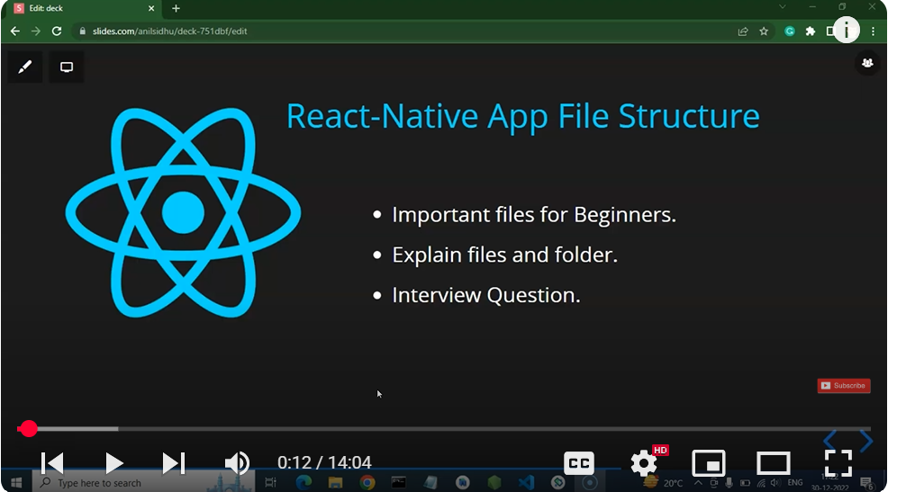

## ---------- React native tutorial in Hindi #4 React-Native App File Structure ---------
1) 
2) 
 **project structure of a newly created React Native app** (`MyFirstApp`). Let me explain each folder/file and its purpose:

---

## 📂 Project Root Files & Folders

### 1. **`__tests__/`**

* Contains sample test files (e.g., `App.test.tsx`).
* Used by **Jest** for unit testing React Native components.

### 2. **`.bundle/`**

* Temporary folder generated by Metro bundler.
* Stores cached bundle files when building your app.

### 3. **`android/`**

* Native **Android project** written in Java/Kotlin.
* You’ll modify this if you want to add Android-specific native code or configure Gradle.

### 4. **`ios/`**

* Native **iOS project** written in Swift/Objective-C.
* Contains Xcode project files. You modify this if you want iOS-specific features.

### 5. **`node_modules/`**

* All installed npm dependencies (React Native, libraries, etc.).
* Generated automatically when running `npm install` or `yarn install`.

---

## 📄 Config & Source Files

### 6. **`.eslintrc.js`**

* Configures **ESLint** (JavaScript/TypeScript linter).
* Helps catch errors and enforce code style.

### 7. **`.prettierrc.js`**

* Configures **Prettier** (code formatter).
* Defines rules for formatting (quotes, indentation, semicolons, etc.).

### 8. **`.watchmanconfig`**

* Config for **Watchman** (file watcher by Meta).
* Helps React Native detect file changes quickly (important for hot reloading).

### 9. **`App.js`**

* Default **JavaScript entry component**.
* This is where your **React Native app UI starts**.
* In your case, you also have `App.tsx` (TypeScript version).

### 10. **`App.tsx`**

* Same as `App.js` but written in **TypeScript**.
* Provides type safety for components and props.

### 11. **`babel.config.js`**

* Configures **Babel** (JS/TS transpiler).
* Converts modern JS/TS + JSX into code mobile devices understand.
* 

### 12. **`Gemfile`**

* Ruby dependencies for iOS (via **CocoaPods**).
* Required when running iOS builds (`pod install`).

### 13. **`index.js`**

* **Main entry point** of your app.
* Registers your root component (`App`) with `AppRegistry`.
* Example:

  ```js
  import { AppRegistry } from 'react-native';
  import App from './App';
  AppRegistry.registerComponent(appName, () => App);
  ```

### 14. **`jest.config.js`**

* Config file for **Jest** testing framework.
* Defines how tests are run (transformers, mocks, etc.).

### 15. **`metro.config.js`**

* Config file for **Metro bundler** (React Native’s JavaScript bundler).
* Controls how your JS/TS code is bundled for Android/iOS.
* what ever we are chaning the code what will done by metro.config.js 

### 16. **`package.json`**

* Project manifest.
* Defines dependencies, scripts, and project metadata.
* Example:

  ```json
  {
    "name": "MyFirstApp",
    "scripts": {
      "start": "react-native start",
      "android": "react-native run-android",
      "ios": "react-native run-ios"
    }
  }
  ```

### 17. **`package-lock.json`**

* Auto-generated file that locks exact versions of npm packages.
* Ensures consistent installs across environments.

### 18. **`README.md`**

* Markdown file where project instructions/documentation are written.

### 19. **`tsconfig.json`**

* TypeScript configuration file.
* Defines compiler options, module resolution, type-checking rules, etc.

---

## 🔑 Summary

* **Core app entry** → `index.js`, `App.js` / `App.tsx`.
* **Config files** → `babel.config.js`, `metro.config.js`, `tsconfig.json`, `.eslintrc.js`, `.prettierrc.js`.
* **Native code** → `android/`, `ios/`.
* **Dependencies** → `package.json`, `node_modules/`.
* **Testing** → `__tests__/`, `jest.config.js`.
* **Docs** → `README.md`.

---

👉 Since you have **both `App.js` and `App.tsx`**, usually React Native defaults to **TypeScript (`App.tsx`)** if TypeScript is configured. You can delete `App.js` if you want to stick only with TypeScript.

Do you want me to also give you a **visual diagram (tree with explanations inline)** so you can remember faster?

- yes:

Perfect 👍 Ritik, here’s a **visual tree diagram** of your React Native project with inline explanations for each folder/file.

---

```
MyFirstApp/                        <-- Root of your project
│
├── __tests__/                     # Unit tests folder (used by Jest)
│
├── .bundle/                       # Temporary bundle cache (by Metro bundler)
│
├── android/                       # Native Android project (Java/Kotlin, Gradle)
│
├── ios/                           # Native iOS project (Swift/Obj-C, Xcode)
│
├── node_modules/                  # Installed npm/yarn dependencies
│
├── .eslintrc.js                   # ESLint config (linting rules)
├── .prettierrc.js                 # Prettier config (code formatting rules)
├── .watchmanconfig                # Watchman config (file watcher)
│
├── App.js                         # React Native entry component (JavaScript)
├── App.tsx                        # React Native entry component (TypeScript)
│
├── babel.config.js                # Babel config (transpile modern JS/TS)
├── metro.config.js                # Metro bundler config
├── tsconfig.json                  # TypeScript compiler config
│
├── index.js                       # App entry point (registers App component)
│
├── jest.config.js                 # Jest testing configuration
│
├── package.json                   # Project manifest (dependencies + scripts)
├── package-lock.json              # Dependency lock file (exact versions)
│
├── Gemfile                        # iOS dependencies (CocoaPods, Ruby)
│
└── README.md                      # Project documentation
```

---

## 📝 Quick Memory Guide

* **Start point** → `index.js` (registers `App.tsx`).
* **UI** → `App.tsx` (your screens/components).
* **Configs** → `.eslintrc.js`, `.prettierrc.js`, `babel.config.js`, `metro.config.js`, `tsconfig.json`.
* **Native projects** → `android/` & `ios/`.
* **Dependencies** → `package.json`, `node_modules/`.
* **Testing** → `__tests__/`, `jest.config.js`.
* **Docs** → `README.md`.

---

⚡ Pro tip: Since you’re learning React Native fresh — focus mainly on:

1. `App.tsx` → build UI & components.
2. `index.js` → entry registration.
3. `package.json` → manage libraries (`react-navigation`, etc.).

Would you like me to also create a **workflow diagram (how app starts from `index.js` → `App.tsx` → UI rendering on Android/iOS)** so you get the flow crystal clear?

- yes: 
Great 👍 let me break down the **workflow of a React Native app** with a diagram and explanation.

---

# ⚡ React Native App Workflow

```
Start App
   │
   ▼
index.js ----------------------------> (Entry point, runs first)
   │
   │  import { AppRegistry } from 'react-native';
   │  AppRegistry.registerComponent('MyFirstApp', () => App);
   │
   ▼
App.tsx / App.js --------------------> (Main React Component)
   │
   │  Defines your UI with JSX (Views, Text, Buttons, etc.)
   │  Can use Hooks, Navigation, State, Context, etc.
   │
   ▼
React Native Bridge -----------------> (JS ↔ Native communication)
   │
   │  Converts JS code → Native instructions
   │  Talks with Android (Java/Kotlin) and iOS (Swift/ObjC)
   │
   ▼
Native Layer (android/ & ios/) ------> (Platform-specific rendering)
   │
   │  Android → Renders using Native Views (TextView, ImageView)
   │  iOS     → Renders using UIKit components
   │
   ▼
Screen/UI Rendered ------------------> (You see app on device/emulator)
```

---

## 🔑 Step-by-step Explanation

1. **`index.js` (Entry Point)**

   * Registers the **root component (`App`)** using `AppRegistry`.
   * React Native uses this as the starting point.

2. **`App.tsx` (Main Component)**

   * Holds your **UI code**.
   * You add screens, navigation, hooks, and components here.

3. **React Native Bridge**

   * Special layer that lets **JavaScript talk to native code**.
   * Example: When you use `<Button />`, JS sends message → Native OS draws a real button.

4. **Native Layer (android/ & ios/ folders)**

   * Android → uses Java/Kotlin + XML Views.
   * iOS → uses Swift/Objective-C + UIKit.
   * React Native maps your React components → native UI elements.

5. **UI Rendered**

   * Finally, you see the app screen in **Android Emulator, iOS Simulator, or real device**.

---

⚡ Think of it like:
👉 `index.js` (starter) → `App.tsx` (your logic/UI) → Bridge (translator) → Native OS (painter) → Screen (output).

---

Would you like me to also create a **visual diagram with arrows and boxes** (like a flowchart) so you can remember it quickly while learning React Native?

- yes:

## What is use of babel .config.js file in react native:
ans: 


In a **React Native** project, the `babel.config.js` file is super important because it tells **Babel** (a JavaScript compiler) how to transform your code so it can run on different devices.

---

## 🔑 Purpose of `babel.config.js`

1. **Transpiling Modern JS → Older JS**

   * React Native uses **modern ES6+ and JSX** syntax.
   * Not all devices (especially Android) can understand this directly.
   * Babel converts (`transpiles`) it into older JavaScript that the runtime can execute.

   Example:

   ```js
   // ES6+
   const greet = (name) => `Hello, ${name}`;
   ```

   Babel converts to:

   ```js
   var greet = function(name) {
     return "Hello, " + name;
   };
   ```

---

2. **Handling JSX**

   * Babel converts JSX (`<View><Text>Hello</Text></View>`) into `React.createElement(...)` calls that React Native understands.

---

3. **Using Plugins & Presets**

   * `metro-react-native-babel-preset`: Special preset for React Native apps.
   * You can also add plugins for things like decorators, optional chaining (`?.`), class properties, etc.

   Example default file in React Native:

   ```js
   module.exports = {
     presets: ['module:metro-react-native-babel-preset'],
   };
   ```

---

4. **Performance optimizations**

   * Babel can remove unused code in production builds.
   * It ensures your code runs smoothly on both **Android & iOS**.

---

✅ **In short:**
`babel.config.js` = A **translator config** that tells Babel how to convert your modern React Native code into something all JavaScript engines (Android/iOS) can run.

---

Do you want me to also show you how to **add custom Babel plugins** (like absolute imports or decorators) in `babel.config.js` so your React Native project becomes cleaner and easier to manage?

## ------- purpose of metro.config.js file -------------
ans: 
 
 — the **`metro.config.js`** file is another key part of a React Native project.

It is the **configuration file for Metro Bundler**, which is the default bundler that React Native uses (like Webpack for web apps).

---

## 🔑 Purpose of `metro.config.js`

1. **Controls Metro Bundler (JS bundler for React Native)**

   * Metro takes your JavaScript, JSX, TypeScript, images, and other assets → bundles them into a single package → delivers it to the mobile app.
   * `metro.config.js` lets you customize this process.

---

2. **Customize Asset Handling**

   * You can tell Metro how to handle assets (images, fonts, videos).
   * Example: Adding support for custom fonts in your app.

   ```js
   const { getDefaultConfig } = require("metro-config");

   module.exports = (async () => {
     const {
       resolver: { sourceExts, assetExts }
     } = await getDefaultConfig();

     return {
       resolver: {
         assetExts: assetExts.filter(ext => ext !== "svg"),
         sourceExts: [...sourceExts, "svg"]
       },
     };
   })();
   ```

   👉 This example makes Metro treat `.svg` files as source files instead of images.

---

3. **Define Watch Folders**

   * If your project imports code from outside the default `node_modules` or root folder, you can add **extra watch folders**.

   ```js
   module.exports = {
     watchFolders: ['../shared-components'],
   };
   ```

---

4. **Transformer Settings**

   * Metro uses a **transformer** to convert code before bundling.
   * You can customize it (e.g., for TypeScript, SVGs, SCSS, etc.).

   ```js
   module.exports = {
     transformer: {
       babelTransformerPath: require.resolve("react-native-svg-transformer"),
     },
   };
   ```

---

5. **Performance Tweaks**

   * Adjust cache, resolver speed, or experimental features.
   * Useful when working with **large apps**.

---

✅ **In short:**
`metro.config.js` = The **control panel for Metro Bundler**, deciding how JavaScript, images, fonts, and other files are bundled, transformed, and served to your React Native app.

---

👉 Would you like me to show you the **difference between `babel.config.js` and `metro.config.js`** side by side (so you clearly know which does what)?


## ------ package.json vs package-lock.json --------

Great question 👍 — this confuses a lot of beginners. Let’s break it down clearly:

---

# 📦 `package.json` vs `package-lock.json`

## 1. **`package.json`**

* **Purpose**: Defines your project metadata and dependencies.
* **Created by you (or npm init)**.
* **Editable**: You add/remove dependencies manually.
* **Specifies dependency ranges** using semver (`^`, `~`).

Example:

```json
{
  "name": "MyFirstApp",
  "version": "1.0.0",
  "scripts": {
    "start": "react-native start"
  },
  "dependencies": {
    "react": "^18.2.0",
    "react-native": "0.73.0"
  }
}
```

👉 Says: *“I need `react` version 18.2.0 or higher (but <19), and exactly `react-native` 0.73.0.”*

---

## 2. **`package-lock.json`**

* **Purpose**: Records the **exact versions** of every dependency installed (including nested ones).
* **Auto-generated by npm** when you install dependencies.
* **Do not edit manually**.
* Ensures **consistent installs** across all environments (your laptop, CI/CD, production).

Example:

```json
{
  "name": "MyFirstApp",
  "lockfileVersion": 3,
  "dependencies": {
    "react": {
      "version": "18.2.0",
      "resolved": "https://registry.npmjs.org/react/-/react-18.2.0.tgz",
      "integrity": "sha512-somehash"
    },
    "react-native": {
      "version": "0.73.0",
      "resolved": "https://registry.npmjs.org/react-native/-/react-native-0.73.0.tgz",
      "integrity": "sha512-anotherhash"
    }
  }
}
```

👉 Says: *“I am locking React to exactly 18.2.0 and React Native to exactly 0.73.0, no surprises.”*

---

## 🔑 Key Differences

| Feature             | `package.json`                       | `package-lock.json`                           |
| ------------------- | ------------------------------------ | --------------------------------------------- |
| **Who creates it?** | You (via `npm init` or manually)     | npm (auto-generated when installing packages) |
| **Editable?**       | Yes (you declare dependencies)       | No (should not be edited manually)            |
| **Version style**   | Ranges allowed (`^18.2.0`, `~1.0.0`) | Exact versions (`18.2.0`)                     |
| **Purpose**         | Project manifest + dependency rules  | Lock dependencies to exact versions           |
| **Needed for**      | Sharing project setup                | Ensuring reproducible installs                |
| **Needed for**      | store information about our project               |  it store information about dependecies of our project package              |

---

✅ **In short:**

* `package.json` = *Shopping list* (I want apples, bananas, oranges — any fresh ones).
* `package-lock.json` = *The receipt* (You bought apples v2.1, bananas v1.3, oranges v1.0).

---

👉 Do you also want me to explain the difference between **`package-lock.json` and `yarn.lock`** (since React Native often suggests using Yarn)?


## ------------ for more: https://www.youtube.com/watch?v=GZhDoxYWaTI&list=PL8p2I9GklV468O2wk-n8Q1KmtMhnHHj4C&index=6


Awesome — since you already know **React.js** and **Next.js**, you’re in a perfect spot to pick up **React Native** quickly. Below is a **complete, ordered 1→100 step-by-step roadmap** (short, actionable steps) that takes you from zero-to-productive React Native developer — covering setup, core concepts, native APIs, styling, navigation, testing, performance, deployment, and real-world skills.
Follow in order; each step is small and focused.

# 🚀 100-Step React Native Roadmap (start → master)

### Phase A — Quick start & mindset (1–10)

1. Understand the **goal**: RN uses React to build native mobile UIs (iOS/Android) — not web.
2. Decide toolchain: **Expo** (fast, easy) vs **React Native CLI** (native modules). Pick Expo to learn fast.
3. Install latest **Node.js** LTS and a good editor (VS Code).
4. Learn the **difference**: RN components (`View`, `Text`, `Image`) vs web DOM.
5. Read the RN **“Hello World”** flow: `index.js` → `App.js/tsx` → Bridge → native UI.
6. Install Expo CLI: `npx create-expo-app MyApp` (or `npx react-native init` for CLI).
7. Run a starter app on phone with **Expo Go** or on emulator/simulator.
8. Learn how to **reload**, use **Fast Refresh**, and read Metro logs.
9. Familiarize with **React DevTools** and basic debugging in RN.
10. Set a daily/weekly learning schedule (e.g., 1–2 hrs/day, 6 days/week).

---

### Phase B — Environment & tooling (11–20)

11. Install Android Studio (AVD) and/or Xcode (macOS) if using RN CLI.
12. Configure `ANDROID_HOME` / `JAVA_HOME` environment variables.
13. Learn to run `npx react-native run-android` and `run-ios`.
14. Use `npx react-native doctor` to validate environment.
15. Install **yarn** or understand `npm` differences; consider `pnpm` for monorepos.
16. Learn how to use **adb** (`adb devices`, `adb logcat`) for Android debugging.
17. Learn Simulator shortcuts and emulator cold boot.
18. Understand **Expo vs Bare workflow**: when to eject.
19. Configure device debugging with **React Native Debugger** or Flipper.
20. Learn to read native crash logs (adb logcat or Xcode logs).

---

### Phase C — Basic RN component & layout fundamentals (21–30)

21. Master RN primitives: `View`, `Text`, `Image`, `TextInput`, `ScrollView`.
22. Understand **Props** and **State** in RN (functional components + hooks).
23. Learn **StyleSheet.create()** and inline styles.
24. Practice Flexbox for layout: `flex`, `flexDirection`, `justifyContent`, `alignItems`.
25. Use `SafeAreaView` and `StatusBar` for device notch/status handling.
26. Learn Image loading (`Image`, `ImageBackground`) and handling remote images.
27. Practice `TouchableOpacity`, `Pressable`, `TouchableHighlight` for interaction.
28. Handle **TextInput**: controlled inputs, keyboardType, secureTextEntry.
29. Understand `KeyboardAvoidingView` and handling keyboard events.
30. Implement simple UIs: header + content + footer layout.

---

### Phase D — Navigation & app structure (31–40)

31. Install and learn **React Navigation** (stack, tab, drawer).
32. Create nested navigators (stack inside a tab).
33. Pass params between screens and use `useNavigation`, `useRoute`.
34. Handle deep links and navigation state persistence.
35. Implement modal screens and custom transitions.
36. Use navigation guards (prevent back) and intercept hardware back button on Android.
37. Structure app folders (screens, components, navigation, assets, services).
38. Use a central **constants** file (colors, sizes) to keep style consistent.
39. Learn to lazy-load screens and code-split navigation.
40. Create a multi-screen sample app (login → home → details).

---

### Phase E — State management & data (41–50)

41. Use local state with `useState` and side effects with `useEffect`.
42. Understand `useContext` for small shared state.
43. Learn `useReducer` for complex local state flows.
44. Integrate **Redux Toolkit** (if app complexity needs it).
45. Learn alternatives: **MobX**, **Zustand**, **Recoil** (pick one for experimentation).
46. Understand async flows: `async/await`, `fetch` or `axios` for API calls.
47. Use **React Query** (or SWR) for server state caching and background refresh.
48. Securely store tokens: **AsyncStorage** or secure storage libs.
49. Learn optimistic updates and error handling patterns.
50. Build a small app that fetches remote data and stores local cache.

---

### Phase F — Styling systems & design (51–60)

51. Deep-dive: `StyleSheet`, arrays of styles, conditional styles.
52. Create a **theme** system (light/dark) and toggle it.
53. Learn advanced text styling and font loading.
54. Use and configure custom fonts (Expo or native).
55. Learn to implement responsive UIs: `Dimensions`, `%`, `AspectRatio`, `useWindowDimensions`.
56. Try CSS-in-JS libraries: `styled-components/native` or `nativewind` (Tailwind for RN).
57. Master shadows: `elevation` for Android, `shadow*` for iOS.
58. Implement accessible components: `accessibilityLabel`, roles, focus.
59. Make pixel-perfect UI by following designs (Figma → RN).
60. Create a small UI component library for your app (Button, Card, Avatar).

---

### Phase G — Lists, performance & large data (61–70)

61. Master `FlatList` (renderItem, keyExtractor, getItemLayout, initialNumToRender).
62. Learn `SectionList` for grouped data (sticky headers).
63. Use `VirtualizedList` for advanced use cases.
64. Implement `onEndReached` (pagination) and pull-to-refresh.
65. Optimize lists: `memo`, `PureComponent`, `shouldComponentUpdate`.
66. Avoid inline functions/objects inside render for huge lists.
67. Learn `useCallback`, `useMemo` to reduce re-renders.
68. Use `react-native-reanimated` or `Animated` for performant animations.
69. Profile with Flipper / React DevTools to find re-render hotspots.
70. Build a product list with infinite scroll and optimized item rendering.

---

### Phase H — Native modules & device APIs (71–80)

71. Learn core device APIs: Camera, Location, File system, Contacts.
72. Use Expo modules (Camera, Location, SecureStore) or native packages for RN CLI.
73. Understand native permissions and request flows for Android/iOS.
74. Learn linking native modules (when to `pod install`, `gradlew`).
75. Understand the Bridge and how JS ↔ Native works; avoid blocking the bridge.
76. Create or use a native module (simple example: native toast) if using RN CLI.
77. Integrate push notifications (Expo Notifications or Firebase + native).
78. Use deep links, universal links, and app links for navigation from external sources.
79. Add background tasks/jobs (e.g., background fetch) with proper platform constraints.
80. Add device testing using physical devices for sensors/performance.

---

### Phase I — Testing, debugging & QA (81–88)

81. Learn unit testing with **Jest** (components, logic, reducers).
82. Do snapshot testing for components (careful with dynamic UI).
83. Use **React Native Testing Library** for integration testing.
84. Test E2E with **Detox** or **Appium** for real-device flows.
85. Use Flipper for debugging network, logs, layout inspector.
86. Learn to read native stack traces and map them to JS.
87. Add TypeScript types across your app and enable `strict` options gradually.
88. Set up CI to run tests on push (GitHub Actions / GitLab CI).

---

### Phase J — Performance & release (89–95)

89. Profile CPU/JS and memory; find leaks (timers, subscriptions).
90. Reduce bundle size: remove unused libs, use Hermes (JS engine) for Android.
91. Optimize images (resize, webp) and use caching strategies.
92. Setup app signing keys (Android Keystore, iOS provisioning) and automate releases.
93. Configure Play Store & App Store metadata and store releases (internal testers first).
94. Implement code-push/over-the-air updates cautiously (Expo/EAS or Microsoft CodePush).
95. Monitor crashes & analytics (Sentry, Firebase Crashlytics, analytics).

---

### Phase K — Advanced topics & ecosystem (96–100)

96. Learn `react-native-gesture-handler` + `react-native-reanimated` for complex gestures & animations.
97. Explore microfrontends and monorepo setups if you unify web & mobile code.
98. Study architecture patterns: Clean Architecture, feature slices, modularization.
99. Practice building and publishing an open-source RN package / component.
100. Prepare an interview project: polished RN app, README, screenshots, PlayStore/TestFlight links.

---

# 🧩 Suggested learning timeline

* Weeks 1–2: Phases A–C (setup + core components + small UI).
* Weeks 3–4: Phases D–E (navigation + data + small API app).
* Weeks 5–8: Phases F–H (styling, performance, native APIs) + 1 medium app.
* Weeks 9–12+: Phases I–K (testing, release, advanced topics) and publish.

---

# 📚 Mini-projects (practice)

* Project 1: To-Do app with local storage (AsyncStorage).
* Project 2: Weather app (API + images + pull-to-refresh).
* Project 3: Recipe/Products grid using FlatList + pagination.
* Project 4: Camera + upload + image picker + native permissions.
* Capstone: Publishable app (auth, API, navigation, analytics).

---

# ✅ Practical tips & pitfalls

* Keep project path short on Windows (avoid 260 char issues).
* Start with **Expo** to build features quickly; eject later if you need native code.
* Prefer functional components + hooks (modern approach).
* Use TypeScript early — it pays off.
* Don’t optimize prematurely; measure first.
* Test on real devices (performance and platform quirks differ).
* Use community: read official docs, RN blog posts, and GitHub issues for native problems.

---

If you want, I can:

* Turn this into a **week-by-week calendar** with exact daily tasks.
* Produce a **checklist PDF** of the 100 steps.
* Generate a **starter repo structure** (TS + Expo) matched to this roadmap.

Which one should I do next?
