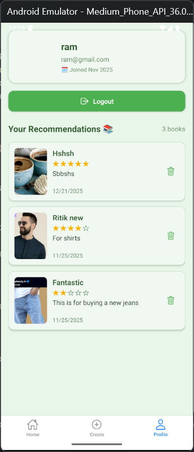
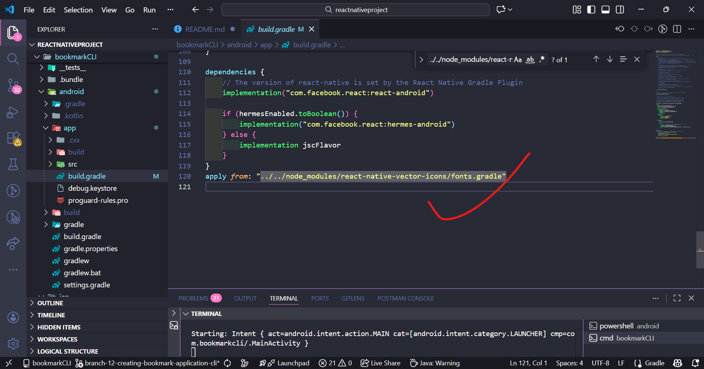

## -------- import Ionicons from "react-native-vector-icons/Ionicons"; not woking in cli ---------
Ah! The issue is a common one with **React Native CLI** projects. `react-native-vector-icons` works differently depending on whether you're using **Expo** or **React Native CLI**. Let’s go step by step to fix your problem.

---

### 1️⃣ Install the package

Make sure you have it installed:

```bash
npm install react-native-vector-icons
# or
yarn add react-native-vector-icons
```

---

### 2️⃣ Link the fonts (React Native CLI only)

For React Native CLI (not Expo), you need to link the fonts:

```bash
npx react-native link react-native-vector-icons
```

This adds the font files to your native Android and iOS projects.

---

### 3️⃣ Android setup

* Open `android/app/build.gradle` and ensure this line exists in `apply from` section:

```gradle
apply from: "../../node_modules/react-native-vector-icons/fonts.gradle"
```

* Rebuild the project:

```bash
npx react-native run-android
```

---

### 4️⃣ iOS setup

* Install pods:

```bash
cd ios
pod install
cd ..
```

* Rebuild the iOS app:

```bash
npx react-native run-ios
```

---

### 5️⃣ Use Ionicons in your code

```javascript
import Ionicons from 'react-native-vector-icons/Ionicons';
import { View } from 'react-native';

export default function App() {
  return (
    <View>
      <Ionicons name="home" size={30} color="blue" />
    </View>
  );
}
```

---

✅ **Important Notes:**

* If you’re using **Expo**, you **don’t need linking**, just install:

```bash
expo install react-native-vector-icons
```

* Then import directly; Expo already supports it.

---

If you want, I can give you a **ready-to-use React Native CLI snippet** that ensures Ionicons works on both Android and iOS without extra linking issues.

Do you want me to do that?

```
npx react-native link react-native-vector-icons >> error: unknown command 'link' PS D:\reactnativeproject\bookmarkCLI>
```
Ah! That explains it. In **React Native 0.60+**, `react-native link` is **deprecated**. Linking is now done automatically with **autolinking**. So you **don’t run `link` anymore**.

Here’s how to fix your issue in a modern React Native CLI project:

---

### 1️⃣ Install `react-native-vector-icons`

```bash
npm install react-native-vector-icons
# or
yarn add react-native-vector-icons
```

Autolinking will handle linking automatically.

---

### 2️⃣ Android setup

1. Open `android/app/build.gradle`
2. Ensure you have this line at the bottom (it copies fonts automatically):

```gradle
apply from: "../../node_modules/react-native-vector-icons/fonts.gradle"
```

3. Rebuild the project:

```bash
npx react-native run-android
```

---

### 3️⃣ iOS setup

1. Go to the `ios` folder:

```bash
cd ios
pod install
cd ..
```

2. Rebuild the project:

```bash
npx react-native run-ios
```

---

### 4️⃣ Use Ionicons in your code

```javascript
import Ionicons from 'react-native-vector-icons/Ionicons';
import { View } from 'react-native';

export default function App() {
  return (
    <View>
      <Ionicons name="home" size={30} color="blue" />
    </View>
  );
}
```

---

⚠️ **Extra Tip:** Sometimes after installing fonts, you need to **clean the build**:

```bash
cd android
./gradlew clean
cd ..
npx react-native run-android
```

---

If you want, I can give you a **full working React Native CLI example with Ionicons** that works on both Android and iOS without any linking issues.

Do you want me to do that?

1) 
2) 