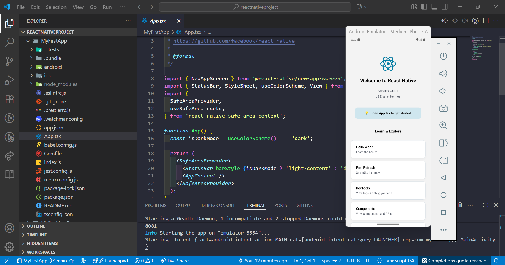

# - follow all the stpes from the react native website: 
1) don't go for Start a new React Native project with Expo that is other way to create react native without using android stdio.
2) to install and setup with android : https://reactnative.dev/docs/set-up-your-environment
3) follow all the steps step by steps and can also refer the youtube video as: https://www.youtube.com/watch?v=3LVwTukzFu8&list=PL8p2I9GklV468O2wk-n8Q1KmtMhnHHj4C&index=4
4) then see and follow the below chats
# --------------- basic details to how many way to create react native app
Great question üëç Since you already know **React.js**, picking up **React Native** will be smooth.
There are two main ways to create a new React Native app: **(1) Expo CLI** (easy, beginner-friendly) and **(2) React Native CLI** (more customizable, close to native).

---

# ‚ö° 1. Create React Native App using **Expo CLI** (Recommended for beginners)

### Step 1: Install Node.js

Make sure Node.js is installed (LTS version).
Check with:

```bash
node -v
npm -v
```

### Step 2: Install Expo CLI

```bash
npm install -g expo-cli
```

### Step 3: Create a new app

```bash
npx create-expo-app MyFirstApp
```

### Step 4: Go inside the project

```bash
cd MyFirstApp
```

### Step 5: Start the app

```bash
npm start
```

This will open **Expo Dev Tools** in the browser.

* Scan the QR code with the **Expo Go app** (Android/iOS).
* The app will run on your phone instantly üéâ

---

# ‚ö° 2. Create React Native App using **React Native CLI** (Closer to native, requires Android Studio/Xcode)

### Step 1: Install dependencies

* Install **Android Studio** (for emulator, SDK, tools).
* On macOS (for iOS), install **Xcode**.
* Install React Native CLI:

```bash
npm install -g react-native-cli
```

### Step 2: Create new app

```bash
npx react-native init MyFirstApp
```

### Step 3: Run app on Android emulator

```bash
cd MyFirstApp
npx react-native run-android
```

### Step 4: Run app on iOS simulator (macOS only)

```bash
npx react-native run-ios
```

---

# ‚úÖ Which should you choose?

* **Expo CLI** ‚Üí Best for starting quickly, small apps, testing.
* **React Native CLI** ‚Üí Best for production apps with native modules.

---

6) choiced the option -2: and 
7) write the command as: 
    - npm install -g react-native-cli  
    - npx react-native init MyFirstApp 
8) got errros as:
```
npx react-native init MyFirstApp1 This will walk you through creating a new React Native project in D:\Extra-Tech\React-Native-tutorial\react_native_code\MyFirstApp1 'yarn' is not recognized as an internal or external command, operable program or batch file. Installing react-native... Consider installing yarn to make this faster: https://yarnpkg.com npm warn deprecated inflight@1.0.6: This module is not supported, and leaks memory. Do not use it. Check out lru-cache if you want a good and tested way to coalesce async requests by a key value, which is much more comprehensive and powerful. npm warn deprecated rimraf@3.0.2: Rimraf versions prior to v4 are no longer supported npm warn deprecated glob@7.2.3: Glob versions prior to v9 are no longer supported added 308 packages, and audited 309 packages in 10s 20 packages are looking for funding run npm fund for details found 0 vulnerabilities C:\Users\Fintern\AppData\Roaming\npm\node_modules\react-native-cli\index.js:302 cli.init(root, projectName); ^ TypeError: cli.init is not a function at run (C:\Users\Fintern\AppData\Roaming\npm\node_modules\react-native-cli\index.js:302:7) at createProject (C:\Users\Fintern\AppData\Roaming\npm\node_modules\react-native-cli\index.js:249:3) at init (C:\Users\Fintern\AppData\Roaming\npm\node_modules\react-native-cli\index.js:200:5) at Object.<anonymous> (C:\Users\Fintern\AppData\Roaming\npm\node_modules\react-native-cli\index.js:153:7) at Module._compile (node:internal/modules/cjs/loader:1706:14) at Object..js (node:internal/modules/cjs/loader:1839:10) at Module.load (node:internal/modules/cjs/loader:1441:32) at Function._load (node:internal/modules/cjs/loader:1263:12) at TracingChannel.traceSync (node:diagnostics_channel:322:14) at wrapModuleLoad (node:internal/modules/cjs/loader:237:24) Node.js v22.19.0 PS D:\Extra-Tech\React-Native-tutorial\react_native_code>
```
----------------
Got it üëç The error is happening because you installed the **old `react-native-cli` globally**, which is **deprecated** and no longer works with the latest React Native.

React Native now uses **`npx`** (not the old CLI). Let’s fix it step by step:

---

# ‚úÖ Fix: Create React Native App Properly

### 1. **Uninstall the old global CLI**

Run this to remove the old `react-native-cli`:

```bash
npm uninstall -g react-native-cli
```

Also remove `react-native-cli` cache if exists:

```bash
npm uninstall -g react-native
```

---

### 2. **Use the new official way with `npx`**

Run this command (don’t install CLI globally):

```bash
npx react-native@latest init MyFirstApp1
```

üëâ This will automatically fetch the latest stable version and create the project.
It doesn’t need `yarn` (it can use `npm` just fine).

---

### 3. **Move into the project folder**

```bash
cd MyFirstApp1
```

---

### 4. **Start Metro bundler**

```bash
npx react-native start
```

---

### 5. **Run the app**

* For **Android** (make sure Android Studio emulator or device is connected):

  ```bash
  npx react-native run-android
  ```
* For **iOS** (Mac only):

  ```bash
  npx react-native run-ios
  ```

---

# ‚ö° Notes

* You **don’t need Yarn** unless you prefer it (npm works fine).
* The warnings about `inflight`, `rimraf`, `glob` are just **npm deprecation notices** (safe to ignore).
* Make sure your **Java JDK, Node.js, and Android SDK** are properly installed.

---

üëâ Ritik, do you want me to also give you the **full Android Studio + environment setup guide (for Windows)** so your `run-android` works smoothly?

## ------------ got again error ---------
```
npx react-native@latest init MyFirstApp2 Need to install the following packages: react-native@0.81.4 Ok to proceed? (y) y npm warn deprecated inflight@1.0.6: This module is not supported, and leaks memory. Do not use it. Check out lru-cache if you want a good and tested way to coalesce async requests by a key value, which is much more comprehensive and powerful. npm warn deprecated rimraf@3.0.2: Rimraf versions prior to v4 are no longer supported npm warn deprecated glob@7.2.3: Glob versions prior to v9 are no longer supported 🚨️ The init command is deprecated. - Switch to npx @react-native-community/cli init for the identical behavior. - Refer to the documentation for information about alternative tools: https://reactnative.dev/docs/getting-started Exiting... PS D:\Extra-Tech\React-Native-tutorial\react_native_code>
```
-------------------
Yes 💯 now you’re hitting the **newer React Native deprecation message** → the `init` command moved out of `react-native` package and into **@react-native-community/cli**.

So instead of:

```bash
npx react-native@latest init MyFirstApp2
```

You should use:

```bash
npx @react-native-community/cli init MyFirstApp2
```

---

# ‚úÖ Correct Way (2025)

1. Run:

```bash
npx @react-native-community/cli init MyFirstApp2
```

2. Go inside the folder:

```bash
cd MyFirstApp2
```

3. Start Metro bundler:

```bash
npx react-native start
```

4. Run on Android (if emulator/device ready):

```bash
npx react-native run-android
```

5. Run on iOS (Mac only):

```bash
npx react-native run-ios
```

---

‚ö° **Notes for you, Ritik:**

* Don’t use `react-native-cli` (deprecated).
* Always use `@react-native-community/cli` for new projects.
* The `npm warn deprecated inflight/rimraf/glob` warnings are **just old npm dependencies** ‚Üí safe to ignore.

---

üëâ Do you want me to also guide you through **Windows Android Studio setup** (JDK + SDK + Emulator) so you can actually run `npx react-native run-android` successfully?

## -------- working fine --------------
1) Images\image.png
2) 
3) 
